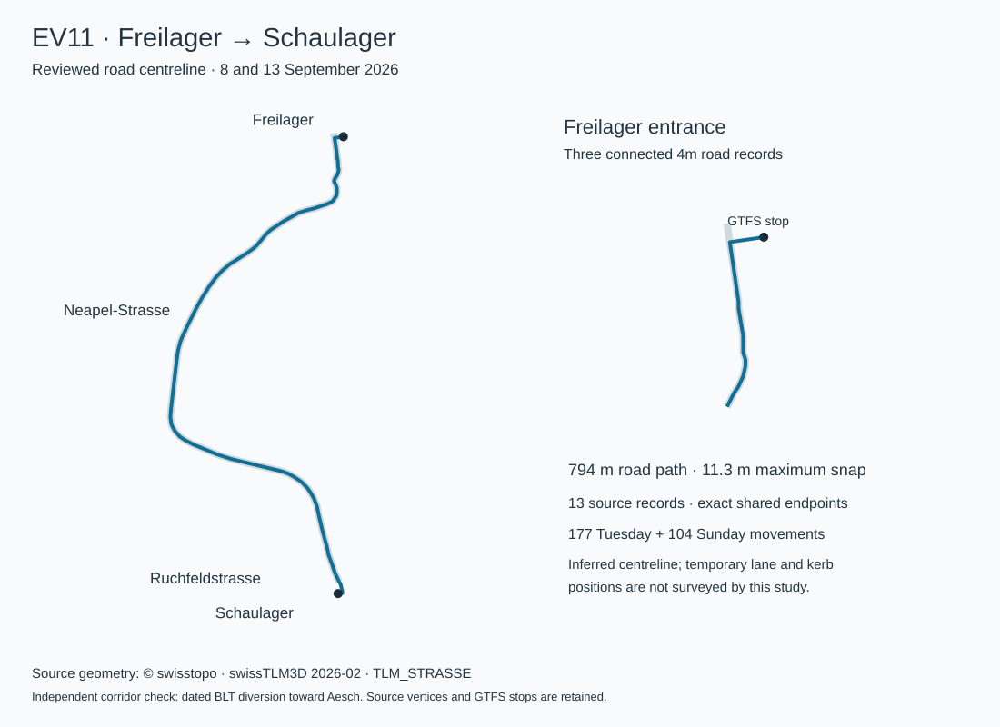

# Basel geometry repairs, 8 September 2026

The reviewed repairs now resolve **every remaining movement-geometry gap** in both Basel fixtures. The initial twelve repairs and tram follow-up added **1,406 Tuesday / 806 Sunday movements**; the final EV11 Freilager–Schaulager repair adds **177 / 104**, for **1,583 / 910** in total. All five groups have 100% inferred centreline coverage. This does not certify individual running tracks or exact temporary bus lanes.

| Repair | Tuesday added | Sunday added | Maximum endpoint snap |
| --- | ---: | ---: | ---: |
| SBB platforms 19/20: S3 and S31 approaches | 85 | 72 | 31.24 m |
| Tram 6: Heuwaage–Zoo Bachletten via Markthalle | 149 | 106 | 5.34 m |
| Tram 6: Markthalle–Heuwaage | 144 | 102 | 1.76 m |
| Bus 33: General Guisan-Strasse–St. Galler-Ring | 95 | 72 | 2.43 m |
| Bus 34: Otto Wenk-Platz A–B | 32 | 0 | 4.26 m |
| EV11: Schaulager–MFP | 177 | 104 | 5.81 m |
| Depot/special tram patterns, follow-up | 724 | 350 | 15.93 m |
| EV11: Freilager–Schaulager, final follow-up | 177 | 104 | 11.28 m |

## Sources and route review

**SBB approaches.** Basel-Stadt's public WFS exposes `LN_SBahnLinie` as well as the previously acquired bus/tram layers. The [queried layer](https://wfs.geo.bs.ch/?SERVICE=WFS&VERSION=2.0.0&REQUEST=GetFeature&TYPENAMES=ms%3ALN_SBahnLinie&COUNT=10000&OUTPUTFORMAT=geojson&SRSNAME=EPSG%3A4326) returned 15 features. Three explicit SBB features cover S3 toward Olten, S3 toward Laufen and S31 toward Laufen. Each repair clips one continuous source feature between the original GTFS platforms. Separate S3 branches are never joined by proximity. The unused `GE_Eisenbahnen_Eisenbahn` layer also reaches the station, but its general railway lines lack the service-corridor identity used here. Retrieval establishes source bytes, not a September validity date; the reviewed timetable and trireno boundary still control admission.

**Tram 6.** The February 2026 [swissTLM3D rail asset](https://data.geo.admin.ch/ch.swisstopo.swisstlm3d/swisstlm3d_2026-02/swisstlm3d_2026-02_2056_5728.shp.zip) supplies the connecting tram infrastructure missing from the existing line/FOT graphs. Only explicitly selected, operational tram features are used. Original feature UUIDs, LV95 coordinates, attributes and source-file hashes are retained. The [BVB diversion plan](https://www.bvb.ch/wp-content/bvb/dokumente/baustelleninformationen/2025/BVB_Umleitung_L6_Baustelle_Auberg_251107.pdf) was rendered and inspected: both directions run via Markthalle, with no outbound call there. The accepted outbound path is **766 m**, and inbound is **385 m**. Initial graph candidates were rejected: one made an unnecessary loop at Heuwaage, another took the closed Holbeinstrasse corridor. The final rules list the actual connected source parts via Markthalle. They add no intermediate timetable call.

**Bus 33.** The rendered [Wanderstrasse plan](https://www.bvb.ch/wp-content/bvb/dokumente/baustelleninformationen/2026/Wanderstrasse_September_2026.pdf) requires continuing south from the temporary General Guisan-Strasse stop, then returning north via Neubadstrasse and St. Galler-Ring. The accepted **859 m** OSM chain follows that loop. Shorter candidates returning along the approach or turning through an earlier side street were rejected. The existing road-cache exclusion remains in force; only the separately reviewed source chain fills the gap afterward.

**Bus 34.** The rendered [BVB Otto Wenk-Platz plan](https://www.bvb.ch/wp-content/bvb/dokumente/diverse_unterlagen/Situationsplaene/Neu/BVB_Sit_OttoWenk-Platz.pdf), dated October 2025, identifies replacement edge A on Hörnliallee and edge B on Kohlistieg. The **53 m** OSM path follows the connecting bus carriageway between these distinct platforms. It replaces the collapsed matcher interval without altering the calls or times.

**EV11.** BLT's [construction page](https://www.blt.ch/projekte/linie-11/bauprojekt) embeds an ArcGIS application with dated, direction-specific replacement routes. The public service item is `f0ba0997bc0d4fbfa95949f7e4b7f2ea`; layer 5, object 2 is the Aesch direction, applicable to both reviewed dates. Its route corroborates the southern carriageway from Schaulager toward MFP. The delivered **784 m** geometry is independently derived from the pinned OSM road extract and retains the GTFS platform access. BLT's map is review evidence; its geometry is not redistributed or assigned an assumed open licence.

**Depot and special tram patterns.** The [7 September–23 October network plan](https://www.bvb.ch/wp-content/bvb/dokumente/liniennetzplan/2026/Liniennetzplan_2026_Baustellen_September_Oktober.pdf) was rendered and reviewed together with the full dated GTFS platform sequences. The 224 additional rules cover 207 Tuesday / 137 Sunday pairs: 172 union pairs use a clipped, forward interval of one continuous Basel-Stadt tram feature; the other 52 use reviewed swissTLM3D junction chains or the existing Markthalle repair. They cover the Wiesenplatz depot approaches, Messeplatz/Riehenring, Voltaplatz/St. Johann, Morgartenring/Allschwilerplatz, the SBB/Markthalle corridors, Münchensteinerstrasse/MParc, Riehen and the central junctions. Full source identities and original vertices remain in the bundle. No new general shortest-path fallback runs during a build.

Two naive junction candidates were rejected after plotting. Dreirosenbrücke–Brombacherstrasse initially turned west and reversed at a switch; the reviewed **375 m** path turns directly east. Denkmal–Aeschenplatz H initially arrived facing west after an unnecessary loop; the reviewed **464 m** path reaches H facing east toward Hardstrasse. The rendered [temporary Dreirosenbrücke plan](https://www.bvb.ch/wp-content/bvb/dokumente/diverse_unterlagen/Situationsplaene/BVB_Dreirosenbruecke_UntereRebgasse_2026.pdf) and [March 2026 Aeschenplatz plan](https://www.bvb.ch/wp-content/bvb/dokumente/diverse_unterlagen/Situationsplaene/Neu/BVB_Sit_Aeschenplatz.pdf) establish these platform approaches. Source hashes are retained with the review. Closed Holbeinstrasse and Claraplatz corridors remain excluded.

Each new rule additionally pins the **entire ordered platform sequence and coordinates**, hashed with SHA-256; 71 distinct full patterns are reviewed. A new pattern containing the same adjacent pair stays unmatched. The [pattern review](../data/basel-tram-pattern-review.json) records each admitted dated trip instance, segment index, pattern hash, source reference and path measurement.

The OSM chains retain source way IDs, node IDs and direction tags from the Geofabrik Switzerland **2026-09-02** extract used by the existing bus pipeline. One-way direction is checked for every selected part. This is a review of these specific chains, not a new general-purpose router or a claim to certify every OSM turn restriction. Basel-Stadt, BAV, OSM/ODbL and swisstopo credits remain visible in the application; mobile attribution includes swisstopo.

## Reproduction and safeguards

[`basel-reviewed-geometry.json`](../data/basel-reviewed-geometry.json) is the self-contained reviewed source bundle. Its `provenance` and `evidence` fields record source URLs, hashes and dates. `features` retain source coordinates and identities; `rules` identify exact agencies, route IDs, modes, platform IDs and ordered source-vertex ranges. No raw-download or temporary-directory dependency is needed for normal builds.

[`basel-reviewed-geometry.mjs`](../scripts/basel-reviewed-geometry.mjs) applies the rules only to missing paths in feed **20260905**, civil dates **8/13 September**, and their explicitly reviewed preceding service dates. It checks unchanged platform coordinates, exact continuity between source parts, forward source ranges, OSM one-way direction, endpoint snaps and complete path lengths. Limits remain **120 m** for snapping, **2× / 600 m** for trams, **4.5× / 1,200 m** for buses, and **4.5× / 3,000 m** for rail. Successful prior paths retain priority. The release wrapper verifies the repair-bundle hash again before publication.

Rebuild with the commands in [Basel core](BASEL-CORE.md). The builder now includes this bundle automatically. Its report separates original matcher decisions from `reviewedGeometry`, so earlier rejected attempts remain auditable. Initial candidates are retained at `/tmp/basel-geometry-improved/`; the completed tram follow-up is at `/tmp/basel-geometry-complete/`.

```sh
node scripts/check-basel-geometry-regression.mjs \
  --before /tmp/basel-core-reviewed \
  --after /tmp/basel-geometry-improved \
  --output data/basel-geometry-regression.json
npx vitest run scripts/basel-reviewed-geometry.test.mjs \
  scripts/basel-core.test.mjs scripts/basel-release.test.mjs
npx vitest run src/test/regions.dom.test.tsx -t basel-core
npx playwright test e2e/regional-layout.spec.ts --workers=1
```

The initial [regression result](../data/basel-geometry-regression.json) verifies every source instance: all **148,577 / 100,850** previously accepted movement paths are unchanged, as are all calls, times, platform coordinates, journey identities and rail clipping ranges. Both complete release sets pass validation. Six Basel desktop/iPhone cases pass; focused geometry tests, TypeScript, production build, edition boundaries, lint and the mobile bundle budget also pass. A broader shared-workspace run found an unrelated Bern release count mismatch and an empty in-progress St. Gallen test file; it is not recorded as a passing full-suite run.

## Follow-up validation

The [incremental regression](../data/basel-geometry-followup-regression.json) preserves **149,259 Tuesday / 101,306 Sunday previously accepted movements**, including every initial repair, byte for byte. Calls, times, platforms, source trip identities and clipping boundaries remain unchanged. Only the repair-bundle hash may change through an explicit regression option; every original timetable/source hash is still checked. Both complete application release sets pass validation.

```sh
node scripts/check-basel-geometry-regression.mjs \
  --before /tmp/basel-geometry-improved \
  --after /tmp/basel-geometry-complete \
  --allow-reviewed-geometry-update \
  --output data/basel-geometry-followup-regression.json
```

The follow-up passes **60 focused tests across nine files**, including refresh recovery, complete-pattern admission, junction direction and regression rejection cases. Focused lint, TypeScript and the production build pass. The shared application JavaScript is **361.4 KiB against a 360 KiB budget** at this check; this follow-up changes no browser code, and the overall release remains blocked by that budget as well as the shared test failures. The shared full-suite run at 20:52 passed 565 tests but failed in ongoing Bern, Zug, St. Gallen and edition-catalogue work; it is not a passing full-suite result. All **six Basel browser cases pass** on desktop Chromium and iPhone WebKit with the promoted Tuesday fixture: lazy selection, rail/foreign-stop search, seek/share, midnight retry with preceding-day trips, morning recovery, translations and overflow.

The shared release blockers above were repaired in `7d2208b`: St. Gallen tests now use Vitest, refresh fixtures create nested regional directories, complete replay tests have bounded CI timeouts, and geometry snapshot checks tolerate only sub-micrometre differences in derived measurements across macOS/Linux. Source coordinates, source hashes and admission decisions remain exact. Cantonal pilot validation now loads with its existing lazy controls, bringing opening JavaScript within the unchanged 360 KiB budget. All 621 tests pass in the isolated integration checkout; all 22 affected road-pilot browser cases pass, with one iPhone selection timeout passing on retry. The [Linux release check](https://github.com/emmettl/gleislicht/actions/runs/34269155014) passes tests, typecheck, lint, architecture, worker builds, production build and publication budgets. The national/regional refresh and full browser jobs were still running when this note was written; deployment is not yet confirmed.

## EV11 Freilager–Schaulager: resolved for the centreline study

The final repair uses **13 continuous swissTLM3D 2026-02 road records** from Freilager along Neapel-Strasse and Ruchfeldstrasse. The first three are classified as **4m Strasse**, with no recorded traffic restriction or directional-road flag. They connect the Freilager forecourt to the wider Neapel-Strasse road. The [earlier OSM probe](../data/basel-ev11-source-probe.json) remains a valid account of that source: its motor-road graph omits this connection, classifying part of it as a footpath. The Basel-Stadt bus layer and Basel-Landschaft transit layer expose the regular network, while the cantonal road-axis layer does not cover this entrance.

The accepted path is **793.6 m**, with a maximum endpoint snap of **11.28 m**. All joins are exact shared source endpoints; no gap-closing connector or moved GTFS stop is introduced. The chain follows the full western Neapel-Strasse curve before Ruchfeldstrasse. The earlier Genuastrasse turn and the direct Emil Frey-Strasse shortcut are excluded. Both were numerically attractive alternatives, but they do not follow the reviewed diversion corridor.

The [dated BLT construction map](https://www.blt.ch/projekte/linie-11/bauprojekt), layer 5 / object 2 toward Aesch, remains the independent route reference. The maximum separation of the inferred path vertices from that reference line is **25.6 m**, concentrated near Freilager. The federal forecourt centreline and the drawn temporary-lane approach are not identical: admission is for the existing schematic centreline model, not a claim to reproduce the precise temporary kerb or lane alignment. BLT coordinates are not redistributed. The [swisstopo terms](https://www.swisstopo.admin.ch/de/kostenlose-geobasisdaten-ogd) permit reuse with attribution, retained in both the source bundle and application.



The compressed [source subset](../data/basel-geometry-sources/ev11-tlm-roads-2026-02.json.gz) retains complete selected `TLM_STRASSE` records: original UUIDs, LV95 XY vertices, road classifications and attributes. The source SHP, DBF and PRJ hashes are recorded along with the archive URL. The existing `lv95ToWgs84` transform derives the display coordinates. Tests independently reproduce those coordinates from the retained records and reject changed vertices, footpaths, restricted roads and direction-specific roads.

The [EV11 review](../data/basel-ev11-geometry-review.json) pins the full ordered platform sequence and coordinates of the single admitted pattern and lists every affected dated trip instance. The rule remains restricted to route `92-A01-I-j26-1`, agency `37`, the exact directed stop pair, feed `20260905`, the two reviewed civil dates and their reviewed source dates. No general road fallback or snap/detour limit changes.

The [complete regression](../data/basel-ev11-geometry-regression.json) verifies **149,983 Tuesday / 101,656 Sunday previously accepted movements** byte for byte. All source calls, times, platforms, trip identities and rail clipping boundaries are unchanged. The only additions are **177 / 104 EV11 movements**; no unmatched movement remains in either fixture. Both complete application release sets pass validation. All **60 focused tests** and **six Basel browser cases** pass on desktop Chromium and iPhone WebKit. Focused lint and diff whitespace checks pass; the corridor and entrance review figure was visually inspected.

```sh
node scripts/check-basel-geometry-regression.mjs \
  --before /tmp/basel-geometry-complete \
  --after /tmp/basel-ev11-repair/candidates \
  --allow-reviewed-geometry-update \
  --output data/basel-ev11-geometry-regression.json
npx vitest run scripts/basel-ev11-geometry.test.mjs scripts/basel-reviewed-geometry.test.mjs
```

To reproduce acquisition, extract `TLM_STRASSEN\swissTLM3D_TLM_STRASSE.{shp,dbf,prj}` from the archive recorded in the source subset and select the 13 retained UUIDs. Preserve each complete source coordinate array and attributes. Normal application rebuilds use the self-contained reviewed geometry bundle and do not need the multi-gigabyte national road layer.
