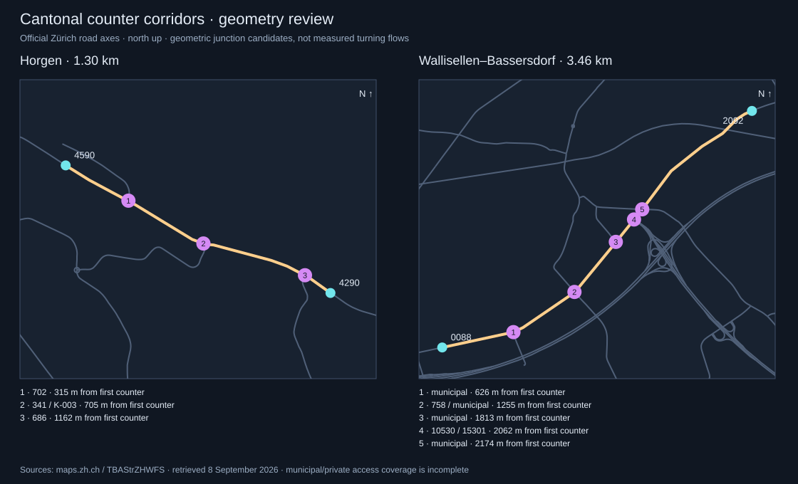

# Cantonal coverage and junction review — 8 September 2026

**The original afternoon review found recurring Horgen source gaps and admitted Wallisellen–Bassersdorf.** A later [evening export](#evening-archive-follow-up--9-september-2026) now supports a separate uninterrupted Horgen hour. The review produced a compiled, direction-reviewed 104-minute draft. A subsequent [playback integration](CANTONAL-ROADS.md#wallisellenbassersdorf-playback) makes that recording available in AUTO; the findings below describe the review evidence.

## Archive findings

The exported Cloudflare archive contains all **245 scheduled measurement minutes from 13:23 through 17:27 CEST** on 8 September 2026. There are no missing archive minutes in this interval. The separate 13:21 manual sample is outside the audit window. Raw snapshots remain in the ignored recording directory; the committed [coverage audit](../data/zurich-cantonal-road-coverage-audit.json) contains aggregate availability, detector failure counts, input hashes and the 245-file source manifest.

| Counter / pair | Complete minutes | Longest complete run |
| --- | ---: | --- |
| Horgen 4290 | 245 / 245 (100%) | 245 minutes |
| Horgen 4590 | 166 / 245 (67.76%) | 28 minutes, 14:53–15:20 |
| Both Horgen counters | 166 / 245 (67.76%) | 28 minutes, 14:53–15:20 |
| Wallisellen 0088 + Bassersdorf 2092 | 233 / 245 (95.10%) | **104 minutes, 14:14–15:57** |
| Bassersdorf 2092 + Lindau 0908 | 245 / 245 (100%) | 245 minutes; direction still unresolved |

Horgen 4590 reports its two detector identities but lacks usable light **and** heavy flow values on both lanes for the same 79 minutes, spread across 11 gaps. Counter 4290 is complete throughout. The longest gap is 25 minutes, 17:02–17:26. This distinguishes recurring source incompleteness from a missed recorder invocation; it does not diagnose the physical counter or upstream supplier software. A complete Horgen hour cannot be produced from this export without filling missing observations.

The 28-minute Horgen run compiles successfully as a local draft. The published 40-minute segmented pilot is retained: its dates, gaps and aggregate values rebuild identically after the stricter validation described below.

## Junction evidence



The [official Zürich road-network dataset](https://geolion.zh.ch/geodatensatz/804.html) covers national and cantonal roads plus municipal roads important to the traffic model. It is not an inventory of every municipal street or private entrance. The [pinned WFS extracts](../data/zurich-cantonal-road-junction-sources.json) contain 24 features around Horgen and 131 around Wallisellen–Bassersdorf, with retrieval time, request URLs and hashes. The source features carry the road-model date 6 August 2026.

The [junction audit](../data/zurich-cantonal-road-junction-audit.json) projects other road-axis endpoints onto each counter section. It accepts candidate approaches within 15 m, groups approaches within 30 m along the section, and excludes the first/last 25 m at the counters. These are geometric junction candidates, not proof of grade, permitted turns or measured turn volumes.

Horgen has three clear junction areas between the counters, measured from counter 4590:

| Approximate position | Connected axis | Source description |
| --- | --- | --- |
| 315 m | ZH 702 | Hirsacher–Horgen/Meilen ferry access |
| 705 m | ZH 341 / K-003 | Hanegg–Horgen approach and roundabout geometry |
| 1,162 m | ZH 686 | Rietwiesstrasse / Seegüetli approach |

The canton's [Rietwiesstrasse project decision](https://www.zh.ch/de/politik-staat/gesetze-beschluesse/beschluesse-des-regierungsrates/rrb/regierungsratsbeschluss-41-2021.html) independently identifies road 686 and its connection to Seestrasse. Together with the road geometry, this makes the unmeasured turning-flow limitation material. Ferry access may introduce bursts, but this review does not attribute any particular observation to ferry traffic.

Across Horgen's 166 simultaneously complete minutes, the positive-direction endpoint totals are 609 and 819 vehicles; negative-direction totals are 610 and 462. These sum reported hourly rates divided by 60 over common samples. They are **not travel-time-aligned vehicle matches**, and the differences are **not estimates of junction turns**. Storage within the section, travel time, omitted periods, counter behaviour and intervening junctions can all affect the comparison.

The second corridor has five geometric junction areas, including municipal approaches and the 10530/15301 interchange approaches. It therefore uses the same counter-based reconstruction caveat. This review does not establish vehicle conservation between its counters.

## Second corridor: Wallisellen–Bassersdorf

The selected section is **3.457 km of ZH 1**, from counter `ZH.CH:0088` on Neue Winterthurerstrasse in Wallisellen to `ZH.CH:2092` in Bassersdorf. The source path is continuous and has no unresolved intervening counter. All four directional detector sites have complete light/heavy observations throughout **14:14–15:57 CEST**, giving 104 samples.

Bassersdorf already passes the automatic destination checks. At Wallisellen, the Winterthur direction passes; the Zürich direction passes destination distance, projection and local bearing (-0.92) but fails the conservative settlement-extent check because Zürich's large bounds cross the station.

The [explicit station review](../data/zurich-cantonal-road-direction-reviews.json) resolves only this pinned case using the independently validated Winterthur lane, exactly two opposing main-carriageway normal lanes in the catalog, the source's Zürich/Winterthur labels, and the local ZH 1 geometry. Winterthur follows positive stored path order, so the opposing Zürich lane follows negative order. This is a documented source-evidence inference, not a surveyed vehicle trajectory. The general settlement-extent gate is unchanged; the original failed status is preserved alongside the review.

The review fails closed if the catalog, base geometry, detector audit, anchor direction or supporting WFS extract changes. It does not apply to extra lanes, slip roads, ambiguous names or bearing conflicts. In particular, Lindau 0908 remains unresolved despite its excellent recording coverage. The Bülach motorway counter near Höri also remains excluded from cantonal playback.

Applying the review yields eight accepted stations, 16 directional sites and four directed sections across two roads. This is a separate optional build from the original seven-station baseline, preserving the reproducibility of the public Horgen pilot.

The [compiled-draft audit](../data/wallisellen-bassersdorf-draft-audit.json) records 104 complete samples, four sites, two sections, 100% site coverage and the direction-review hashes. The existing playback reader was checked at every recorded minute: reconstructed counts range from **37 to 98 vehicles**. The full draft and chunks remain under the ignored `recordings/astra-zurich-cantonal/wallisellen-bassersdorf-draft/` directory.

## Reproduce

Export the recording day using the credentials documented in [Cloudflare operations](CLOUDFLARE.md), then run:

```sh
node scripts/audit-cantonal-road-coverage.mjs \
  --date=2026-09-08 --from=13:23 --to=17:27
node scripts/audit-cantonal-road-junctions.mjs

node scripts/validate-cantonal-road-directions.mjs \
  --places=data/zurich-cantonal-road-directions.json \
  --reviews=data/zurich-cantonal-road-direction-reviews.json \
  --output=/tmp/zurich-directions-reviewed.json

node scripts/compile-cantonal-road-study.mjs \
  --topology=/tmp/zurich-directions-reviewed.json --road=ZH:1 \
  --date=2026-09-08 --from=14:14 --to=15:57 --minimum-samples=104 \
  --output=recordings/astra-zurich-cantonal/wallisellen-bassersdorf-draft

node scripts/compile-cantonal-road-study.mjs \
  --date=2026-09-08 --from=14:53 --to=15:20 --minimum-samples=28 \
  --output=recordings/astra-zurich-cantonal/horgen-longer-draft
```

The audit defaults to the original automatic direction topology, so its candidate statuses intentionally describe the baseline before the explicit Wallisellen review. `--from`/`--to` keep the archived evidence window fixed as later files arrive. `--input` and `--output` allow alternate archive and report paths.

## Validation and next implementation

The review exposed a compiler edge case: aggregation could accept a direction when all detector IDs were present but one lane lacked a vehicle class, because another complete lane supplied the aggregate. Cantonal compilation now checks **every lane and both classes before aggregation**. Positive flow requires a positive speed; zero flow may omit speed. Federal compilation behaviour is unchanged.

Validation: **244 tests across 63 files passed**, including changed evidence, invalid anchors/carriageways, incomplete multi-lane observations, missing archive minutes, source failures, duplicate conflicts and partial WFS responses. Lint passes for the changed scripts. The existing Horgen public artifact rebuilds byte-for-byte identically.

The subsequent playback integration now offers the reviewed **ZH 1 corridor and its 104-minute window** in AUTO, with its own recording identity and junction disclosure. The original review artifacts remain as provenance for that publication.

## Bassersdorf–Lindau follow-up

The **2.232 km** section has **245 consecutive complete minutes, 13:23–17:27 CEST**, in the audited archive. It remains excluded from playback after the detailed direction review.

At Lindau `ZH.CH:0908`, both detector destinations fail the local bearing gate: Zürich **−0.64**, Winterthur **+0.24**, against the required absolute agreement of **0.75**. A fresh [official collector configuration](https://vdp.zh.ch/pws/public-service/readCollectorsCfg) confirms the same two normal-lane destination labels. The detailed [official road-axis extract](https://maps.zh.ch/wfs/TBAStrZHWFS?SERVICE=WFS&VERSION=2.0.0&REQUEST=GetFeature&TYPENAMES=ms:strassenachsen&SRSNAME=EPSG:2056&OUTPUTFORMAT=application%2Fjson&BBOX=2690300,1253300,2693000,1255000,EPSG:2056&COUNT=10000) places the precise counter on axis feature 66 and gives almost the same local agreements, **−0.63 / +0.23**. This does not resolve the detector directions. The local feature is too short to replace the full road path for destination projection; its bearing is used only as a diagnostic comparison.

Unlike Wallisellen, Lindau has **no independently validated anchor detector**. The existing opposing-lane review therefore cannot be applied. Alert-C signs and the neighbouring Bassersdorf directions alone do not establish Lindau's detector-to-path mapping. No direction threshold, published topology or recording catalog entry has been changed.

The next required evidence is a detector-specific surveyed direction or independently verified directional reference tied to the station and road path. A successful review would then need the section/junction audit before publication. The absence of that evidence in this review does not establish that it is unavailable from the publisher.

The [pinned source extracts](../data/lindau-road-review-sources.json) and [review report](../data/lindau-road-review.json) record source URLs, retrieval time, hashes, both automatic direction results, detailed-axis comparison and the separate observation coverage. Reproduce with:

```sh
node scripts/audit-lindau-road.mjs
```

The audit recomputes the automatic directions and validates the source hashes and detector labels. Tests verify that complete observations do not authorize a direction override and that changed source evidence is rejected.

## Lakeside follow-up: Kilchberg–Thalwil and Meilen–Stäfa

Kilchberg–Thalwil passes the existing pinned opposing-lane direction review and is now [published in AUTO](CANTONAL-ROADS.md#kilchbergthalwil-playback): 4.803 km, 142 uninterrupted minutes from 14:14–16:35 CEST. Its complete observation count over the whole audited afternoon remains 227/245; publication selects the longest complete run rather than filling the other minutes.

The initial Meilen–Stäfa review found 245 complete minutes and two validated Zürich directions, but withheld publication pending road-continuation evidence. The original exact lookup of “Rapperswil” missed the canton-qualified SwissNames entries. Fresh exact searches for **Rapperswil SG** and **Rapperswil BE** return both alternatives; the existing 50 km regional check uniquely selects SG. Both reviewed directions then pass local bearing (0.95 / 0.96), but the destination is **2,522.39 m from the available ZH 17 path**, above the unchanged 1,500 m gate. Resolving the name therefore does not by itself validate the direction. Further road-continuation evidence is needed before publication; no override or broader automatic alias has been enabled.

The [source extracts](../data/lakeside-road-review-sources.json) preserve exact query URLs, responses and hashes. The [destination review](../data/meilen-staefa-direction-review.json) records the remaining geometry failure. Reproduce it with `node scripts/audit-meilen-staefa-directions.mjs`. The same official axis extract gives two geometric junction candidates in this potential section, around 1.177 km (axis 718) and 2.749 km (axis 720); these remain review evidence, not measured turning flows.

The subsequent [official St. Gallen continuation review](CANTONAL-ROADS.md#meilenstäfa-playback-and-official-road-continuation) resolves the gap: KS17 joins the Zürich endpoint within 0.379 m and reduces the destination-to-axis distance to 85.38 m. Both directions pass the unchanged gates, and the 245-minute Meilen–Stäfa recording is now published. The earlier Zürich-only result above is retained as provenance.


## Meilen Seestrasse follow-up

A separate review now admits the adjacent **0491–0591 Meilen counter pair**: 2.902 km, both directions, and 142 uninterrupted minutes from 14:14–16:35 CEST. The archive has 241 complete minutes out of 245 for this pair. The new station evidence uses the verified KS17 continuation without broadening the original Meilen–Stäfa review. Three geometric junction areas are recorded in a new full-section extract. See [Meilen Seestrasse playback](CANTONAL-ROADS.md#meilen-seestrasse-playback) for provenance, limits and rebuild commands. Erlenbach's bearing conflict and Lindau's missing direction evidence remain unresolved.


## Bauma–Wila follow-up

The sixth recording admits the 3588–1623 counter pair: **4.822 km and 104 uninterrupted minutes, 14:14–15:57 CEST**. A complete SwissNames archive inventory verifies all 25 Wald settlements against the API responses. A separate pinned review selects Wald ZH because it alone passes every direction gate opposite the validated Winterthur anchors. At Bauma, a small Wald settlement passing in the Winterthur direction is explicitly excluded using the catalog’s opposing-normal-lane evidence. The automatic regional lookup remains ambiguous. Two geometric junction areas are documented. The neighbouring Stegstrasse counter 2891 remains excluded because its Wald bearing is −0.74. See [Bauma–Wila playback](CANTONAL-ROADS.md#baumawila-playback-and-qualified-wald-destination-review) for the evidence, limits and rebuild commands.


## Oberland destination follow-up

A [complete Pfäffikon, Wetzikon and Gossau review](OBERLAND-ROAD-CANDIDATES.md) covers six settlement alternatives, 21 stations and 14 counter pairs with at least one complete hour. All 14 still need direction or geometry evidence even under an optimistic Zürich-qualified-name diagnostic. Hittnau 3091 needs an independent directional reference; Seegräben 2988 needs a verified road binding. No new pilot or topology is published by this audit.

The [Hittnau source investigation](HITTNAU-ROAD-REVIEW.md) subsequently verifies the public station point and collector labels. The checked metadata and generic VDE handbook do not provide the missing detector-to-path reference. Its audit retains the short-distance failure and identifies the exact station-plan evidence needed to resume.

The [Seegräben road-binding review](SEEGRAEBEN-ROAD-REVIEW.md) establishes that 2988 and 0392 measure municipal branches. It rejects three ZH 340 diagnostic pairs involving these stations, preserving their observation statistics. The [Wetzikon follow-up](WETZIKON-ROAD-REVIEW.md) identifies 2788 as another municipal-branch counter and rejects the newly apparent 0188–2788 pair. No eastward extension from 0188 remains on this path in the current catalog.

The [complete unmatched-counter batch review](CANTONAL-UNMATCHED-ROADS.md) then checks all 33 geometry exclusions against 7,427 detailed road features and the complete public station/collector inventories. It finds ten missing station IDs, nine high-speed-road cases, eight municipal-road leads, two city-road cases and four classified-road ambiguities. All remain unapproved in this diagnostic; the report preserves competitors and identifies the independent evidence required for each follow-up.

The [Dietikon–Oetwil follow-up](DIETIKON-ROAD-REVIEW.md) retains both near-parallel classified axes and all four Dietikon detector labels. A detector-to-carriageway mapping is still missing, while Oetwil independently fails its destination checks. The batch queue now includes both endpoints' unresolved direction evidence beside each candidate's observation window.

The [Allmendstrasse–Adliswil review](ALLMEND-ROAD-REVIEW.md) validates 4087's opposing directions in a saved station-scoped review. Allmendstrasse 0197 remains blocked: its detailed city axis 4.1 is absent from the classified network and ends at a nearby shared ramp junction. Neither adjacent pair is admitted, including 1520–4087, whose other endpoint still fails direction checks.

The [Witikonerstrasse review](WITIKON-ROAD-REVIEW.md) verifies the exact city-road 30051 connection to ZH 742, 71.85 m from counter 1101. Searching all 42 detailed features with those road numbers finds only 1101 on its 38-feature endpoint component. Maur 0889 lies on another selected component and has no complete archived minutes. The city connection therefore supplies no supported recording pair; wider-network connectivity is outside this review's scope.

The [Henggart review](HENGGART-ROAD-REVIEW.md) retains the nearby A4 competitor and exposes additional direction failures under a diagnostic ZH 15 assumption: Winterthur bearing −0.56, Schaffhausen off-axis distance 1,652.20 m and bearing +0.70. Neftenbach 4789 also has two unresolved directions despite the southern pair's 104-minute window; Adlikon 1900 is disabled and supplies no complete observations. Resolving Henggart's geometry alone would admit neither candidate.

The [Lindau 2491 review](LINDAU-2491-ROAD-REVIEW.md) records both A1 crossing coordinates without creating junctions and tests all four exact Lindau settlement alternatives. The local Lindau and Effretikon references are too close at 2491 and neighbour 1320; the remaining Lindau alternatives fail off-axis checks. Partner 1292 also lacks a validated anchor. Both 104-minute candidates stay unapproved, independently of a future road-level binding. This review is separate from Lindau 0908 on ZH 1.

The [Stallikon review](STALLIKON-ROAD-REVIEW.md) completes the six-case priority queue. It retains the A3 road-level ambiguity and identifies a ZH 642 roundabout within the 208.39 m candidate. The conditional Stallikon direction passes at 3387, but Zürich fails projected separation, off-axis and bearing checks; neighbour 3287 also fails its Zürich checks. The 149-minute paired window therefore remains unapproved. Further progress on these six cases requires the independent evidence listed in their reviews.

The subsequent [Hittnau document search](HITTNAU-ROAD-REVIEW.md#public-document-follow-up--9-september-2026) finds the actual public 3091 annual-report link through the interactive GIS, correcting the earlier failed guessed URL. Its seven pages corroborate the station, road and R1/R2 destination labels, but contain no surveyed channel mapping. The document hash and findings are saved, and a precise station-plan request is drafted. No direction approval follows from the annual statistics; access to the two linked authenticated portals remains unestablished.


## Evening archive follow-up — 9 September 2026

The [completed evening audit](../data/zurich-cantonal-evening-coverage-audit.json) covers **637/637 scheduled minutes, 13:23–23:59 CEST on 8 September**. There are no missing archive minutes. It preserves the original afternoon audit and pins the exact expanded input manifest. Horgen has 489 complete paired minutes; the source still has recurring incomplete observations, but its **61-minute run at 21:10–22:10** is now published as [a separate evening recording](CANTONAL-ROADS.md#horgen-evening-playback).

| Previously reviewed corridor | Complete paired minutes / 637 | Longest complete run (CEST) |
| --- | ---: | --- |
| Horgen | 489 | **61 minutes, 21:10–22:10 — published separately** |
| Wallisellen–Bassersdorf | 620 | 279 minutes, 19:21–23:59 |
| Kilchberg–Thalwil | 612 | 279 minutes, 19:21–23:59 |
| Meilen–Stäfa | 637 | 637 minutes, 13:23–23:59 |
| Meilen Seestrasse | 622 | 279 minutes, 19:21–23:59 |
| Bauma–Wila | 608 | 146 minutes, 19:21–21:46 |

The remaining longer runs are candidates for separate recordings using each corridor's existing pinned direction and junction evidence. They have not replaced any published recording. This establishes useful expansion work without depending on the unresolved station-plan access: Meilen–Stäfa offers the largest next increase. Raw observations remain in the private archive and ignored local recording directory.
