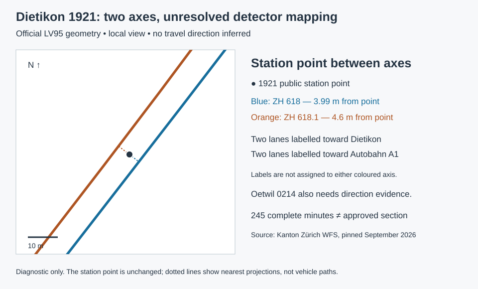

# Dietikon–Oetwil recording review — 8 September 2026

**The 1921–0214 pair remains unapproved despite 245 complete minutes.** Dietikon 1921 needs an independent mapping from four detector channels to the two nearby road axes. Oetwil 0214 separately needs direction evidence. Resolving Dietikon's geometry alone would not make this a usable recording.



## What the geometry establishes

The [complete detailed-road source](../data/cantonal-unmatched-sources/manifest.json) is recorded in the [batch review](CANTONAL-UNMATCHED-ROADS.md). Its two closest features at Dietikon 1921 are **7440 / ZH 618**, 3.99 m from the point, and **7436 / ZH 618.1**, 4.60 m away. Their nearest projected points are about 8.59 m apart. The station coordinate is unchanged at LV95 **2,671,556.43 / 1,252,071.49**.

The fresh [classified-road response](../data/dietikon-road-review-sources.json) returns both axes as canton roads in the same eligible classified-road category. It reproduces the two existing stored paths exactly. The detailed axes run alongside the station with opposite local vertex order. That geometry is consistent with separate carriageways, but vertex order is not travel direction, and the `.1` suffix is not a detector assignment.

The public collector configuration has four channels:

| Destination label | Detector | Lane description |
| --- | --- | --- |
| Dietikon | 1921.01 | Normal lane |
| Dietikon | 1921.02 | Passing lane |
| Autobahn A1 | 1921.03 | Passing lane |
| Autobahn A1 | 1921.04 | Normal lane |

None of these catalog records contains a valid detector coordinate or AlertC direction. The source station point and road labels do not locate the individual lanes. The existing review for two opposing normal lanes cannot be extended to this four-detector station by choosing whichever axis is nearer. A dated station plan or independently verified channel-to-carriageway reference must identify all four channels, both axes and geographic orientation.

## The other endpoint also blocks publication

Oetwil **0214** already has a geometry match to ZH 618, but its direction audit fails independently:

- **0214.03 toward Dietikon:** the destination is 1,808.73 m off the axis, above the 1,500 m limit; bearing agreement is also only −0.61.
- **0214.04 toward Oetwil an der Limmat:** the destination is only 678.63 m away, below the 1,500 m minimum. Its projected separation is −656 m and bearing agreement is 0.11, so changing the distance threshold would not establish a direction.

Both Oetwil records also lack catalog direction/coordinate evidence. Neither endpoint has a shortcut through the existing two-normal-lane extent review. Independent direction evidence at Oetwil is required before a subsequent section/junction audit and playback compilation.

The archived pair has **245 complete minutes, 13:23–17:27 CEST**, with a diagnostic projected length of **1,793.79 m**. The length uses the unapproved association to the main axis; it is not an approved split-carriageway route.

## Implementation

The [Dietikon report](../data/dietikon-road-review.json) pins the batch scope and fresh classified-road evidence, validates the stored paths, retains both axes and all four labels, and includes Oetwil's original direction results. The accompanying SVG is generated from the same LV95 geometry and was rendered and visually inspected. No detector is assigned to either coloured axis.

The batch queue now includes **both endpoints' unresolved direction checks beside every archived candidate pair**, with the direction baseline independently recomputed before accepting the saved audit. This prevents coverage and a single geometry issue from concealing blockers at the neighbouring counter. No original geometry, direction gate, pilot catalog or public recording changes.

```sh
node scripts/audit-cantonal-unmatched-roads.mjs --output=/tmp/cantonal-unmatched-road-audit.json
cmp data/cantonal-unmatched-road-audit.json /tmp/cantonal-unmatched-road-audit.json
node scripts/audit-dietikon-road.mjs --output=/tmp/dietikon-road-review.json --map-output=/tmp/dietikon-road-review.svg
cmp data/dietikon-road-review.json /tmp/dietikon-road-review.json
cmp docs/assets/dietikon-road-review.svg /tmp/dietikon-road-review.svg
npx vitest run scripts/audit-dietikon-road.test.mjs scripts/audit-cantonal-unmatched-roads.test.mjs scripts/review-cantonal-road-direction.test.mjs scripts/validate-cantonal-road-directions.test.mjs
```

The subsequent [Allmendstrasse review](ALLMEND-ROAD-REVIEW.md) identifies a missing city axis beside a shared ramp junction and validates Adliswil 4087's direction issue through the existing scoped method. The 4087–0197 pair remains unapproved pending Allmendstrasse's network and detector mapping evidence.
