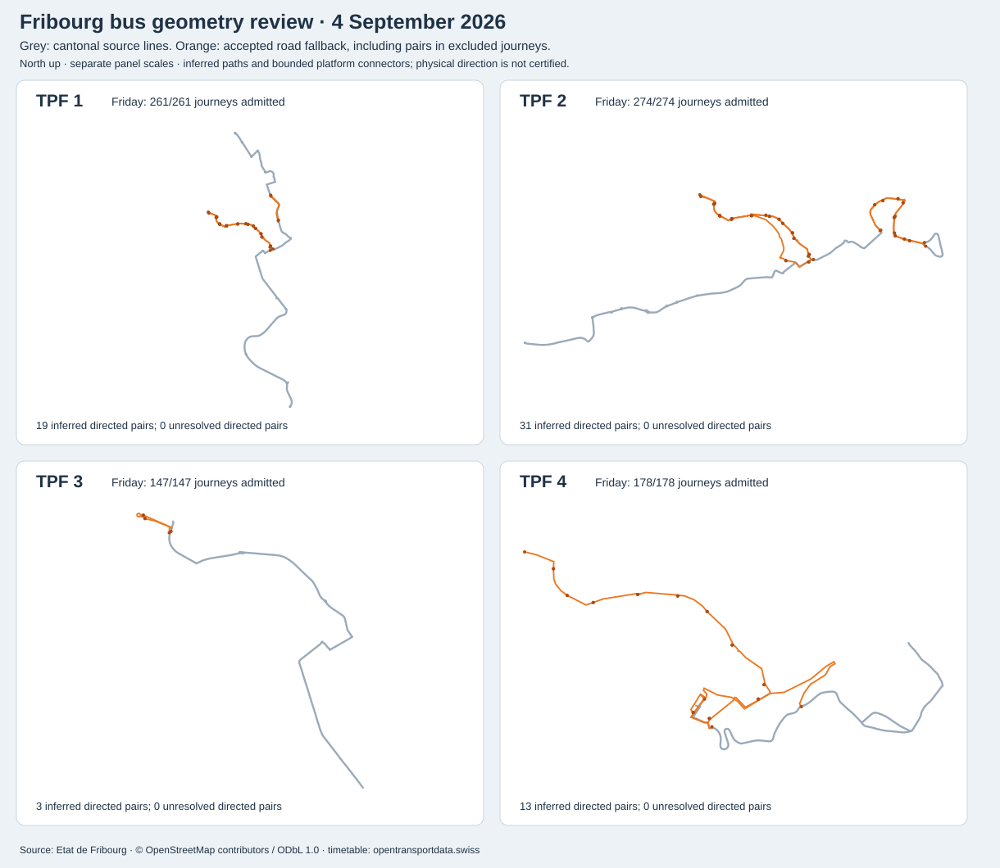
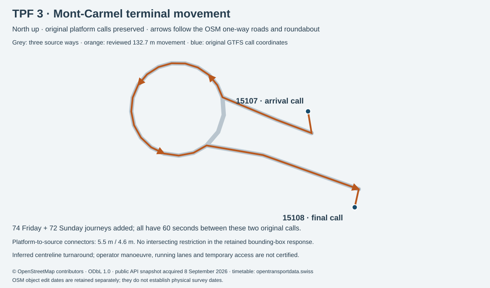
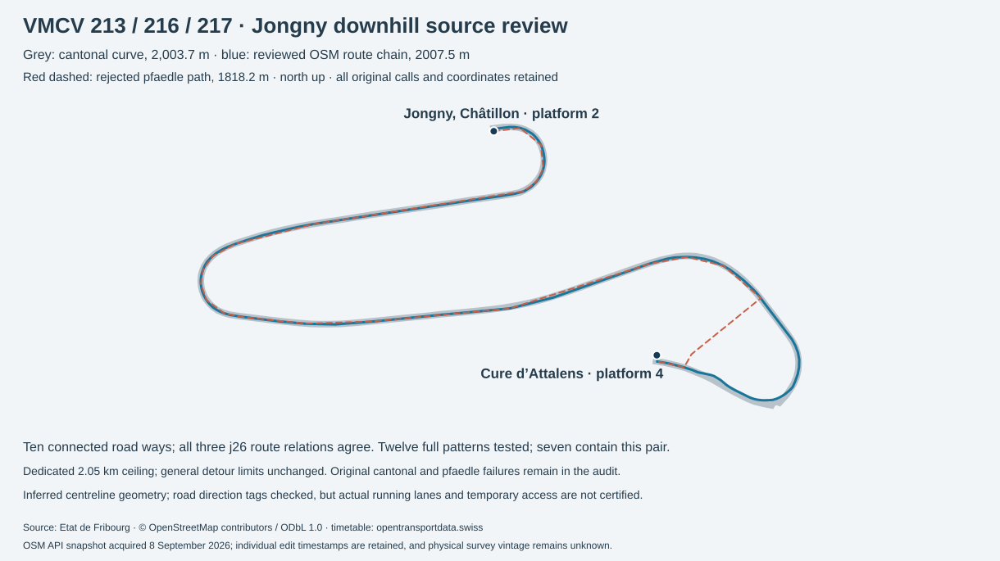
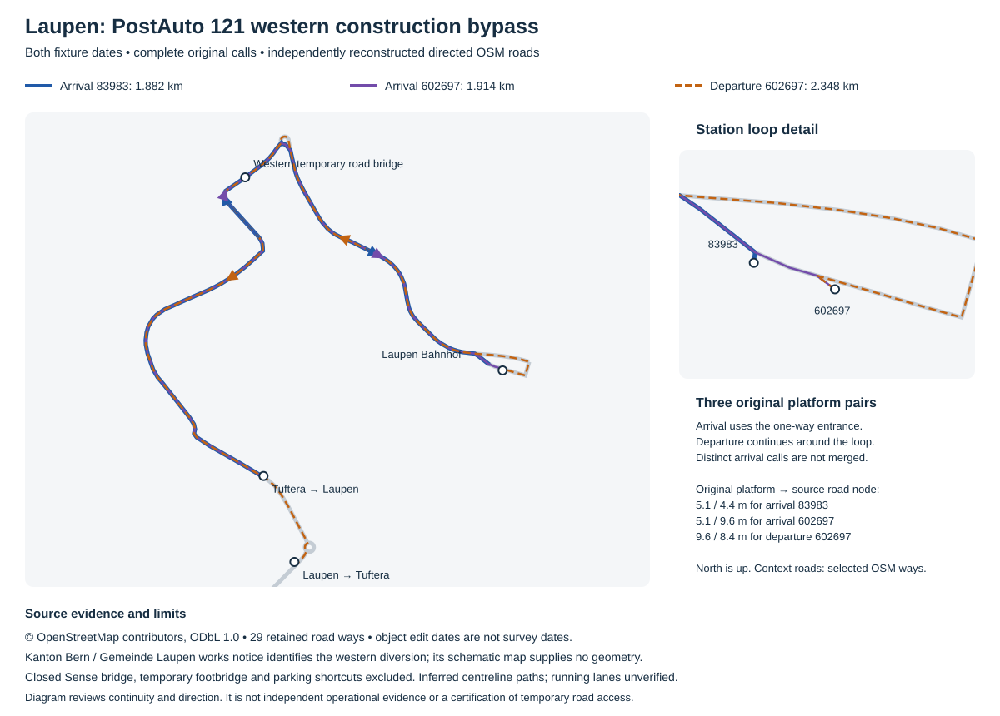
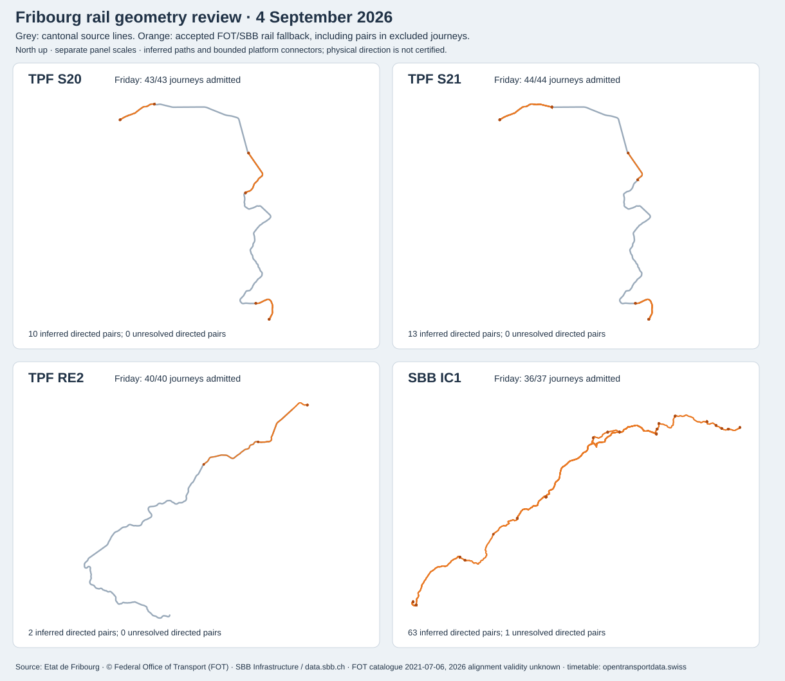
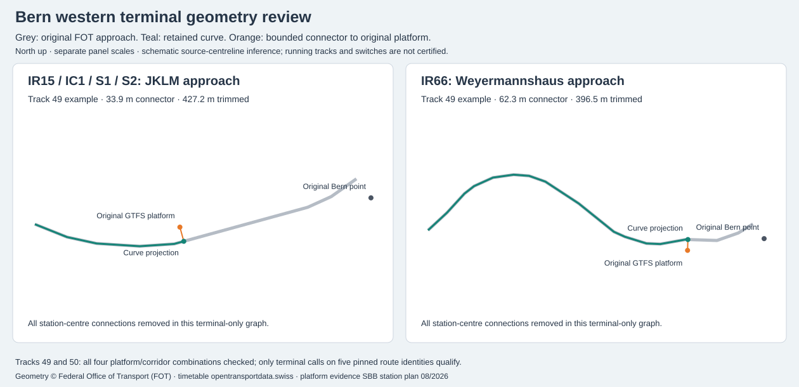
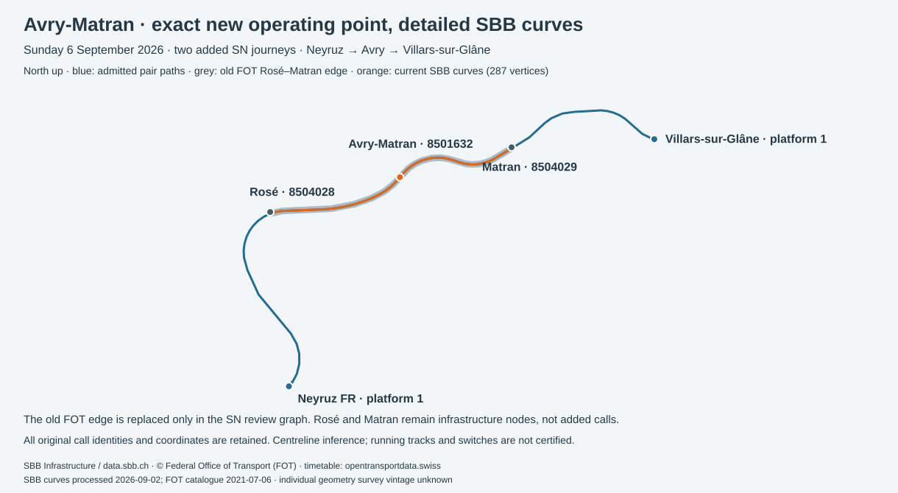

# Fribourg / Freiburg cantonal source study

Fixture audit: **8 September 2026**. Starting point: [Swiss transit source inventory](SWISS-TRANSIT-SOURCE-INVENTORY.md#fr).

The entire canton is inventoried against the pinned annual national GTFS: **207 route records, 17 agency identities and all seven districts**, including detached territories and complete out-of-canton journeys. The regional feed admits **5,508 Friday journeys and 3,763 Sunday journeys** with complete directed stop patterns from cantonal lines and explicitly tagged inferred OSM road and FOT/SBB rail fallback. This is partial geometry admission, not full service coverage. One route is a provisional geographic member because its sole in-canton platform is within a metre of the boundary; see below.

The [regional feed index](../data/fribourg-region/index.json) points to both civil-day manifests, twelve two-hour chunks per date, and 06:45–08:45 extracts. It uses the existing network snapshot format, **not a new GTFS ZIP**. It is saved under `data/` as a **local archival research artifact**. The exact matching cantonal OGD service explicitly permits attributed vector redistribution. Geometry vintage and physical direction remain unverified; this archival study is not added to public hosting or the application's study selector.

## Deliverables and scope

- [Every admitted, partly admitted, excluded and inactive route](FRIBOURG-ROUTE-INVENTORY.md); [machine-readable routes](../data/fribourg-audit/routes.json).
- [Source feature inventory](../data/fribourg-audit/source-lines.json): all 128 records, raw timetable fields, operator/line interpretation, source geometry size, candidate routes and routes retaining at least one admitted official segment.
- [Friday directed-pattern and pair audit](../data/fribourg-audit/2026-09-04.json), [Sunday audit](../data/fribourg-audit/2026-09-06.json), [summary](../data/fribourg-audit/summary.json), [in-canton stop records](../data/fribourg-audit/stops.json).
- [Acquisition evidence](../data/fribourg-sources/acquisition.json), [source dates/credits/terms](../data/fribourg-sources/sources.json), [reviewed mapping policy](../data/fribourg-policy.json).

Every annual trip with at least one original GTFS call coordinate inside the unsimplified swissBOUNDARIES3D Fribourg polygon contributes to membership. No operator whitelist, tariff-zone rectangle or geometry match selects the denominator. The census scans **34,499,152 national stop-time rows**; route membership includes inactive annual records. Full calls outside Fribourg are retained on the two validation dates. District route counts overlap because journeys can serve several districts.

| District | Called in-canton platforms (annual) | Annual routes | Routes admitting Friday trips | Routes admitting Sunday trips |
| --- | --- | --- | --- | --- |
| La Gruyère | 352 | 51 | 20 | 25 |
| Sense | 290 | 33 | 21 | 24 |
| La Glâne | 229 | 48 | 27 | 26 |
| See | 199 | 39 | 20 | 17 |
| La Veveyse | 127 | 22 | 15 | 13 |
| La Sarine | 600 | 83 | 42 | 55 |
| La Broye | 207 | 34 | 19 | 17 |

The source is the national fixed-stop timetable, not a verified census of every real-world service. School, seasonal, night, replacement bus, lake, funicular and cableway records present in the archive are included; services absent from that archive and GTFS-Flex service areas remain outside its evidence. Agency 3004 (Fribourg funicular) is present in the annual inventory but inactive on both fixture dates. This is not an assertion about its year-round operation.

### Boundary sensitivity

The canton and district polygons retain all rings and disconnected components. Source geometry is original LV95 XY; GTFS WGS84 points are classified using the repository's metre-level swisstopo approximation. Nine stop records within ten metres of the boundary are retained in the summary, on both sides, including parent records. **PostAuto 661 (`96-247-j26-1`) has only Sassel, Chapalettaz platform `ch:1:sloid:70404:0:710788` inside, at approximately 0.17 m from the polygon edge.** Its geographic membership remains excluded from feed admission even if road geometry is available, pending a higher-accuracy coordinate/boundary review. The other 206 route memberships have at least one platform beyond that uncertainty band. Route 661 is excluded from the geometry feed. The polygon is not buffered to hide this ambiguity.

## Friday and Sunday validation

Civil days are **Friday 4 September and Sunday 6 September 2026**, with calendar exceptions and preceding-service-day carry-in. Frequency templates are expanded according to GTFS `exact_times`; representative headway instances are counted separately from scheduled journeys. The same route, direction ID and **full ordered original platform IDs**, including repeats, define a directed pattern. Direction 0 and 1 are never merged or assumed to be simple reversals.

| Measure | Friday 2026-09-04 | Sunday 2026-09-06 |
| --- | --- | --- |
| Civil trip instances | 8,556 | 6,326 |
| Scheduled instances | 5,812 | 4,062 |
| Representative headway instances | 2,744 | 2,264 |
| Admitted instances before OSM fallback | 2,595 | 1,692 |
| Additional admitted instances from OSM fallback | 2,270 | 1,365 |
| Additional admitted instances from rail fallback including reviewed mappings | 643 | 706 |
| Admitted scheduled instances | 5,508 | 3,763 |
| Admitted headway instances | 0 | 0 |
| Directed patterns tested | 849 | 588 |
| Complete/admitted directed patterns | 727 | 507 |
| Matched unique directed route/platform pairs | 4,208 / 4,509 (93.3%) | 4,357 / 4,607 (94.6%) |
| Matched scheduled segment occurrences (before whole-pattern exclusion) | 87,462 / 89,328 (97.9%) | 60,722 / 62,231 (97.6%) |
| Matched occurrences including representative headways | 87,462 / 92,072 (95.0%) | 60,722 / 64,495 (94.1%) |
| Segment occurrences retained in admitted complete journeys | 84,587 | 58,879 |
| Inferred road occurrences retained in admitted journeys | 5,972 | 3,511 |
| Inferred rail occurrences retained in admitted journeys | 3,863 | 3,664 |
| Official-only matched directed pairs before OSM fallback | 3,350 / 4,509 | 3,424 / 4,607 |
| Carry-in instances / admitted | 97 / 93 | 179 / 159 |
| Night instances / admitted | 0 / 0 | 53 / 44 |
| Patterns revisiting platforms / admitted | 9 / 6 | 6 / 2 |

There are **327 shared patterns, 522 Friday-only patterns and 261 Sunday-only patterns**. These comparisons include failed and headway patterns. A matched segment in a failed journey contributes to source coverage, but that journey is excluded in full. Thus source-pair coverage must not be presented as the percentage of service admitted. Every segment actually emitted in the feed has geometry.

The Friday civil day ends before Friday-night departures after midnight; Sunday includes Saturday-night carry-in. Two September dates establish neither public-holiday nor winter/summer/year-round completeness. No authenticated realtime data or vehicle GPS positions are used.

## Source adapter and identity

The [cantonal ArcGIS layer](https://map.geo.fr.ch/arcgis/rest/services/PortailCarto/Theme_mobilite/MapServer/2) contains **128 lines**: bus and rail centrelines. Retrieval requests object IDs and a count independently, downloads explicit pages of 50 IDs in EPSG:2056, verifies every ID exactly once, rejects transfer-limit/error/invalid-coordinate responses and compares IDs again after acquisition. Original response bytes and SHA-256 hashes are retained; an ID-stable service is not an immutable historical snapshot. `OBJECTID` is used only within that hashed acquisition.

116 source records have a route-identity candidate; 115 support at least one admitted journey; 12 have no matched canton-serving route identity.

- `20.002` is timetable field 20.002. Its reviewed TPF bus interpretation maps to display line **2**, agency **834**; it is not parsed as a decimal passenger number. Prefixes 10, 20 and 30 are accepted only for reviewed bus records.
- TPF rail uses agency **53**, buses **834**; `Post Auto` and `Car Postal` map to **801**. SBB, BLS and MOB remain separate identities. Replacement agencies never inherit their parent brand's paths.
- Named night labels in `NOM_LIGNE` take priority: field 20.143 maps to **N1**, and the source's regionally typed field 20.463 maps to **N24**. Anonymous Noctambus records remain unresolved. Source field 20.922 links to PDF 30.922; the raw mismatch is retained, while its explicit **M22** label controls the candidate match.
- Features 43–45 say `Autre`. The preserved official 2026 timetable PDFs identify **VMCV 213, 216, 217 (agency 876)**. Feature 3's field 254 PDF identifies **TPF RE2/RE3**. Exceptions require the exact source number, name, enterprise and mode. PDF identity evidence does not extend the source geometry to missing termini such as Broc-Chocolaterie.
- Explicit rail labels such as S20/S21 and R8 are matched exactly. Generic IC/IR, RE or Regio fields and unlabelled MOB services do not become universal rail graphs. No global nearest-line match or cross-operator cantonal geometry borrowing is used. The road fallback below is separately attributed and binds to the original agency and complete route/platform patterns.

Graph vertices join at identical LV95 coordinates, with one disclosed precision repair: source feature 22 (TPF line 9) has two components ending **11.22 mm apart** near Charmettes. The adapter moves only the pinned first vertex of part 0 onto the original last vertex of part 2. The original geometry hash, both coordinates and vertex indices are asserted before applying it; original source bytes remain unchanged. This is **inferred topology**, not a surveyed connection. Every affected route journey carries a geometryInference marker. No general nearest-endpoint bridge or crossing-node inference is added. Ordered calls orient each inferred path along the undirected source centreline. Bus projection limit: **80 m**; rail: **120 m**. Paths exceeding the greater of **4.5× straight-line distance** or **1,200 m bus / 3,000 m rail** are rejected. An alternative source-part projection is considered only within **5 m** of the nearest gap after a topology/detour failure. Collapsed paths are rejected. Endpoint connectors are bounded projections, not observed vehicle tracks. Output uses the shared approximate LV95/WGS84 transform and seven-decimal coordinates without line simplification.

Road one-way legality, rail running-track choice, bridge/tunnel topology and temporary diversions are **not certified** by these undirected source records. Exact source topology prevents invented connections at visual crossings, but does not prove physical direction. Original repeated calls remain in each pattern. Reservation/on-demand pickup or drop-off excludes an entire journey; none is silently converted to an ordinary fixed departure.

GTFS times remain unchanged. Among admitted journeys there are **5,965 Friday and 4,599 Sunday zero-duration segments**, of which 5,961 / 4,599 exceed 100 m of source centreline. Minute-rounded equal timestamps are not instantaneous-speed measurements; a renderer may jump at those transitions. Maximum positive-duration implied speeds are 144.6 / 160.1 km/h across all admitted modes. These are source-time plausibility flags, not validated vehicle speeds. The rail follow-up rejects the approximately 41 km FOT alternative between Olten and Aarau; its 306.7 km/h implied maximum exposed a detour that the initial 4.5× guard would have accepted. Geometry admission does not certify travel-time precision. No travel-time smoothing or invented call times are applied.

## Admission and exclusions

| Agency ID | National feed identity | Annual route records | Friday admitted / all instances | Sunday admitted / all instances |
| --- | --- | --- | --- | --- |
| 11 | Schweizerische Bundesbahnen SBB | 23 | 334 / 334 | 334 / 334 |
| 33 | BLS AG (bls) | 8 | 443 / 443 | 384 / 384 |
| 53 | Transports publics fribourgeois | 14 | 170 / 265 | 243 / 280 |
| 64 | Montreux-Oberland Bernois | 6 | 0 / 50 | 0 / 50 |
| 182 | Bielersee-Schifffahrts-Gesellschaft AG | 1 | 0 / 2 | 0 / 2 |
| 189 | Lacs de Neuchâtel et Morat | 5 | 0 / 16 | 0 / 16 |
| 801 | PostAuto AG | 22 | 566 / 602 | 264 / 272 |
| 834 | Service d'automobiles TPF | 92 | 3,821 / 3,918 | 2,370 / 2,435 |
| 876 | Transports publics Vevey-Montreux-Chillon-Villeneuve | 3 | 148 / 148 | 115 / 115 |
| 3004 | Transports publics fribourgeois | 1 | 0 / 0 | 0 / 0 |
| 3005 | Kaisereggbahnen Schwarzsee AG | 1 | 0 / 1,020 | 0 / 1,080 |
| 3009 | Centre Touristique Moléson | 2 | 0 / 104 | 0 / 104 |
| 3258 | TéléCharmey SA | 1 | 0 / 1,620 | 0 / 1,080 |
| 7040 | Montreux-Oberland Bernois Ersatzverkehr | 1 | 0 / 0 | 4 / 9 |
| 7223 | Transports publics fribourgeois Ersatzverkehr | 5 | 2 / 2 | 10 / 10 |
| 7230 | BLS Netz AG Ersatzverkehr | 3 | 0 / 0 | 0 / 0 |
| 7231 | SBB Infrastruktur AG Bahnersatz | 19 | 24 / 32 | 39 / 155 |

| Route status across both dates | Records |
| --- | --- |
| All dated trips admitted | 118 |
| Inactive on both dates | 48 |
| Excluded | 20 |
| Partially admitted | 21 |

| Failed segment reason | Friday directed pairs / occurrences | Sunday directed pairs / occurrences |
| --- | --- | --- |
| collapsed-path | 3 / 32 | 1 / 16 |
| endpoint-gap | 22 / 133 | 9 / 61 |
| missing-line | 276 / 4,445 | 240 / 3,696 |

Failures remain route-scoped and directed. The machine audit names both original platforms and records projection gaps, detour lengths and fallback projection choices when available. `missing-line` means no verified source identity; it does not claim that a road or railway is absent. `endpoint-gap`, `disconnected-line`, `implausible-detour` and `collapsed-path` cause whole-pattern exclusion. Night, replacement, mountain and boat services are not silently dropped from the denominator. This adapter supplies no boat or mountain-mode geometry, and no rail geometry is repurposed for replacement buses.

### Geometry follow-up

Before the OSM supplement, the line 9 precision repair is evaluated against an unmodified-source baseline on each date. It adds **143 Friday / 151 Sunday complete journeys**, losing none. Source feature 22's affected route graphs admit 143 / 151 journeys after the repair; remaining extensions still fail the normal projection limits. The daily audit preserves baseline failed pairs and before/after counts.

The [reproducible topology diagnostic](../data/fribourg-audit/topology-followup.json) found a **9.024 m** break in line 1 (feature 128), a **561.161 m** component separation in line 2 (feature 16), and three components in S20/S21 (feature 10), with nearest separations of 0.026 m and 0.040 m. These remain unchanged: the bus breaks exceed the precision-repair limit, and the rail junction needs a separate topology review. Rail station/terminal projection failures also remain. The later road supplement can cover bus source gaps using actual inferred road paths; it does not alter these original source geometries.

### Complete bus-pattern road supplement

The [road adapter](../scripts/fribourg-road-geometry.mjs) prepares all **614 distinct full bus patterns** across both civil days and six active bus agency identities: TPF, PostAuto, VMCV and the three active replacement operators. Inactive annual agencies remain in the canton census. All source calls, out-of-canton termini, repeated platforms, short branches and night patterns are retained. Routing-only carry-in timestamps are shifted by whole days to satisfy GTFS input constraints; delivered timestamps are unchanged.

The matcher uses the pinned Geofabrik Switzerland **2 September 2026** road extract plus the **8 September 2026** border extract, SHA-256 **d5c675456e935cfbcab88fe894fe9145dc5bd1fbd4318cea30ffd838a9aad02b**, and pfaedle commit **99f2cd466696ecc6bdb73b2b3bb9008557fcb84a**. The copied configuration, binary hash, routing inputs, shapes, trips, stop times, complete warning logs and run hashes are retained in [road evidence](../data/fribourg-road-evidence). The checker reimports those outputs and verifies emitted pfaedle segments against them. The separately hashed Mont-Carmel, Jongny and Laupen reviews below reconstruct their source paths directly from retained OSM XML; rejected pfaedle geometry remains excluded.

A failed cantonal pair receives a road path only when **every complete pattern context containing the same agency/route/directed-platform pair has a valid, identical path**. A successful context cannot hide a failed context. Differing branch paths remain rejected; no context exception is added. Source-matched pairs retain their original paths. Explicit pfaedle fallback hops are rejected even if the matcher writes a straight segment. Monotone shape-distance slicing preserves direction and loops. Road projection is limited to 120 m; simplification is 5 m, followed by the stricter final detour guard of max(600 m, 3 × direct distance). These tolerances apply to inferred roads, separately from the cantonal 80 m bus projection guard.

| Measure | Friday | Sunday |
| --- | --- | --- |
| All bus instances | 4,702 | 2,996 |
| Admitted bus instances | 4,561 | 2,802 |
| Additional admitted journeys | 2,270 | 1,365 |
| Road-backed directed pairs | 540 | 515 |
| Lost previously admitted journeys | 0 | 0 |
| road-excessive-detour — remaining directed pairs | 7 | 7 |
| road-matcher-rejected — remaining directed pairs | 1 | 3 |
| road-pattern-dependent-path — remaining directed pairs | 18 | 12 |

The original cantonal failure is preserved as officialFailure and the road assessment records all contributing full pattern IDs. Journeys record their inferred segment count and geometry source. Reservation/on-demand calls, GTFS demand-responsive type 715 and provisional boundary route 661 remain excluded. The OSM profile uses bus/PSV access and direction tags with penalties; **it does not enforce an absolute one-way prohibition**. Physical legality, temporary restrictions and actual operator routing remain unverified. Complete directed stop matching is not a claim of certified road direction.



The four updated urban panels and the Mont-Carmel terminal diagram were rendered and visually inspected for continuity, direction arrows, original endpoints and source/fallback separation; they are not independent operator evidence. Both dates and all other bus patterns are covered by the automated full-sequence and retained-output checks. The Mont-Carmel review below resolves the remaining TPF 3 terminal pair. The Jongny review below also resolves the remaining VMCV 213/216/217 gaps. The Laupen review below resolves PostAuto 121; remaining larger exclusion groups include Sunday replacement patterns; every failed pair and trip count remains in the machine audit.

### Mont-Carmel: directed terminal review for TPF 3

The original final pair `ch:1:sloid:87238:0:15107 → ch:1:sloid:87238:0:15108` has two distinct Mont-Carmel platforms. The cantonal source misses an endpoint by 212.1 m, and pfaedle rejects the final hop in both contributing full patterns. Neither original failure is erased or converted into a straight line. The [review policy](../data/fribourg-mont-carmel-policy.json) inventories all **4 complete route-3 patterns**, including the two unaffected reverse patterns. Only the final directed pair in the two contributing patterns can receive the new source-backed path; earlier, repeated, intermediate or changed platform contexts fail review.

The [retained OSM API response](../data/fribourg-mont-carmel-sources/map.osm.gz) supplies three connected road ways, their original node identities and all 10 turn restrictions returned for the bounding box. The accepted **132.7 m** path follows one-way approach **1097802067**, the forward arc of roundabout **55700630**, then one-way exit **1095950865**. All three are tagged with trolley wires. The adapter rejects changed direction, missing shared nodes, conditional or restricted access, absent trolley wires and any returned restriction touching the selected ways or nodes. Exact source stop-position nodes have UIC 8587238; their connectors to the untouched GTFS platform coordinates measure **5.5 / 4.6 m**, within a dedicated 15 m limit. No duplicate-name call is collapsed.

The [TPF operator page](https://www.tpf.ch/fr/horaires-et-reseaux/horaire-par-reseaux/agglo), retained with its hash, identifies line 3 as Mont-Carmel–Charmettes for the timetable starting 14 December 2025. Four OSM route relations support the arrival/departure stop identities, but their **j23 GTFS references are historical** and do not prove current operations or the turnaround. The [26 May 2026 municipal notice](https://www.givisiez.ch/article/deplacement-provisoire-de-larret-de-bus-mont-carmel-26052026) concerns a temporary stop displacement towards Belfaux; it is retained as context and does not authorize changing the original GTFS coordinates. The inferred terminal movement is not an operator-certified manoeuvre or assurance of temporary road access. OSM edit timestamps are not survey dates.

| Directed OSM way | Version | Object edited |
| --- | --- | --- |
| 1097802067 | 4 | 2026-01-28T08:57:25Z |
| 55700630 | 14 | 2026-01-28T08:57:25Z |
| 1095950865 | 4 | 2026-01-28T08:57:25Z |

The [complete terminal audit](../data/fribourg-audit/mont-carmel.json) retains the raw-source hashes, source dates, selected node chain, all restriction records, original failures and full contributing patterns. The two dated feeds add **74 Friday / 72 Sunday journeys**; TPF 3 now admits **147/147 and 143/143**. Every affected timetable journey keeps both terminal calls and their original 60-second interval, with a `mont-carmel-terminal` road-review marker. At commit 102d51f, the [Mont-Carmel regression checkpoint](../data/fribourg-audit/mont-carmel-regression.json), against **abd1fd8**, proved all **8,915 previous journeys and 138,707 segment occurrences** retain identical calls, coordinates, permissions, times, directions and geometry.



### Jongny: independently corroborated VMCV road chain

VMCV **213, 216 and 217** share one failed downhill pair: **Jongny, Châtillon platform 2 → Corsier-Vevey, Cure d’Attalens platform 4**, exact original IDs `ch:1:sloid:4959:0:2 → ch:1:sloid:4963:0:4`. The stops are 420.8 m apart. Each original cantonal curve measures approximately **2,003.7 m**, beyond its 4.5× detour guard. All seven pfaedle contexts produced the same shorter **1,818.2 m** path, still beyond the separate 3× road guard. Both original failures remain retained; neither general threshold changes.

The [hashed review policy](../data/fribourg-jongny-policy.json) admits a separately reconstructed **2007.5 m** source path, with a dedicated **2,050 m maximum**, only for the three exact directed route/platform pairs. Ten connected OSM road sections appear in the same order in all three independently read route relations: **8291117 (213), 8291116 (216), 12495927 (217)**. Each names its exact **j26 GTFS route**, VMCV operator, Vevey destination and the two consecutive source stop nodes. The adapter checks shared nodes, forward travel on one-way roads and the roundabout, ordinary vehicle access and all restrictions returned in the bounding box. This snapshot returns no restriction relations; that is bounded source evidence, not a guarantee that restrictions do not exist. Unknown conditional access, a conflicting relation sequence or an out-of-order called stop prevents admission.

Exact UIC numbers **8504959 / 8504963**, names, route memberships and bounded platform attachments (**3.5 / 9.6 m**, maximum 15 m) connect the original calls to source nodes. The complete **12 full route patterns** remain in the policy; all seven contributing contexts must agree. Reverse patterns and previously accepted pairs receive no change. The original pfaedle path remains excluded: its shorter alignment cuts part of the detailed source route.

An independent diagnostic reconstruction of cantonal features **43/44/45** corroborates the longer path. The diagnostic permits a 5× ratio solely to retrieve the rejected source curves for comparison; it cannot admit them. Maximum vertex-to-other-polyline distances in both directions must remain below **10 m**. This check compares original vertices, not surveyed running lanes or continuous physical accuracy.

| Cantonal source | Original length | Cantonal vertices → OSM curve | OSM vertices → cantonal curve |
| --- | --- | --- | --- |
| 43 | 2003.7 m | 8.2 m | 7.1 m |
| 44 | 2003.7 m | 8.2 m | 7.1 m |
| 45 | 2003.7 m | 8.2 m | 7.1 m |

The [official VMCV 2026 network plan](../data/fribourg-jongny-sources/vmcv-network-2026.pdf), valid **14 December 2025–12 December 2026**, was visually inspected. It supports the three line identities and consecutive stop relationship; no schematic geometry is extracted. The operator’s individual line-213 webpage returned HTTP 403 on direct acquisition and is recorded as unused. Source object edits span **2021–2026** and do not establish physical survey dates. Every exact version and timestamp is retained in the [source and full-pattern audit](../data/fribourg-audit/jongny.json). The reviewed path remains inferred centreline geometry, not operator-certified running lanes or temporary access.

The change adds **74 Friday / 57 Sunday journeys**: 213 adds **36 / 21**, 216 adds **19 / 16**, and 217 adds **19 / 20**. All three routes now admit every dated journey: **73/73, 37/37, 38/38 Friday; 42/42, 33/33, 40/40 Sunday**. Original call intervals remain 120 or 180 seconds on Friday and 120 seconds on Sunday, with explicit `jongny-route-chain` markers. At commit 71f8a5e, the [Jongny regression checkpoint](../data/fribourg-audit/jongny-regression.json), against **102d51f**, preserves all **9,061 previous journeys and 140,383 segment occurrences**, including identical call identities, coordinates, permissions, times, directions and geometry.



### Laupen: dated western construction bypass for PostAuto 121

All **59 Friday / 20 Sunday** PostAuto 121 journeys originally failed a station pair. The [official construction notice](../data/fribourg-laupen-sources/sense-bridge-works-2025.pdf), page 4, explicitly assigns route 121 and its Cholholz shuttle to **Bauumfahrung West**. The [24 August 2026 update](../data/fribourg-laupen-sources/sense-bridge-update-2026.html) confirms bridge construction during September–December 2026 and planned reopening in summer 2027. The [project corridor description](../data/fribourg-laupen-sources/western-bypass.html) also identifies the temporary Industriestrasse stop. These establish the diversion corridor; their schematic maps provide no geometry.

The [hashed policy](../data/fribourg-laupen-policy.json) and [complete audit](../data/fribourg-audit/laupen.json) retain **29 detailed OSM road ways**, three exact directed platform pairs and all **six full route patterns**. Arrival follows Industriestrasse and the full western bypass to the station's one-way entrance. Departure continues forward around the station loop, returns over the full western bypass and reaches the distinct southbound Tuftera platform through its roundabout. It is not a reversal of the arrival path. Every selected source-node join is exact; one-way roads and roundabouts require forward traversal. Construction roads, parking aisles, conditional/restricted access, barriers and touching returned turn restrictions fail review. This bounding-box response returns zero restriction relations; it does not prove that no restrictions exist.

| Original directed platform pair | Source-backed path | Original platform attachments | Full contexts |
| --- | --- | --- | --- |
| 323303 → 83983 | 1881.6 m | 5.1 / 4.4 m | 2 |
| 323303 → 602697 | 1913.9 m | 5.1 / 9.6 m | 1 |
| 602697 → 65751 | 2348.4 m | 9.6 / 8.4 m | 3 |

Original GTFS station platforms **83983 and 602697** remain separate, with UIC 8570555 OSM stop-position evidence. Tuftera's original calls retain their coordinates and attach to reviewed road nodes within the fixed **15 m** limit. Platform-to-road assignment is inference, not a surveyed platform equivalence. No current OSM bus-121 relation was returned. The independently documented corridor supports the specific **2.0 km arrival / 2.5 km departure ceilings**; general road and cantonal detour guards are unchanged, and both original failures remain in the audit. The original Sense bridge, temporary footbridge and residential shortcuts outside the full western bypass remain excluded.

Two road ways and four nodes were edited on **7 September 2026**, after both fixture dates. The decoder restores their preceding versions from separately retained OSM way records and complete node histories, including two nodes removed from the later way sequences. It checks that all selected road/node versions predate 4 September and that the replaced versions remain valid through 6 September. All six restorations retain selected versions, available current records and next-edit timestamps; complete histories retain the subsequent deletion records for removed nodes. This establishes source-version chronology, not physical survey vintage; the remaining source-object dates and every original response hash are retained.

The [29 May station-access notice](../data/fribourg-laupen-sources/station-entrance-works-2026.html) schedules a full entrance closure and temporary PostAuto stops for **3–14 August**, outside these fixtures, while Neueneggstrasse works continue. No altered stop coordinates or assumed temporary traffic scheme are introduced. This review is restricted to **4 and 6 September 2026** and does not certify that announced construction dates remained unchanged or that the inferred centreline is the operator's exact running lane.

The feed now admits **59/59 Friday and 20/20 Sunday** route-121 journeys, all carrying `laupen-western-bypass` markers and retaining their original four- or five-minute station-pair intervals. The [current regression checkpoint](../data/fribourg-audit/laupen-regression.json), against **71f8a5e**, preserves all **9,192 previously admitted journeys and 142,875 segment occurrences**, including original platform identities, coordinates, permissions, times, directions and paths. The source PDF and the directed geometry diagram were rendered and visually inspected.




## Federal railway supplement and dated works review

The [rail adapter](../scripts/fribourg-rail-geometry.mjs) tests **412 full directed patterns across 35 annual route identities**: SBB, BLS and explicitly reviewed TPF S20/S21/RE2/RE3. The [complete input call chains](../data/fribourg-rail-inputs.json), [pattern results](../data/fribourg-audit/rail-patterns.json) and [all 3424 source segment assessments](../data/fribourg-audit/rail-source-segments.json) are retained. Metre-gauge TPF and MOB, gauge-changing GPX and unreviewed TPF special services remain outside this supplement.

The pinned [FOT railway network](https://data.geo.admin.ch/ch.bav.schienennetz/schienennetz/schienennetz_2056_de.xtf) has **3210 operating-point nodes and 3424 infrastructure segments**. Exact operating-point identifiers attach original GTFS platforms within 350 m. No nearest-name station substitute or general platform override is allowed; the hashed Kerzers mappings and Bern western-terminal clipping described below are explicit exceptions. Infrastructure attachments must be within 120 m; source gauge must include 1435 mm and source validity fields must permit both dates. FOT geometry is simplified by 5 m; the reviewed SBB curve retains all 44 input vertices before output-coordinate rounding. The Fribourg supplement rejects paths above max(3,000 m, **2.5 × direct distance**); the stricter guard rejects the implausible approximately 41 km Olten–Aarau alternative. The later reviewed SBB Däniken curve supplies the missing permitted-gauge connection without changing the rejected FOT record.

All full pattern contexts must agree on the same directed source segment chain and path. Other called operating points are blocked when routing an intervening pair, preventing out-of-order shortcuts. Every previously accepted cantonal path is retained. The original failure, directed infrastructure IDs, attachment distances, contributing pattern IDs and resulting geometry hash accompany each inferred pair. A single remaining failure excludes the complete journey. Journeys tag their inferred rail segment count, and the checker reproduces every emitted path from the pinned XTF and, for the reviewed Däniken connection, the retained SBB curve.

| Measure | Friday | Sunday |
| --- | --- | --- |
| All rail instances | 1,092 | 1,048 |
| Admitted rail instances | 947 | 961 |
| Additional admitted journeys from rail fallback including review | 643 | 706 |
| FOT-backed directed pairs | 318 | 418 |
| Lost previously admitted journeys | 0 | 0 |

The [TPF 2026 standard-gauge network statement, version 3.5](../data/fribourg-rail-sources/tpf-network-statement-2026-vn.pdf), dated **1 January 2026**, identifies Fribourg–Morat–Anet and Broc-Chocolaterie–Romont as its normal-gauge network; section 3.5.2 specifies 1435 mm. This supports route gauge review, not a claim that old FOT alignments reflect every rebuilt section. Catalogue date **6 July 2021** and asset update **18 January 2025** remain explicit; September 2026 alignment validity is unknown. Running track, signal direction and actual train paths remain inferred.

TPF's [La Verrerie–Vaulruz-Sud works notice](https://www.tpf.ch/fr/horaires-et-reseaux/perturbations-et-travaux/travaux-sur-le-troncon-ferroviaire-la-verrerie-vaulruz-sud) reports metre-gauge rebuilding during 2025–2027 and **no S50/S51 rail service between Bulle and Semsales after 21:00 on Sunday 6 September 2026**. The [reproducible works audit](../data/fribourg-audit/works.json) retains complete S50/S51 calls from both dates. It finds **48 corridor segment occurrences on 12 Friday trains, and 0 on Sunday**, in the same 21:00–24:00 window. The builder fails if Sunday calls contradict the notice. This is one dated consistency check, not a comprehensive diversion census; replacement bus geometry remains independently assessed by the road adapter. No new FOT paths are admitted on the altered metre-gauge corridor.

The current SBB Avry-Matran supplement resolves the remaining Sunday SN failures. Remaining rail exclusions include most TPF S50/S51, unlabelled TPF special journeys and all MOB/GPX journeys. The route inventory records exact dated counts rather than treating an admitted route label as proof of every branch.



The S20, S21, RE2 and IC1 panels were rendered and visually inspected for continuity and source/fallback extent. They show accepted pairs even when another pair excludes the full journey; the graphic is not independent operational evidence.

### Kerzers and Däniken review

The [review policy](../data/fribourg-rail-review-policy.json), [source snapshots](../data/fribourg-rail-review-sources/sources.json) and [complete review audit](../data/fribourg-audit/rail-review.json) pin two independent corrections. Every originally accepted path remains unchanged. The review retains **53 full directed patterns** for IR66 and IC1, including contexts that still fail; all contexts must agree before a directed pair is reused. At commit 007a946 this review added **26 Friday / 25 Sunday journeys** beyond the original FOT supplement; the following Bern review extends admission further.

- **Kerzers:** the [BLS platform table](../data/fribourg-rail-review-sources/bls-platforms-2026.pdf), state 28 May 2026 and valid from 6 June 2026, assigns physical tracks 4 and 6 to the Bern–Neuchâtel line. The [official station plan](../data/fribourg-rail-review-sources/bls-kerzers.svg), version 1.0 dated 9 March 2023, places those tracks on the western branch, separately from tracks 1 and 3. Only IR66 calls at original platforms `ch:1:sloid:4400:2:4` and `ch:1:sloid:4400:3:6` map to the existing FOT **Kerzers BLS operating point 8516192**. GTFS station identity 8504400, original call IDs, coordinates and times remain intact. Unknown platforms and other routes do not inherit the exception. No connection is invented across the two railway branches. That checkpoint admitted **23/40 Friday and 22/38 Sunday** IR66 journeys; the remaining Bern 49/50 terminal failures are resolved by the separate review below.
- **Däniken:** the original FOT segment `ch14uvag00087837` remains rejected with its raw **mm1000** attribute. The independently published [SBB line geometry query](https://data.sbb.ch/api/explore/v2.1/catalog/datasets/linie-mit-polygon/records?where=search%28%22D%C3%A4niken%22%29&limit=100) returns 21 records. Only line **540**, operating points **DK → DKO**, km positions **45673.43 → 46100**, contributes its **44 original vertices** and **N (normal-gauge)** classification. The other 20 query results are inventoried and excluded. Exact named endpoint nodes and bounded attachments (9.6 / 10.0 m) bind the curve to the FOT graph; no global gauge relabelling occurs. The review is restricted to IC1 and restores three Olten–Aarau journeys per date within the unchanged 2.5× detour guard.

The BLS table and station plan were visually inspected. The source records, rejected primary rail assessment, reviewed platform IDs or SBB segment identity, full pattern IDs and path hashes remain in the pair audit. Affected journeys carry explicit `railReviewKinds` markers. SBB metadata reports processing on **2026-09-02T03:01:34+00:00** and modification on **2026-07-29T06:16:28+00:00**; neither proves feature survey vintage or a specific train's running track. Geometry credits now include **SBB Infrastructure / data.sbb.ch**, with attribution-required commercial and noncommercial reuse terms preserved. BLS documents are supporting platform evidence rather than a geometry licence.

### Bern western-terminal review

The [August 2026 SBB station plan](../data/fribourg-bern-platform-sources/sbb-bern-plan-2026-08.pdf), exterior plan on page 3, locates tracks **49/50 at the western end** of Bern. Their exact GTFS coordinates are 446.0 / 427.8 m from the FOT station point, beyond the unchanged 350 m guard. The [hashed review policy](../data/fribourg-bern-platform-policy.json) covers only the two original platform IDs, five route identities (IR15, IC1, S1, S2 and IR66), and a **single Bern call at the start or end of the complete journey**. Intermediate, repeated or unknown Bern platform calls receive no exception.

Each eligible platform projects onto one explicitly pinned FOT western approach: Bern–JKLM for IR15/IC1/S1/S2, or Bern–Weyermannshaus for IR66. Projection is limited to **75 m**, and the clipped source length to **200–600 m**. The local graph replaces the Bern station point with the projection, retaining operating-point identity 8507000, clips only the selected approach, and removes **all four original station-centre connections**. This prevents an inferred movement back through the station centre or an invented link to an eastern approach. The original graph, GTFS call coordinates and source bytes remain unchanged. Standard gauge, source validity, the 350 m station / 120 m topology limits and the 2.5× detour guard still apply. The already reviewed Kerzers mapping composes with the IR66 terminal graph.

| FOT approach | Track | Platform-to-curve connector | Source curve trimmed |
| --- | --- | --- | --- |
| ch14uvag00087328 | 49 | 33.9 m | 427.2 m |
| ch14uvag00087328 | 50 | 38.6 m | 408.2 m |
| ch14uvag00087196 | 50 | 52.2 m | 379.8 m |
| ch14uvag00087196 | 49 | 62.3 m | 396.5 m |

The [full-pattern audit](../data/fribourg-audit/bern-platforms.json) retains 156 complete directed pattern contexts, all projections, original station/segment identities and prior rail failures. It adds **20 Friday and 20 Sunday journeys**. IR66 now admits **40/40 and 38/38** dated journeys; all dated IR15, IC1, S1 and S2 journeys also have complete geometry. Every added journey carries the `bern-western-terminal` review marker. This remains centreline inference, not a surveyed running track or switch route.

At commit fab6dd9, the Bern review preserved all **8,873 previously admitted journeys and 138,361 segment occurrences**, with all 40 additions carrying the Bern terminal marker. The current regression checkpoint below covers the subsequent Avry review. The SBB plan and the derived clipping diagram were visually inspected. The separate SBB station-description page returned HTTP 403 on direct acquisition and is explicitly unused as retained evidence.



## Avry-Matran: current SBB operating point and curves

The pinned 2021 FOT graph predates operating point **8501632, Avry-Matran**. The canton’s [12 November 2025 announcement](https://www.fr.ch/dime/actualites/gare-routiere-et-parc-relais-a-la-future-halte-ferroviaire-davry-matran) schedules opening on **14 December 2025**. Current SBB platform records explicitly identify **AVRY / 8501632**, line 250, platforms 1 and 2; both original GTFS platform coordinates agree within 15 m. Current SBB traffic-count records independently supply the same exact operating-point number, name and coordinate in every occurrence. Their two-point links are **excluded as route geometry**.

The [hashed policy and source manifest](../data/fribourg-avry-policy.json) restrict this correction to SBB SN route `91-2B-Y-j26-1`. Its local graph replaces the old FOT Rosé–Matran edge with the two detailed, normal-gauge SBB curves below, joined at the new exact Avry node. The original FOT graph and all previously accepted paths remain unchanged. Every original call and direction is retained; all **3 complete SN patterns** are tested together, including patterns that do not need the correction. The full two-date validation adds **zero Friday / two Sunday journeys** and two previously missing directed pairs, Neyruz → Avry and Avry → Villars-sur-Glâne. Both additions run early on Sunday (source service date 6 September); their original service dates remain in the feed. Synthetic reverse-pattern tests also pass; these do not imply a dated reverse service exists.

| Detailed SBB feature (line / from / to / km) | Original vertices | Exact node attachment distances |
| --- | --- | --- |
| 250 / ROS / AVRY / 57535.35 / 59039 | 152 | 16.7 m / 0.0 m |
| 250 / AVRY / MTR / 59039 / 60377 | 135 | 0.0 m / 10.0 m |

The [full review audit](../data/fribourg-audit/avry.json) inventories all two curve records, two platform records and eight traffic-count records, with source URLs, hashes, retrieval timestamps, processing dates, reuse terms, complete patterns and original failures. The 350 m station, 120 m topology and 2.5× detour guards remain unchanged; traversal through another called station out of order is rejected. No curve is enabled before 14 December 2025. Source processing timestamps do not certify survey vintage, platform-specific running tracks or switches.

At commit abd1fd8, the [Avry regression checkpoint](../data/fribourg-audit/rail-review-regression.json) compared against **fab6dd9**: all **8,913 previously admitted journeys and 138,673 segment occurrences** retain identical original calls, coordinates, permissions, times, directions and geometry. Only the two Sunday additions at that checkpoint carried new `sbb-avry-operating-point` evidence. All dated SBB and BLS rail journeys are now admitted; this does not establish completeness for inactive or untested seasonal dates.



## Dates, reuse and attribution

| Source | Pinned date / vintage | Attribution / reuse |
| --- | --- | --- |
| National GTFS | Feed 20260902; valid 2025-12-14–2026-12-12 | opentransportdata.swiss; processed by Gleislicht; platform terms, not an assigned CC licence |
| Fribourg line layer | 2026-09-08T18:02:36.135027+00:00; actual geometry vintage unknown | Source: Etat de Fribourg; free use, sharing and reuse under dataset OGD terms |
| Embedded Esri metadata | Created 2022-07-14 | Metadata creation, not geometry vintage |
| OGD catalogue item | Created 2024-09-20T13:26:30.775000+00:00; modified 2026-07-08T14:41:59.462000+00:00 | Catalogue timestamps, not geometry vintage |
| OSM road supplement | Swiss extract 2026-09-02; border retrieved 2026-09-08 | © OpenStreetMap contributors; ODbL 1.0; inferred geometry database |
| Mont-Carmel road topology | OSM API acquired 2026-09-08; three ways edited 2026-01-28; survey vintage unknown | © OpenStreetMap contributors; ODbL 1.0 |
| Mont-Carmel operator / works evidence | TPF timetable from 2025-12-14; municipal notice 2026-05-26 | TPF / Commune de Givisiez; supporting identity and works evidence |
| Jongny road / route relations | OSM API acquired 2026-09-08; individual way edits 2021–2026; survey vintage unknown | © OpenStreetMap contributors; ODbL 1.0 |
| Laupen OSM roads and object histories | Acquired September 2026; pre-fixture versions restored for two ways and four nodes edited 7 September; survey vintage unknown | © OpenStreetMap contributors; ODbL 1.0 |
| Laupen construction evidence | PDF filename 2025-07-30 (publication timestamp unverified); updates 2026-05-29 / 2026-08-24; undated corridor page | Kanton Bern / Gemeinde Laupen; supporting corridor/date evidence only |
| VMCV network-plan evidence | Valid 2025-12-14–2026-12-12 | VMCV; schematic identity evidence only |
| SBB reviewed Däniken curve | 2026-09-02T03:01:34+00:00; individual survey vintage unknown | SBB Infrastructure / data.sbb.ch; terms_by, reference required |
| Avry SBB linie-mit-polygon | Processed 2026-09-02T03:01:34+00:00; modified 2026-07-29T06:16:28+00:00; survey vintage unknown | SBB Infrastructure / data.sbb.ch; terms_by, reference required |
| Avry SBB perron | Processed 2026-09-01T22:03:57+00:00; modified 2026-09-01T22:03:57+00:00; survey vintage unknown | SBB Infrastructure / data.sbb.ch; terms_by, reference required |
| Avry SBB zugzahlen | Processed 2026-03-19T19:12:20+00:00; modified 2026-02-23T15:08:04+00:00; survey vintage unknown | SBB Infrastructure / data.sbb.ch; terms_by, reference required |
| Avry opening notice | Published 2025-11-12; announced opening 2025-12-14 | Source: Etat de Fribourg; temporal evidence only |
| Bern platform evidence | SBB station plan 08/2026; acquired September 2026 | SBB / OpenStreetMap; identity and extent evidence, no map geometry extracted |
| BLS Kerzers platform evidence | Table state 2026-05-28, valid 2026-06-06; plan state 2023-03-09 | BLS Netz AG; supporting identity evidence |
| FOT railway network | 2021-07-06T00:00:00Z; asset updated 2025-01-18T04:23:13.735821Z; 2026 alignment validity unknown | © Federal Office of Transport (FOT); attribution-required OGD terms |
| TPF gauge / works evidence | Network statement 2026 v3.5 (2026-01-01); works page retrieved September 2026 | TPF; supporting documents, not geometry licences |
| swissBOUNDARIES3D | 2026-01; original canton and seven district polygons | © swisstopo; free geodata terms |
| timetable-10.213.pdf | Timetable 2026; state 2025-12-19 | Official tp-info / oev-info timetable; identity evidence only |
| timetable-10.216.pdf | Timetable 2026; state 2025-12-19 | Official tp-info / oev-info timetable; identity evidence only |
| timetable-10.217.pdf | Timetable 2026; state 2026-05-28 | Official tp-info / oev-info timetable; identity evidence only |
| timetable-254.pdf | Timetable 2026; state 2025-09-25 | Official tp-info / oev-info timetable; identity evidence only |

GTFS SHA-256: `d325fd0954a91ac50005ad53db1976b8e528ebb1c388e4e8fd5a4415e4139a1e`. Decoded source snapshot: `e8523af34fcedca7f8b0cbe495446ff93a75d8563c62b243da942c39c5243f47`. The acquisition and feed metadata retain every raw-response hash, URL and UTC retrieval timestamp. Mutable PDF URLs and live ArcGIS responses are not claimed to be permanent release URLs. Refreshing either source requires a new census, mapping review and both full directed-pattern validations.

The [dataset catalogue item](https://maps.fr.ch/portal/sharing/rest/content/items/518a09fdd5874b76b6eacfb0fe2bb8ec?f=pjson) explicitly permits free use, sharing and reuse with **Source: Etat de Fribourg** attribution. Its title incorrectly says stops, but its service URL and serviceItemId identify the service containing [polyline layer 1](https://maps.fr.ch/ags/rest/services/OpenData/Lignes_de_transport_public/FeatureServer/1). An independent complete query matches **all 128 geometries, vertex-for-vertex, and every original attribute** to the original MapServer snapshot; the OGD response adds the numeric TYPE_LIGNE field. The reproduction checks reject changed terms, missing/duplicate features, altered identities and even millimetre coordinate changes. Both raw snapshots and the catalogue/service metadata are preserved. **The vector reuse question is resolved**, without assigning a Creative Commons licence or relying on an uncertain ordinance product mapping.

The earlier [portal terms](https://map.geo.fr.ch/help/fr/conditions_utilisation.htm) and [geoinformation ordinance](https://bdlf.fr.ch/api/fr/versions/8468/pdf_file_with_annexes) remain supporting evidence. The linked [geocat record](https://www.geocat.ch/geonetwork/srv/fre/catalog.search#/metadata/d578f90c-348f-41de-80be-4385a57605b9) did not yield XML during the follow-up (HTTP 403/500 or a login page). Neither service declares a geometry update date; the OGD catalogue's July 2026 modification timestamp must not be presented as line vintage.

Timetable reuse follows the [national platform terms](https://opentransportdata.swiss/en/terms-of-use/); boundary reuse follows [swisstopo's terms](https://www.swisstopo.admin.ch/en/terms-of-use-free-geodata-and-geoservices). The [OSM copyright terms](https://www.openstreetmap.org/copyright) require attribution and ODbL share-alike for derived data. The combined derived geometry database is offered under [ODbL 1.0](https://opendatacommons.org/licenses/odbl/1-0/), with the full derived road cache retained; this does not relabel the separate timetable or boundary sources. FOT reuse follows its linked [attribution-required OGD terms](https://opendata.swiss/terms-of-use/#terms_by); the catalogue's literal proprietary licence field is preserved separately, without inventing a CC licence. These credits are distinct and are embedded in both manifests and the feed's source record. No live-service accuracy or real-time position claim is made.

## Reproduction and checks

From the repository root (Node 24+, installed dependencies, Python 3, curl and unzip):

```sh
# Offline source-byte verification and deterministic decoding.
python3 scripts/prepare-fribourg-sources.py --offline

# Full national census; temporary cache stays outside public hosting.
node --max-old-space-size=8192 scripts/fribourg-timetable.mjs \
  /private/tmp/GTFS_FP2026_20260902.zip /private/tmp/fribourg-timetable.json.gz

# Both civil-day feeds and route/pattern/works audits using committed road and rail evidence.
node --max-old-space-size=8192 scripts/build-fribourg-region.mjs \
  --archive /private/tmp/GTFS_FP2026_20260902.zip \
  --timetable-cache /private/tmp/fribourg-timetable.json.gz
node scripts/check-fribourg-region.mjs
node scripts/check-fribourg-laupen-regression.mjs
node scripts/audit-fribourg-topology.mjs
node scripts/review-fribourg-roads.mjs
node scripts/review-fribourg-rail.mjs
node scripts/review-fribourg-bern-platforms.mjs
node scripts/review-fribourg-avry.mjs
node scripts/review-fribourg-mont-carmel.mjs
node scripts/review-fribourg-jongny.mjs
node scripts/review-fribourg-laupen.mjs
node scripts/write-fribourg-audit.mjs
python3 scripts/test_fribourg_sources.py
python3 scripts/test_fribourg_laupen.py
npx vitest run scripts/fribourg-region.test.mjs scripts/fribourg-road-geometry.test.mjs scripts/fribourg-rail-geometry.test.mjs scripts/fribourg-rail-review.test.mjs scripts/fribourg-bern-platforms.test.mjs scripts/fribourg-avry.test.mjs scripts/fribourg-mont-carmel.test.mjs scripts/fribourg-jongny.test.mjs scripts/fribourg-laupen.test.mjs scripts/luzern-rail-geometry.test.mjs scripts/bern-region.test.mjs

# Optional rail-input regeneration from the complete timetable cache and retained source bytes.
node scripts/fribourg-rail-geometry.mjs /private/tmp/fribourg-timetable.json.gz
node scripts/prepare-fribourg-rail-review.mjs
node scripts/prepare-fribourg-bern-platforms.mjs
node scripts/prepare-fribourg-avry.mjs
node scripts/prepare-fribourg-mont-carmel.mjs
node scripts/prepare-fribourg-jongny.mjs
node scripts/prepare-fribourg-laupen.mjs

# Optional offline road rebuild: prepare all patterns, match each agency directory
# with scripts/match-postbus-roads.mjs --no-trie/-W wrapper and the pinned extract,
# then import all six outputs. Renew policy hashes after review.
node scripts/fribourg-road-geometry.mjs prepare \
  /private/tmp/fribourg-timetable.json.gz /private/tmp/fribourg-road-feed
for agency in 834 876 7223 7231 801 7040; do
  node scripts/match-postbus-roads.mjs \
    --pfaedle /private/tmp/gleislicht-pfaedle/build/pfaedle \
    --config data/fribourg-road-evidence/pfaedle.cfg \
    --osm /private/tmp/gleislicht-postbus-roads.osm.pbf \
    --feed /private/tmp/fribourg-road-feed/$agency \
    --output /private/tmp/fribourg-road-matched/$agency
done
node scripts/fribourg-road-geometry.mjs import \
  /private/tmp/fribourg-road-feed /private/tmp/fribourg-road-matched

# Fresh acquisition changes hashes and requires renewed source review.
python3 scripts/prepare-fribourg-sources.py --boundary \
  /private/tmp/swissboundaries3d-2026/swissBOUNDARIES3D_1_5_LV95_LN02.gpkg
```

The checker independently reconciles all routes, source identities, seven districts, both pattern sets and directed-pair occurrence counts. It reconstructs both full-day feeds from all 24 chunks, checks chunk hashes and trip identity, validates full original call counts, path direction, finite coordinates and ordered times, and reconciles every admitted pattern against the manifest. Focused tests cover source paging failures, coordinate-order errors, detached territory membership, bus/night/rail identity collisions, changed operator overrides, reverse/loop call chains, disconnected lines, gauge and validity rejection, conflicting full rail contexts, detour and station guards, dated works violations and whole-journey exclusion. Shared Bern behavior is regression-tested because Fribourg reuses its census, topology, calendar/frequency and snapshot validators.
