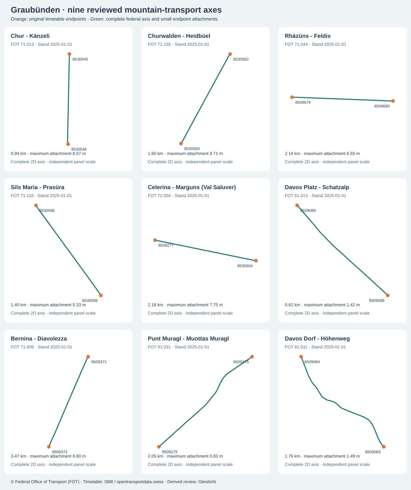

# Graubünden: federal cableway review and complete mountain inventory

The existing September study now includes three cableways: Rhäzüns–Feldis, Sils–Furtschellas and Bernina–Diavolezza. All six complete directed patterns use exact timetable/FOT station-number crosswalks, with no station aliases or section splicing. The initial selection is deliberately small; every annual mountain route remains in the audit.

## Validated scope

| Date | All candidates | Previous admitted | New cableway instances | Of which representative headways | Scheduled additions | Total admitted |
| --- | ---: | ---: | ---: | ---: | ---: | ---: |
| 2026-09-04 | 39'402 | 6'545 | 151 | 144 | 7 | 6'696 |
| 2026-09-06 | 38'425 | 5'324 | 147 | 144 | 3 | 5'471 |

All original calls, call rules, source trip IDs, service dates, intervals and times are retained. The before/after audit checks every non-mountain pattern byte-for-byte, and all previously admitted journeys remain admitted. Headway instances (`exact_times=0`) are representative movement on the original interval grid, not exact departures or observed cabin counts. No additional service dates are released.

| Route / agency | Installation / infrastructure operator | Original station numbers | Friday / Sunday instances | Maximum station attachment |
| --- | --- | --- | ---: | ---: |
| 93-294-0-j26-1 / 232 | 71.044 Rhäzüns - Feldis / 585 | 8509679 ↔ 8509680 | 66 / 62 | 6.55 m |
| 93-296-0-j26-1 / 249 | 71.118 Sils Maria - Prasüra / 1099 | 8530599 ↔ 8530598 | 33 / 33 | 5.33 m |
| 93-62-Y-j26-1 / 218 | 71.006 Bernina - Diavolezza / 1029 | 8509371 ↔ 8509372 | 52 / 52 | 6.80 m |

Timetable agency IDs and FOT infrastructure operator numbers are different namespaces. Each mapping is explicit in [policy](../data/graubuenden-cableway-policy.json); equal names alone do not admit a route. All stations lie under the reviewed 10 m attachment limit; source station-to-axis gaps are zero under a 1 m topology limit. The complete source axes are retained, oriented to the calls and joined by small, disclosed endpoint attachments. The model is two-dimensional: no cable sag, elevation profile, vehicle tracking, lane assignment or live operational certification.



## Source, vintage and reuse

The complete national [FOT federal-concession cableway archive](https://data.geo.admin.ch/ch.bav.seilbahnen-bundeskonzession/seilbahnen-bundeskonzession/seilbahnen-bundeskonzession_2056_de.xtf.zip) is reused from data/luzern-cableway-sources. That directory is a national archive, not a Luzern extract. It contains 653 installations, 1349 stations and 653 axes. Catalogue SHA-256, ZIP member, decompressed XML and every preserved file hash are verified before matching. Archive SHA-256: `eb2c04bbb481fcac1ae472527a237ce9294f227047f340288e79c18cd0e14ddf`.

The member is Seilbahnen_20260105.xtf; catalogue date 2025-11-07T00:00:00Z, asset update 2026-01-29T06:46:40.489123Z. Each selected installation has Stand 2025-01-01, an earlier valid-from date, and no valid-until value. These dates allow the reviewed infrastructure inference but do not establish September 2026 observed alignment or service. Original feature IDs and dates remain in the audit and application source metadata.

Attribution: **© Federal Office of Transport (FOT), Seilbahnen mit Bundeskonzession**, with the linked source above. The preserved collection retains its generic `proprietary` licence label and links to [open use with mandatory source attribution](https://opendata.swiss/en/terms-of-use/#terms_by). Commercial and non-commercial reuse are permitted under that attribution condition; this is not silently relabelled as a Creative Commons licence. Derived processing: LV95-to-WGS84 polynomial conversion to seven decimals, axis orientation and disclosed stop attachments. Existing timetable, swisstopo and OSM attribution/reuse requirements remain as described in the [main study](GRAUBUENDEN-STUDY.md).

## Official local investigation and timetable discrepancies

The [GeoGR data page](https://geogr.ch/geodaten) lists the canton-wide cableway/ski-lift product. Its registered ordering workflow delivers a download notification by email. The previously inspected [GeoShop description](../data/graubuenden-rail-completion/geogr-catalogue-review.json) says the federal concession dataset is added on download. This supports investigating that national source directly; it does not establish reuse terms or currency for the separate local component. No local order was submitted and no unverified cantonal vector geometry is incorporated. The five routes without exact federal station-number leads are useful targets for the local product; this absence of an identity lead is not proof that their physical infrastructure is absent from all official sources.

The [operator’s summer 2026 timetable](https://www.corvatsch-diavolezza.ch/en/news-1/operating-hours), checked 8 September, lists Diavolezza every 20 minutes through 17:00 during 17 August–27 September. The pinned GTFS frequency interval ends at 17:00 exclusively, emitting 08:20–16:40. For Furtschellas, the operator lists a last ascent at 16:30 and a half-hourly descending service from 08:40; the archive’s exclusive interval endpoints emit ascents only through 16:00 and regular descents through 16:10, plus its separate 17:05 descent. These source discrepancies remain explicit: no terminal departure is invented and no operator page replaces the pinned feed. Geometry admission is not a claim of complete operator timetable coverage.

The large Cassons route (93-288-D-j26-1) remains excluded with 13,659 fixture instances per day. Its Flims/Foppa/Startgels calls overlap the corridor described in the [FlemXpress commissioning announcement](https://www.flimslaax.com/en/news/detail/flemxpress-commissioning), which identifies Rope-Taxi technology. This is a review lead, not an installation or vehicle-identity approval. A dense schedule without a GTFS frequency marker is not proof of that many distinct moving cabins. Multi-section routing and the service representation still need review.

## Every annual mountain candidate

All **57** mountain route records are listed below, including **17** inactive on both fixtures. The machine-readable [audit](../data/graubuenden-audit/cableways.json) retains original agency and mode identities, annual calls, full source station and installation identity leads, source dates, every selected directed geometry, and dated counts. An identity lead is only an exact station-number overlap, never automatic admission. Inactive routes use annual in-canton calls; no dated full pattern is fabricated.

| Route | Agency / line | Annual records | Friday admitted / candidates | Sunday admitted / candidates | Exact-number installation leads | Disposition |
| --- | --- | ---: | ---: | ---: | --- | --- |
| 93-23-Y-j26-1 | 223 Pendicularas Scuol SA / GB | 8 | 0 / 1'020 | 0 / 1'020 | 72.027 | not-admitted-needs-installation-and-complete-pattern-review |
| 93-24-Y-j26-1 | 223 Pendicularas Scuol SA / SL | 10 | 0 / 885 | 0 / 885 | 73.230 | not-admitted-needs-installation-and-complete-pattern-review |
| 93-261-5-j26-1 | 3119 Cantone di Grigioni / 2615 | 2 | 0 / 286 | 0 / 286 | none; local investigation needed | not-admitted-needs-installation-and-complete-pattern-review |
| 93-261-6-j26-1 | 3120 Funivia Selma-Landarenca / 2616 | 2 | 0 / 286 | 0 / 286 | none; local investigation needed | not-admitted-needs-installation-and-complete-pattern-review |
| 93-284-8-j26-1 | 3140 Aelplibahn Malans Genossenschaft / 2848 | 2 | 0 / 72 | 0 / 72 | none; local investigation needed | not-admitted-needs-installation-and-complete-pattern-review |
| 93-285-2-j26-1 | 3142 Gemeinde Grüsch / 2852 | 8 | 0 / 1'140 | 0 / 1'140 | none; local investigation needed | not-admitted-needs-installation-and-complete-pattern-review |
| 93-287-0-j26-1 | 224 Sportbahnen Pischa / 2870 | 2 | 0 / 0 | 0 / 0 | 71.096 | inactive-on-both-September-fixtures |
| 93-288-0-j26-1 | 236 Chur-Dreibündenstein / 2880 | 2404 | 0 / 962 | 0 / 1'022 | 72.006, 71.013 | not-admitted-needs-installation-and-complete-pattern-review |
| 93-288-A-j26-1 | 236 Chur-Dreibündenstein / 2880 | 87 | 0 / 52 | 0 / 54 | 71.013 | not-admitted-needs-installation-and-complete-pattern-review |
| 93-288-D-j26-1 | 3201 Cassons AG / 2885 | 26722 | 0 / 13'659 | 0 / 13'659 | 72.188, 72.189, 72.190 | not-admitted-needs-installation-and-complete-pattern-review |
| 93-289-2-j26-1 | 275 Weisse Arena Bergbahnen AG / 2892 | 4 | 0 / 31 | 0 / 31 | 71.109 | not-admitted-needs-installation-and-complete-pattern-review |
| 93-289-3-j26-1 | 275 Weisse Arena Bergbahnen AG / 2893 | 4 | 0 / 930 | 0 / 930 | 73.078 | not-admitted-needs-installation-and-complete-pattern-review |
| 93-290-0-j26-1 | 3151 Sesselbahn Vals-Gadenstatt / 2900 | 6 | 0 / 720 | 0 / 720 | 72.019 | not-admitted-needs-installation-and-complete-pattern-review |
| 93-290-8-j26-1 | 251 Andermatt-Sedrun Sport AG / 2908 | 2 | 0 / 0 | 0 / 0 | 73.008 | inactive-on-both-September-fixtures |
| 93-291-0-j26-1 | 219 Arosa Bergbahnen / 2910 | 8 | 0 / 99 | 0 / 99 | 71.004, 71.003 | not-admitted-needs-installation-and-complete-pattern-review |
| 93-291-2-j26-1 | 219 Arosa Bergbahnen / 2912 | 4 | 0 / 915 | 0 / 915 | 72.051 | not-admitted-needs-installation-and-complete-pattern-review |
| 93-292-2-j26-1 | 252 Lenzerheide Bergbahnen / 2922 | 4 | 0 / 960 | 0 / 960 | 72.155 | not-admitted-needs-installation-and-complete-pattern-review |
| 93-293-0-j26-1 | 252 Lenzerheide Bergbahnen / 2930 | 10 | 0 / 1'020 | 0 / 1'020 | 72.088 | not-admitted-needs-installation-and-complete-pattern-review |
| 93-293-2-j26-1 | 3026 Val Sporz-Piz Scalottas / 2932 | 8 | 0 / 1'980 | 0 / 1'980 | 73.033, 73.038 | not-admitted-needs-installation-and-complete-pattern-review |
| 93-293-A-j26-1 | 252 Lenzerheide Bergbahnen / 2930 | 8 | 0 / 48 | 0 / 48 | 72.088, 71.074 | not-admitted-needs-installation-and-complete-pattern-review |
| 93-294-0-j26-1 | 232 Rhäzüns-Feldis/Veulden / 2940 | 8 | 66 / 66 | 62 / 62 | 71.044 | reviewed-exact-full-patterns |
| 93-294-1-j26-1 | 3158 Sesselbahn Feldis-Mutta / 2941 | 6 | 0 / 780 | 0 / 960 | 74.173 | not-admitted-needs-installation-and-complete-pattern-review |
| 93-295-8-j26-1 | 3160 EWZ Bergeller Kraftwerke / 2958 | 4 | 0 / 960 | 0 / 960 | none; local investigation needed | not-admitted-needs-installation-and-complete-pattern-review |
| 93-296-0-j26-1 | 249 Surlej-Silvaplana-Corvatsch / 2960 | 9 | 33 / 33 | 33 / 33 | 71.118 | reviewed-exact-full-patterns |
| 93-296-5-j26-1 | 249 Surlej-Silvaplana-Corvatsch / 2965 | 20 | 0 / 100 | 0 / 100 | 71.060, 71.061 | not-admitted-needs-installation-and-complete-pattern-review |
| 93-298-2-j26-1 | 267 Pontresina-Alp Languard / 2982 | 2 | 0 / 1'050 | 0 / 1'050 | 74.043 | not-admitted-needs-installation-and-complete-pattern-review |
| 93-30-Y-j26-1 | 238 Engadin St. Moritz Mountains AG / GB | 6 | 0 / 1'080 | 0 / 1'080 | 72.004 | not-admitted-needs-installation-and-complete-pattern-review |
| 93-31-Y-j26-1 | 3051 Sesselbahn St. Moritz Suvretta-Randolins / SL | 6 | 0 / 1'020 | 0 / 1'020 | 73.080 | not-admitted-needs-installation-and-complete-pattern-review |
| 93-38-Y-j26-1 | 293 Glaris-Rinerhorn / GB | 4 | 0 / 1'005 | 0 / 1'005 | 72.105 | not-admitted-needs-installation-and-complete-pattern-review |
| 93-3K-Y-j26-1 | 309 Klosters-Madrisa Bergbahn / GB | 4 | 0 / 1'035 | 0 / 1'035 | 72.058 | not-admitted-needs-installation-and-complete-pattern-review |
| 93-55-Y-j26-1 | 336 Bergün Filisur Tourismus AG / SL | 4 | 0 / 16 | 0 / 16 | 74.164 | not-admitted-needs-installation-and-complete-pattern-review |
| 93-56-Y-j26-1 | 3152 Bergbahnen Piz Mundaun AG / SL | 2 | 0 / 0 | 0 / 0 | 73.200 | inactive-on-both-September-fixtures |
| 93-57-Y-j26-1 | 230 Savognin-Bergbahnen AG / GB | 2 | 0 / 0 | 0 / 0 | 72.135, 72.177 | inactive-on-both-September-fixtures |
| 93-58-Y-j26-1 | 3148 Bergbahnen Piz Mundaun AG / SL | 2 | 0 / 0 | 0 / 0 | 74.065 | inactive-on-both-September-fixtures |
| 93-5C-Y-j26-1 | 3146 Bergbahnen Obersaxen AG / SL | 2 | 0 / 0 | 0 / 0 | 74.223 | inactive-on-both-September-fixtures |
| 93-5J-Y-j26-1 | 3148 Bergbahnen Piz Mundaun AG / SL | 2 | 0 / 0 | 0 / 0 | 73.104, 74.065 | inactive-on-both-September-fixtures |
| 93-5K-Y-j26-1 | 336 Bergün Filisur Tourismus AG / SL | 2 | 0 / 0 | 0 / 0 | 74.118, 74.164 | inactive-on-both-September-fixtures |
| 93-5L-Y-j26-1 | 3152 Bergbahnen Piz Mundaun AG / SL | 2 | 0 / 0 | 0 / 0 | 73.086, 73.200 | inactive-on-both-September-fixtures |
| 93-5Y-Y-j26-1 | 111 Sportbahnen Davos / FUN | 16 | 0 / 102 | 0 / 102 | 61.013 | not-admitted-needs-installation-and-complete-pattern-review |
| 93-62-Y-j26-1 | 218 Bergbahnen Engadin St. Moritz, Bernina-Diavolezza (lbd) / PB | 10 | 52 / 52 | 52 / 52 | 71.006 | reviewed-exact-full-patterns |
| 93-6F-Y-j26-1 | 247 Curtinatsch-Piz Lagalb / PB | 4 | 0 / 0 | 0 / 0 | 71.066 | inactive-on-both-September-fixtures |
| 93-6L-Y-j26-1 | 133 Celeriner Bergbahnen - Punt Muragl-Muottas Muragl / FUN | 10 | 0 / 62 | 0 / 62 | 61.031 | not-admitted-needs-installation-and-complete-pattern-review |
| 93-6S-Y-j26-1 | 147 Bergbahnen Engadin St. Moritz AG / PB | 8 | 0 / 51 | 0 / 51 | 71.121 | not-admitted-needs-installation-and-complete-pattern-review |
| 93-6W-Y-j26-1 | 109 Davos Klosters Bergbahnen (dpb) / FUN | 2 | 0 / 49 | 0 / 49 | 61.011 | not-admitted-needs-installation-and-complete-pattern-review |
| 93-6X-Y-j26-1 | 207 Davos Klosters Bergbahnen (bbbj) / PB | 2 | 0 / 0 | 0 / 0 | 71.017 | inactive-on-both-September-fixtures |
| 93-6Z-Y-j26-1 | 147 Bergbahnen Engadin St. Moritz AG / FUN | 4 | 0 / 0 | 0 / 0 | 61.039 | inactive-on-both-September-fixtures |
| 93-7-Y-j26-1 | 208 Davos Klosters Bergbahnen (lkp) / PB | 6 | 0 / 33 | 0 / 33 | 71.032 | not-admitted-needs-installation-and-complete-pattern-review |
| 93-70-Y-j26-1 | 207 Davos Klosters Bergbahnen (bbbj) / PB | 2 | 0 / 0 | 0 / 0 | 71.018 | inactive-on-both-September-fixtures |
| 93-71-Y-j26-1 | 109 Davos Klosters Bergbahnen (dpb) / FUN | 2 | 0 / 48 | 0 / 48 | 61.012, 61.011 | not-admitted-needs-installation-and-complete-pattern-review |
| 93-76-Y-j26-1 | 147 Bergbahnen Engadin St. Moritz AG / FUN | 4 | 0 / 0 | 0 / 0 | 71.016, 61.039 | inactive-on-both-September-fixtures |
| 93-77-Y-j26-1 | 109 Davos Klosters Bergbahnen (dpb) / PB | 2 | 0 / 44 | 0 / 44 | 71.041, 61.012 | not-admitted-needs-installation-and-complete-pattern-review |
| 93-7F-Y-j26-1 | 147 Bergbahnen Engadin St. Moritz AG / PB | 4 | 0 / 46 | 0 / 46 | 71.016 | not-admitted-needs-installation-and-complete-pattern-review |
| 93-7J-Y-j26-1 | 3161 Bergbahnen Samnaun AG / PB | 5 | 0 / 34 | 0 / 34 | 71.098 | not-admitted-needs-installation-and-complete-pattern-review |
| 93-8-Y-j26-1 | 208 Davos Klosters Bergbahnen (lkp) / PB | 6 | 0 / 33 | 0 / 33 | 71.033, 71.032 | not-admitted-needs-installation-and-complete-pattern-review |
| 93-8F-Y-j26-1 | 109 Davos Klosters Bergbahnen (dpb) / PB | 2 | 0 / 0 | 0 / 0 | 61.012, 71.056 | inactive-on-both-September-fixtures |
| 93-8T-Y-j26-1 | 329 Bergbahnen Disentis / PB | 2 | 0 / 0 | 0 / 0 | 71.142 | inactive-on-both-September-fixtures |
| 93-8U-Y-j26-1 | 329 Bergbahnen Disentis / PB | 3 | 0 / 0 | 0 / 0 | 71.112 | inactive-on-both-September-fixtures |

All unreviewed active mountain journeys remain excluded in full. The other 323 annual route records are retained in the [whole-canton route inventory](GRAUBUENDEN-ROUTE-INVENTORY.md). Numerical coverage never substitutes for source-identity, seasonal access or complete-pattern review.

## Reproduction

```sh
node scripts/prepare-graubuenden-cableways.mjs
node scripts/review-graubuenden-cableways.mjs
node scripts/build-graubuenden-region.mjs
node scripts/check-graubuenden-region.mjs
node scripts/graubuenden-seasonal.mjs
node scripts/check-graubuenden-seasonal.mjs
node scripts/document-graubuenden-cableways.mjs
npx vitest run scripts/graubuenden-cableways.test.mjs scripts/luzern-cableway-geometry.test.mjs
```

The prepare step records a reviewed source; acquisition changes require review before running it. Runtime loaders fail on changed hashes, dates, agency/line/operator identities, unknown full patterns, ambiguous installations, disconnected axes, excessive attachments and invalid source dates. The full-region checker verifies complete original calls, frequency semantics, geometry provenance, every candidate denominator and every published chunk hash.
