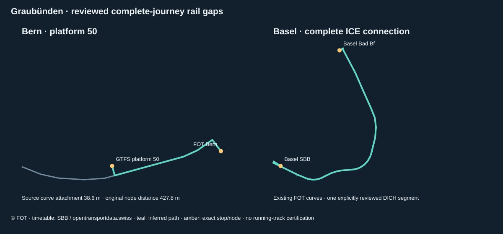

# Graubünden: Bern platform 50 and Basel rail completion

This review adds **30 Friday and 31 Sunday complete rail journeys**. Rail admission reaches **854/856** and **840/842**; rail and bus admission remains **6,545** and **5,324** complete journeys. The subsequent [cableway review](GRAUBUENDEN-CABLEWAYS.md) brings all-mode application totals to **9,049** and **7,826** instances. Both dated whole-canton denominators stay unchanged. Every earlier complete journey and every previously successful directed pair remain identical.

[Before/after audit](../data/graubuenden-audit/rail-completion-review.json) · [Explicit policy](../data/graubuenden-rail-completion/policy.json) · [Official evidence](../data/graubuenden-rail-completion/evidence.json) · [Source probes](../data/graubuenden-rail-completion/probes.json) · [All annual routes and exclusions](GRAUBUENDEN-ROUTE-INVENTORY.md)



## Complete candidate comparison

| Metric | Friday 4 September | Sunday 6 September |
| --- | ---: | ---: |
| All-mode candidate journeys | 39'402 | 38'425 |
| Admitted with this rail review disabled | 9'019 | 7'795 |
| Admitted with this rail review enabled | 9'049 | 7'826 |
| Newly complete rail journeys | 30 | 31 |
| Earlier complete journeys preserved | 9'019 | 7'795 |
| Earlier matched pair occurrences preserved | 89'177 | 75'022 |
| All rail candidates | 856 | 842 |
| Admitted complete rail journeys | 854 | 840 |

| Route / agency | Friday gain | Sunday gain | Review |
| --- | ---: | ---: | --- |
| 91-35-A-j26-1 / 82 (IR35) | 16 | 17 | Bern platform 50 terminal extension |
| 91-35-B-j26-1 / 11 (IR35) | 11 | 11 | Bern platform 50 terminal extension |
| 91-N-Y-j26-1 / 11 (ICE) | 3 | 3 | One existing Basel DICH segment |

The 34 newly admitted full directed patterns are explicitly listed in policy, with ordered stop IDs and call rules. Every candidate in every mode is reconciled against the released audit, including the excluded services. The comparison executes the current pipeline with only this rail review disabled/enabled; later cableway admissions are held fixed on both sides, so these all-mode counterfactual totals are not historical release totals. It verifies complete-path equality for all earlier admissions and pair equality even within earlier rejected journeys. Calendar, frequency, original full calls and chunk checks are performed by the regional validator.

## Bern platform 50

SBB’s [official station description](https://www.sbb.ch/de/reiseinformationen/bahnhoefe/bahnhof-finden/bahnhof-bern/bahnhofsbeschrieb.html) places platforms 49 and 50 in the westward continuation of platforms 9 and 10 towards Fribourg. It also identifies ongoing station construction. The page was readable through web retrieval on 8 September 2026; direct acquisition returned HTTP 403, which is preserved as a failed probe. The Aargau platform-49 review identified the same original FOT station corridor; platform 50 and both IR35 operator identities were independently checked here.

The exact GTFS platform `ch:1:sloid:7000:55:50` is 427.8 m from the FOT Bern operating point, exceeding the unchanged 350 m primary station limit. It projects 38.6 m from the original standard-gauge SBB curve `ch14uvag00087328` between Bern JKLM and Bern. A specifically reviewed **50 m** projection guard admits this attachment. The extension follows the ordered source-curve interval from the exact Bern node to that projection, then uses the bounded connector to the original platform coordinate. Its total inferred length is 502.1 m; the source-curve/node attachment is 55.2 m. The curve is not relocated, and the original platform ID and coordinate remain in every emitted call.

This applies only when the reviewed platform is the first or last call of an explicitly listed IR35 pattern under SOB agency 82 or SBB agency 11. The whole train is routed in its original stop context via the exact Bern operating point; only its failed terminal pair receives the source-curve extension. All other pairs must be identical to the original result. Mid-journey use, different platforms, changed route/operator identity, altered source curves, expired infrastructure, excessive projection or detour fail the review. There is a nearby BLS westward curve; proximity alone is not the selection rule. This review explicitly selects the SBB Bern–Bern JKLM corridor supported by the station description and original topology. It does not identify a platform-specific running track or certify temporary works.

## Basel Bad Bf–Basel SBB

DB InfraGO’s [2026 operating-interface document](https://www.dbinfrago.com/resource/blob/13174882/51e2dc5224da35667f1d133ecdaae239/Ril-302-5004-INB-2026-data.pdf), valid from 14 December 2025, describes the Basel Bad Bf–Gellert–Basel SBB passenger/freight corridor and its DB/BEV–SBB infrastructure interfaces (PDF pages 1–2 and 7). Its [Swiss infrastructure page](https://www.dbinfrago.com/web/schienennetz/europa/strecken_in_der_schweiz-11156934) identifies the DB infrastructure presence in the Basel area. These establish corridor context; no geometry is traced from a schematic drawing and no legal or operational compliance is inferred for a particular train.

The FOT source already contains `ch14uvag00068131`, a 914.3 m standard-gauge DICH segment from Basel VB Grenze to Basel Bad Bf. The primary graph rejects it solely because that infrastructure operator is outside its allowlist. The completion review permits **only this exact segment**, with its original endpoint objects, curve, gauge, operator and validity, for SBB-coded ICE route `91-N-Y-j26-1`. Other DICH segments remain outside this review. No general foreign-operator permission, geometric bridge or new rail alignment is introduced.

The resulting Basel pair follows the complete existing FOT corridor through Gellert and the SBB station approaches, with source-segment provenance retained in traversal order. All primary station, topology, detour and stop-order checks remain active. Three complete ICE journeys are recovered on each date, including all their external-to-Graubünden calls. Every originally matched pair is identical.

## Remaining exclusions and local geometry follow-up

Only **two rail candidate journeys per date** remain excluded: route `91-GEX-B-j26-1`, agency `9999`, labelled GEX under the generic Diverse INFO identity. Their St. Moritz–Chur source calls are retained in the audit. A familiar route label and nearby RhB geometry do not establish that these informational records should be animated as separate operating trains; no operator identity is silently reassigned. Bus, mountain, boat and tram exclusions remain as documented in the full study.

An unauthenticated inspection of the functioning [GeoGR GeoShop](https://geoshop.geogr.ch/de/welcome) identified the canton-wide cableway and ski-lift product. Its metadata describes tourist transport infrastructure and says the federal concessioned cableway dataset is included on download. This is a concrete source lead for mountain geometry. However, the description did not establish a dated alignment, a timetable/operator crosswalk or dataset-specific redistribution terms. The visible public list showed no operational bus-line product; searching for Verkehr returned only the canton/SchweizMobil slow-traffic product. These are findings about the inspected public interface, not proof that other datasets do not exist. No order or account was submitted. [Preserved observation](../data/graubuenden-rail-completion/geogr-catalogue-review.json).

The twelve-date seasonal comparison has been refreshed against the expanded September baseline, with the same **374,218** complete original journey instances and all 380 annual routes. Its extra dates remain audit-only; matching an admitted September pattern does not validate winter access, diversions or the repeated October daylight-saving hour.

## Sources, reuse and reproduction

Geometry remains **© Federal Office of Transport**, from the original pinned Schienennetz XTF (segment Stand 6 July 2021, asset timestamp 18 January 2025). Its checksum, source metadata and attribution-based opendata.swiss terms remain unchanged; the source’s generic proprietary catalogue field is preserved. The station extension is labelled as a derived slice/connector, and the Basel segment retains its source operator tag. Timetable: **SBB / opentransportdata.swiss**. Existing OSM bus databases retain their **© OpenStreetMap contributors / ODbL 1.0** attribution. Official SBB/DB descriptions support identity and context; their publication is not presented as an open licence for a replacement alignment. See the [initial study’s complete reuse statement](GRAUBUENDEN-STUDY.md#reuse-and-attribution).

```sh
python3 scripts/prepare-graubuenden-rail-completion.py
# Review changed source receipts and policy hashes explicitly before admission.
node scripts/build-graubuenden-region.mjs
node scripts/check-graubuenden-region.mjs
node scripts/review-graubuenden-rail-completion.mjs
node scripts/review-graubuenden-rail.mjs
node scripts/review-graubuenden-access-roads.mjs
node --max-old-space-size=8192 scripts/graubuenden-seasonal.mjs
node --max-old-space-size=8192 scripts/check-graubuenden-seasonal.mjs
node scripts/document-graubuenden-rail-completion.mjs
node scripts/document-graubuenden-study.mjs
node scripts/document-graubuenden-expansion.mjs
```

Offline reconstruction uses the pinned FOT source, timetable cache, preserved source receipts and explicit completion policy. A fresh source request may change timestamps or return a different response; the build does not automatically approve new hashes.
