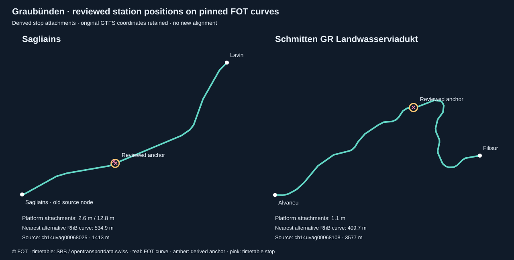

# Graubünden: entire-canton inventory and initial regional study

Pinned timetable release **20260902**, valid **14 December 2025–12 December 2026**. Validation fixtures: **Friday 4 September and Sunday 6 September 2026**, Europe/Zurich, full civil days with preceding-service-day spillover. Initial scope is numerically validated rail, bus and selected cableway motion; it is explicitly partial canton coverage.

[Cableway review and all mountain candidates](GRAUBUENDEN-CABLEWAYS.md) · [Bern/Basel rail completion](GRAUBUENDEN-RAIL-COMPLETION.md) · [Complete bus-pattern recovery](GRAUBUENDEN-BUS-REVIEW.md) · [Twelve-date seasonal inventory (audit only)](GRAUBUENDEN-SEASONAL-STUDY.md) · [Every annual route and its exclusions](GRAUBUENDEN-ROUTE-INVENTORY.md) · [Machine-readable route inventory](../data/graubuenden-audit/routes.json) · [Coverage summary](../data/graubuenden-audit/summary.json) · [Validation](../data/graubuenden-audit/validation.json) · [Feed index](../public/data/graubuenden-region/index.json)

## Entire-canton denominator

The census streams all **34'499'152 national annual stop-time rows**. It selects **79'029 annual trip records**, **380 route records** and **67 agency identities** with at least one source call inside the complete official Graubünden MultiPolygon. All polygon components and holes count. Of 5'695 GTFS stop records inside it, 3'850 are called in the annual feed; these are platform/parent records, not unique physical stations. Bounding boxes are a preliminary filter only. No agency allowlist or city pilot defines canton membership.

Every selected fixture journey retains **every original ordered call, time, stop sequence and call rule**, including calls in other cantons and abroad. Through services without a stop in the canton and services absent from this GTFS release are outside the measured denominator. No straight-line boundary crossing approximation is used. Annual records inactive on both dates remain in the inventory, with explicit inactive status. The annual denominator is an inventory of records in the archive, not a claim that each record operates daily.

The geographical scope includes Chur/Rheintal, Prättigau and Davos, Surselva, Imboden, Albula and the Viamala valleys, Upper and Lower Engadin, Samnaun, Val Müstair, Bregaglia, Poschiavo, Mesolcina and Calanca. Full external calls include connections towards Zürich, St. Gallen, Andermatt/Brig/Zermatt, Bellinzona, Tirano, Chiavenna, Livigno, Mals and Landeck where present in the source. Unresolved external geometry excludes the whole journey. Regional names are review areas, not substitutes for the polygon.

## Sources and official local geometry investigation

**National timetable:** [SBB / opentransportdata.swiss GTFS](https://data.opentransportdata.swiss/en/dataset/timetable-2026-gtfs2020), ZIP hash `d325fd0954a91ac50005ad53db1976b8e528ebb1c388e4e8fd5a4415e4139a1e`. The pinned archive supplies no shapes. Calendar exceptions, stop sequences and call permissions are retained. Frequency instances use the original interval-anchored grid; exact_times=0 is counted as representative headway movement, not an exact departure. Conditional/prior-arrangement patterns are withheld from unconditional animation.

**Boundary:** [swisstopo canton feature 18](https://api3.geo.admin.ch/rest/services/api/MapServer/ch.swisstopo.swissboundaries3d-kanton-flaeche.fill/18?sr=4326&geometryFormat=geojson), checked as canton code GR, hash `b403c35f07ebc31127eb5d32c2c800f6b5cfe60d46ff3fdc22632928f1ed77ec`. No dataset-edition date is supplied in this response; retrieval date is not presented as a boundary vintage.

**Reviewed rail infrastructure:** the pinned [FOT Schienennetz XTF](https://data.geo.admin.ch/ch.bav.schienennetz/schienennetz/schienennetz_2056_de.xtf) has 3,210 operating-point nodes and 3,424 segments. The catalogue checksum and preserved source files are verified. Segment Stand is 6 July 2021; the asset-update timestamp is 18 January 2025. Neither establishes September 2026 operational alignment. Hash `2895811c6c338cdc3d32e946d2861ce58ca72ddde7d700fe9b73f2c393f7b828`. Every source segment has a disposition in [rail-segments.json](../data/graubuenden-audit/rail-segments.json).

**Official local investigation:** the [cantonal network page](https://www.gr.ch/DE/institutionen/verwaltung/diem/aev/oev/angebote/liniennetz/Seiten/liniennetz.aspx) directs readers to graubünden invia and publishes network diagrams. These establish the existence and organisation of services; schematic diagrams are not routable geometry. The [official map-search catalogue](https://ws.geo.gr.ch/reports/v1/search-list/pdf?job_ref=false&reverse=false), dated 25 January 2026, lists bus-company/line/stop, PostAuto course, railway, night-bus and mountain-transport searches, including Chur, Arosa, Samnaun and Scuol. Thus local transport data demonstrably exists; its absence from this implementation is an access/validation finding, not a claim that Graubünden lacks it.

The live [metadata catalogue](https://katalog.geo.gr.ch/) and its directly embedded service-list endpoint still return **HTTP 200 with ORA-24415**, so neither is a valid catalogue response. The [current GeoGR data page](https://geogr.ch/geodaten) is reachable and explains registered GeoShop ordering, lists directly available datasets including cableways, and links WMS/WFS guidance. Its former links.html URL returns 404. The map page is reachable but its advertised dynamic.json returns 404 in the unauthenticated probe. Exploratory `/oev` WMS/WFS capabilities probes also return 404; these guessed endpoints do not establish that no other service exists. Every request, effective URL, status, body hash, timestamp and error remains in [probes.json](../data/graubuenden-sources/probes.json), with compressed response evidence.

No current canton-wide local bus-line export with verified route/operator identifiers, dated alignment and dataset-specific redistribution terms was established. Official planning layers (for example regional-plan rail infrastructure) and mountain-transport catalogue entries are separate products, not evidence of an operational bus line export. No local vector data was silently substituted, traced from a schematic map, or labelled open based solely on portal availability. A subsequent live GeoShop inspection identified the canton-wide cableway/ski-lift product and its description, while the Verkehr search showed only the slow-traffic product. The shop is functional despite the separate metadata-catalogue errors. No operational bus export or local mountain dataset with verified vintage/reuse was obtained; the national FOT cableway archive was subsequently reviewed separately and is now incorporated for ten routes (see the cableway review); see the [preserved observation](../data/graubuenden-rail-completion/geogr-catalogue-review.json). Follow-up: obtain the operating transport layer metadata/export via the functioning GeoGR/ALG channel, establish dataset-specific terms and currency, and then crosswalk all local operator lines against this complete inventory.

## Geometry admission

Rail routing uses declared source topology and exact operating-point numbers. Reviewed groups isolate standard gauge (SBB/SOB/THURBO/BLS infrastructure) from RhB/MGB metre gauge, including specifically allowed mixed-gauge RhB segments. The mainline RhB graph includes MGB infrastructure for through Glacier Express journeys; no gauge-changing transfer is invented. Other scheduled operating points are blocked during each pair search so a path cannot pass a later call early. Full-pattern identity includes route, direction and every ordered stop and call rule.

Three explicit platform mappings resolve GTFS shared-station IDs to named FOT nodes: **Landquart → Landquart [Gleis 5–8]**; **Chur → Chur [Gleis 10–14]** for reviewed RhB mainline routes; **Chur → Chur Arosabahn** only for R16/RE6. Each mapping pins the source/target operating-point number, target name and route scope in [policy](../data/graubuenden-policy.json). Original GTFS calls remain unchanged. These select existing nodes; they add no graph edges. A subsequent, separately pinned review resolves Sagliains and Schmitten GR Landwasserviadukt by attaching their timetable stops to two explicitly identified existing source curves, as detailed below. No primary tolerance was raised.

### Reviewed Sagliains and Landwasserviadukt attachments

[Review policy](../data/graubuenden-rail-review/policy.json) · [Reproducible before/after audit](../data/graubuenden-audit/rail-anchor-review.json) · [Archived official evidence](../data/graubuenden-rail-review/sources.json)



RhB documents the [Sagliains station expansion](https://www.rhb.ch/de/aktuelles/blog/sichere-wege-fuer-die-kleinsten/). Its [14 May 2025 announcement](https://www.rhb.ch/it/medien/medienmitteilungen/viaduktshuttle-auf-dem-landwasserviadukt/) establishes the new Schmitten GR Landwasserviadukt stop between Alvaneu and Filisur; the [current station page](https://www.rhb.ch/de/informationen/bahnhoefe/schmitten-gr-landwasserviadukt/) and [Viaduktshuttle page](https://www.rhb.ch/de/ausfluege/viaduktshuttle/) confirm the identity and corridor. These pages support station/service identity; they do not supply replacement alignment or certify the fixture timetable.

For R4, RE4 and R15, the two exact Sagliains timetable platform coordinates identify a position inside FOT segment `ch14uvag00068025` (Sagliains–Lavin). Their mean projects 6.3 m from that curve; the two original platform endpoints are 2.6 m and 12.8 m from the derived anchor. The old FOT Sagliains node stays connected as a junction, but station-number lookup in this route-scoped derived graph uses the inserted anchor. For R28, the Schmitten GR Landwasserviadukt timetable stop projects 1.1 m from segment `ch14uvag00068108` (Alvaneu–Filisur), with the same 1.1 m bounded connector. Its GTFS operating-point identity already exists; the new derived topology node is explicitly distinguished from a FOT source record.

Each reviewed segment is subdivided at a single interior position. Its original vertices, curve and junction connectivity remain intact. The policy pins both source endpoint objects, the simplified curve hash, exact platform IDs/coordinates, four route/operator identities, the timetable hash and both fixture dates. It uses a stricter 20 m platform-to-anchor limit and requires at least 100 m separation from alternative RhB curves. The nearest alternatives are 534.9 m and 409.7 m away. Segment validity, gauge/operator checks, topology attachment, full-pattern stop order and primary detour limits still apply. The audit records derived segment IDs, their original FOT segment, source vertex intervals, direction, and the primary failure. This is an explicit linear-reference inference, not a station-node relocation in the source or proof of a particular running track.

All 724 previously complete Friday rail journeys and 723 Sunday rail journeys retain exactly the same path arrays and evidence. The reviewed anchors recover 100 Friday and 86 Sunday complete journeys: rail admission rises to 824/856 (96.3%) and 809/842 (96.1%). Every call, source time and cross-canton terminus remains intact. This rail comparison leaves the entire-canton denominator and bus admission unchanged. The comparison is regenerated by running the same pinned pipeline with and without the two reviews.

Alternative-source audit: all 24 records returned by the SBB Sagliains graphical query are schematic two-point records. The four Schmitten search results refer to other locations (including Schmitten FR and Roggwil Schmitten); none is admitted. All 28 records receive explicit dispositions. The direct SBB Bern station-page acquisition returned HTTP 403, recorded as such. At that stage, Bern platform 50, Basel border topology and the generic Diverse INFO GEX identity remained excluded; proximity or a generic operator label alone is insufficient. This review does not expand seasonal dates or certify local bus vectors.

The subsequent [Bern/Basel completion review](GRAUBUENDEN-RAIL-COMPLETION.md) admits a bounded platform-50 source-curve extension and exactly one existing DICH infrastructure segment for ICE. It adds 30 Friday and 31 Sunday complete journeys, preserving every previously successful pair and complete journey. Rail admission is now 854/856 and 840/842; only the two generic Diverse INFO GEX records per day remain excluded. The standalone RhB comparison runs with this independent completion enabled on both sides (754→854 Friday and 754→840 Sunday), retaining the same 100/86 RhB gain.

Rail limits: 350 m stop-to-operating-point attachment, 120 m source-segment topology attachment, max(3,000 m, 4.5 × direct distance) pair detour, 5 m LV95 simplification before the existing swisstopo WGS84 conversion. Accepted source segments must not be expired or future-dated for the fixture interval. These are inferred infrastructure paths with bounded stop connectors; there is no running-track or diversion certification.

Bus matching evaluates **all 1,268 active full bus patterns across 210 route records**, including replacement and conditional candidates, with pinned pfaedle `99f2cd466696ecc6bdb73b2b3bb9008557fcb84a`, unmodified bus configuration, and the preserved Switzerland 2 September 2026 plus border 8 September OSM extract. Extract SHA-256: `d5c675456e935cfbcab88fe894fe9145dc5bd1fbd4318cea30ffd838a9aad02b`. `--no-trie -W` preserves individual fallback warnings. The importer verifies original matcher-output hashes and rejects explicit fallback hops even when a line-shaped fallback was emitted. Monotone shape distances preserve repeated stops, loops and hairpins; geometry is scoped to the complete ordered route/platform/coordinate pattern.

Bus limits: 120 m road snap, max(1,500 m, 6 × direct distance) detour, 5 m simplification and exact original GTFS endpoints after bounded inferred access connectors. The original primary run rejects 108 pattern-segment occurrences in the two-date pattern union. The original primary run finds 145,376 of 146,112 bus segment occurrences (99.5%), but this is **pair coverage inside all candidates**, not whole-journey admission. pfaedle uses OSM bus relations, access, direction and supported restriction tags; this is not an operator-certified itinerary or proof of every road restriction.

A subsequent [whole-pattern bus review](GRAUBUENDEN-BUS-REVIEW.md) evaluates all 187 fixture patterns on all 24 routes with a previously excluded bus journey. A separately pinned, GR-filtered OSM graph retaining service roads recovers 35 complete road patterns, adding 145 Friday and 119 Sunday journeys. Every previously complete primary path and its evidence remain identical. Whole-pattern replacement, exact route/operator identities, original source calls and all primary importer limits are enforced. Bus admission is now 5,691/5,762 and 4,484/4,561; that bus increment leaves rail unchanged. The linked review documents all trial dispositions, official diagram evidence, failed graph reuse and the separately attributed derived database.

If any pair fails, **the whole directed journey is excluded**. No partial fragments, stop chords, route cropping, last-known geometry or unsourced fallback enters the admitted application feed. Six aerial cableways and four funiculars now have reviewed federal axes; all other mountain routes, boats and the GTFS-coded Alpintrans tram service remain inventoried without admitted geometry. See the linked cableway review for every annual mountain route, source vintage and official timetable discrepancies. The raw mode classification is retained; a feed category does not establish the physical vehicle type.

## Coverage against all candidates

| Metric | Friday 2026-09-04 | Sunday 2026-09-06 |
| --- | ---: | ---: |
| Civil-day movement instances | 39'402 | 38'425 |
| Admitted complete journeys | 9'049 | 7'826 |
| Excluded whole journeys | 30'353 | 30'599 |
| Complete directed patterns | 1'567 | 1'292 |
| Admitted complete patterns | 1'447 | 1'169 |
| Pattern-specific directed pairs | 17'605 | 14'862 |
| Matched pattern-specific directed pairs | 17'435 | 14'689 |
| All segment occurrences | 119'682 | 105'774 |
| Matched segment occurrences | 89'207 | 75'053 |
| Scheduled segment occurrences | 101'604 | 87'516 |
| Matched scheduled segment occurrences | 86'764 | 72'610 |
| Representative headway instances | 18'078 | 18'258 |
| Preceding-day carry-ins | 86 | 242 |
| Admitted carry-ins | 86 | 238 |

| Mode | Annual routes | Friday admitted / candidates | Sunday admitted / candidates |
| --- | ---: | ---: | ---: |
| boat | 1 | 0 / 6 (0.0%) | 0 / 6 (0.0%) |
| bus | 266 | 5'691 / 5'762 (98.8%) | 4'484 / 4'561 (98.3%) |
| mountain | 57 | 2'504 / 32'764 (7.6%) | 2'502 / 33'002 (7.6%) |
| rail | 55 | 854 / 856 (99.8%) | 840 / 842 (99.8%) |
| tram | 1 | 0 / 14 (0.0%) | 0 / 14 (0.0%) |

All-mode admission is deliberately low because large mountain-service and headway counts remain in the denominator. The cableway addition includes 2,395 representative headway instances per day; these retain exact_times=0 and are not exact departures. Other admitted journeys remain scheduled instances. Pair success within a rejected pattern contributes to pair/occurrence coverage but never to admitted journey counts. Inactive route records: **87**. Friday and Sunday do not establish annual, winter, ski-shuttle, holiday, pass-road or diversion coverage. The [twelve-date seasonal inventory](GRAUBUENDEN-SEASONAL-STUDY.md) finds 58 additional active route records but admits no extra dates or geometry.

### Every operator identity

| ID | Feed agency | Annual routes | Friday admitted / candidates | Sunday admitted / candidates |
| --- | --- | ---: | ---: | ---: |
| 11 | Schweizerische Bundesbahnen SBB | 9 | 76 / 76 | 79 / 79 |
| 48 | Matterhorn Gotthard Bahn (fo) | 3 | 36 / 36 | 36 / 36 |
| 65 | THURBO | 3 | 76 / 76 | 72 / 72 |
| 72 | Rhätische Bahn | 36 | 608 / 608 | 594 / 594 |
| 82 | Schweizerische Südostbahn (sob) | 4 | 58 / 58 | 59 / 59 |
| 109 | Davos Klosters Bergbahnen (dpb) | 4 | 97 / 141 | 97 / 141 |
| 111 | Sportbahnen Davos | 1 | 102 / 102 | 102 / 102 |
| 133 | Celeriner Bergbahnen - Punt Muragl-Muottas Muragl | 1 | 62 / 62 | 62 / 62 |
| 147 | Bergbahnen Engadin St. Moritz AG | 4 | 0 / 97 | 0 / 97 |
| 207 | Davos Klosters Bergbahnen (bbbj) | 2 | 0 / 0 | 0 / 0 |
| 208 | Davos Klosters Bergbahnen (lkp) | 2 | 0 / 66 | 0 / 66 |
| 218 | Bergbahnen Engadin St. Moritz, Bernina-Diavolezza (lbd) | 1 | 52 / 52 | 52 / 52 |
| 219 | Arosa Bergbahnen | 2 | 0 / 1'014 | 0 / 1'014 |
| 223 | Pendicularas Scuol SA | 2 | 0 / 1'905 | 0 / 1'905 |
| 224 | Sportbahnen Pischa | 1 | 0 / 0 | 0 / 0 |
| 230 | Savognin-Bergbahnen AG | 1 | 0 / 0 | 0 / 0 |
| 232 | Rhäzüns-Feldis/Veulden | 2 | 66 / 66 | 62 / 62 |
| 236 | Chur-Dreibündenstein | 2 | 52 / 1'014 | 54 / 1'076 |
| 238 | Engadin St. Moritz Mountains AG | 1 | 1'080 / 1'080 | 1'080 / 1'080 |
| 247 | Curtinatsch-Piz Lagalb | 1 | 0 / 0 | 0 / 0 |
| 249 | Surlej-Silvaplana-Corvatsch | 2 | 33 / 133 | 33 / 133 |
| 251 | Andermatt-Sedrun Sport AG | 1 | 0 / 0 | 0 / 0 |
| 252 | Lenzerheide Bergbahnen | 3 | 960 / 2'028 | 960 / 2'028 |
| 267 | Pontresina-Alp Languard | 1 | 0 / 1'050 | 0 / 1'050 |
| 275 | Weisse Arena Bergbahnen AG | 2 | 0 / 961 | 0 / 961 |
| 293 | Glaris-Rinerhorn | 1 | 0 / 1'005 | 0 / 1'005 |
| 309 | Klosters-Madrisa Bergbahn | 1 | 0 / 1'035 | 0 / 1'035 |
| 329 | Bergbahnen Disentis | 2 | 0 / 0 | 0 / 0 |
| 336 | Bergün Filisur Tourismus AG | 2 | 0 / 16 | 0 / 16 |
| 617 | Alpintrans GmbH | 1 | 0 / 14 | 0 / 14 |
| 712 | Autoservizi Silvestri Livigno | 4 | 0 / 32 | 0 / 32 |
| 716 | Ortsbus St. Moritz | 1 | 56 / 56 | 56 / 56 |
| 740 | Verkehrsbetrieb der Landschaft Davos | 10 | 425 / 425 | 362 / 362 |
| 766 | Bus und Service AG (Chur) | 20 | 1'184 / 1'184 | 662 / 662 |
| 801 | PostAuto AG | 169 | 3'343 / 3'367 | 2'727 / 2'757 |
| 815 | Bus und Service AG (Engadin) | 9 | 411 / 411 | 399 / 399 |
| 851 | Automobildienst Matterhorn Gotthard Bahn (fo auto) | 1 | 6 / 6 | 4 / 4 |
| 862 | Autolinee Bleniesi | 1 | 4 / 4 | 4 / 4 |
| 865 | Autoverkehr RhB | 9 | 106 / 117 | 104 / 115 |
| 3026 | Val Sporz-Piz Scalottas | 1 | 0 / 1'980 | 0 / 1'980 |
| 3042 | Sesselbahn Fatschel - Triemel | 1 | 0 / 0 | 0 / 0 |
| 3051 | Sesselbahn St. Moritz Suvretta-Randolins | 1 | 0 / 1'020 | 0 / 1'020 |
| 3119 | Cantone di Grigioni | 1 | 0 / 286 | 0 / 286 |
| 3120 | Funivia Selma-Landarenca | 1 | 0 / 286 | 0 / 286 |
| 3140 | Aelplibahn Malans Genossenschaft | 1 | 0 / 72 | 0 / 72 |
| 3142 | Gemeinde Grüsch | 1 | 0 / 1'140 | 0 / 1'140 |
| 3146 | Bergbahnen Obersaxen AG | 1 | 0 / 0 | 0 / 0 |
| 3148 | Bergbahnen Piz Mundaun AG | 2 | 0 / 0 | 0 / 0 |
| 3151 | Sesselbahn Vals-Gadenstatt | 1 | 0 / 720 | 0 / 720 |
| 3152 | Bergbahnen Piz Mundaun AG | 2 | 0 / 0 | 0 / 0 |
| 3158 | Sesselbahn Feldis-Mutta | 1 | 0 / 780 | 0 / 960 |
| 3160 | EWZ Bergeller Kraftwerke | 1 | 0 / 960 | 0 / 960 |
| 3161 | Bergbahnen Samnaun AG | 1 | 0 / 34 | 0 / 34 |
| 3183 | Schiffahrtsunternehmung Silsersee | 2 | 0 / 6 | 0 / 6 |
| 3201 | Cassons AG | 1 | 0 / 13'659 | 0 / 13'659 |
| 3257 | La Punt Ferien | 1 | 8 / 8 | 8 / 8 |
| 7031 | Aroser Verkehrsbetriebe | 2 | 51 / 51 | 51 / 51 |
| 7047 | Vischnaunca Sumvitg | 1 | 4 / 4 | 4 / 4 |
| 7052 | Gemeinde Surses - Cumegn Surses | 1 | 10 / 10 | 10 / 10 |
| 7078 | Busbetrieb Gemeinde Bergün | 2 | 17 / 17 | 6 / 6 |
| 7081 | Verein Naturpark Beverin | 2 | 0 / 4 | 6 / 10 |
| 7085 | Ortsbus der Gemeinde Silvaplana / Gemeinde Silvaplana | 1 | 61 / 61 | 61 / 61 |
| 7094 | Gemeinde Luzein | 3 | 0 / 0 | 16 / 16 |
| 7231 | SBB Infrastruktur AG Bahnersatz | 3 | 1 / 1 | 0 / 0 |
| 7250 | Rhätische Bahn Ersatzverkehr | 20 | 4 / 4 | 4 / 4 |
| 9028 | Gemeinde Celerina/Schlarigna | 2 | 0 / 0 | 0 / 0 |
| 9999 | Diverse INFO | 1 | 0 / 2 | 0 / 2 |

### Exclusions

| Reason | Friday affected journeys | Sunday affected journeys |
| --- | ---: | ---: |
| cableway-summer-installation-conflict | 34 | 34 |
| cableway-unreviewed-route | 30'226 | 30'466 |
| no-reviewed-boat-geometry | 6 | 6 |
| no-reviewed-tram-geometry | 14 | 14 |
| road-excessive-detour | 22 | 20 |
| road-matcher-fallback | 53 | 61 |
| road-missing-shape | 4 | 4 |
| road-stop-too-far | 5 | 5 |
| unreviewed-rail-identity | 2 | 2 |

Reasons may overlap within one excluded journey. Full pattern IDs, ordered stops, call rules, every directed pair, infrastructure-segment IDs or OSM pattern/segment provenance, accepted path hashes and failure reasons are retained for [Friday](../data/graubuenden-audit/2026-09-04.json) and [Sunday](../data/graubuenden-audit/2026-09-06.json). All annual routes, including every inactive/excluded record, are listed in the linked route inventory. No numeric threshold is evidence of current seasonal road access.

## Reuse and attribution

- Timetable: **SBB / opentransportdata.swiss**, under the [platform terms](https://opentransportdata.swiss/en/terms-of-use/). Attribution and raw-data refresh requirements apply. This deliberately pinned archive is presented as a dated research study, not a current journey planner.
- Rail and admitted cableways: **© Federal Office of Transport (FOT)**. The preserved catalogue advertises attribution-based [opendata.swiss terms](https://opendata.swiss/terms-of-use/#terms_by). Its generic `proprietary` licence field is retained in source metadata rather than silently relabelled Creative Commons. Preserve attribution and identify the derived routing and conversion.
- Boundary: **© swisstopo**, under the [swisstopo open geodata terms](https://www.swisstopo.admin.ch/de/nutzungsbedingungen-kostenlose-geodaten-und-geodienste), including attribution.
- Bus paths: **© OpenStreetMap contributors**, [ODbL 1.0](https://www.openstreetmap.org/copyright). The attributed, machine-readable [derived bus path database](../public/data/graubuenden-region/road-paths.json) is supplied under ODbL with complete pattern/path mapping. Keep its attribution, licence link and share-alike database obligations on redistribution. Matcher executable licensing is distinct from the data licence. Original matcher evidence is preserved in data/graubuenden-roads and data/graubuenden-access-roads. The supplemental [access-road path database](../public/data/graubuenden-region/access-road-paths.json) is also supplied under ODbL.
- Official GR local vectors: **not incorporated**. General free portal access and a separate dataset’s BY label do not establish reuse rights for the unverified operational transport export.

Processing by Gleislicht: spatial selection, civil-day expansion, infrastructure/group selection, OSM map matching, geometry validation, simplification, coordinate conversion and chunking. These changes and source vintages are disclosed in the feed metadata and UI source links. Attribution accompanies both desktop and mobile study views.

## Application and reproduction

The application includes GR in the study browser and network selector, a Friday/Sunday switch, morning and full-day ranges, shareable dated links, translated labels (DE/EN/FR/IT), source attribution and an explicit initial/partial-scope notice. Each day has a morning snapshot and twelve integrity-checked two-hour chunks. All complete calls remain available beyond the displayed time window. Zero-duration source segments are retained and counted rather than receiving invented timing precision.

```sh
python3 scripts/prepare-graubuenden-sources.py
node --max-old-space-size=8192 scripts/graubuenden-timetable.mjs /private/tmp/GTFS_FP2026_20260902.zip
node scripts/prepare-graubuenden-roads.mjs
node scripts/match-postbus-roads.mjs \
  --pfaedle /private/tmp/gleislicht-pfaedle/build/pfaedle \
  --osm /private/tmp/gleislicht-postbus-roads.osm.pbf \
  --config /private/tmp/gleislicht-pfaedle/pfaedle.cfg \
  --feed /private/tmp/graubuenden-road-feed \
  --output /private/tmp/graubuenden-road-matched
node scripts/import-graubuenden-roads.mjs
# Review changed source hashes and route mappings before changing the policy.
node scripts/build-graubuenden-region.mjs
node scripts/check-graubuenden-region.mjs
node scripts/document-graubuenden-study.mjs
npx vitest run scripts/graubuenden-region.test.mjs scripts/graubuenden-rail-anchors.test.mjs scripts/zug-rail-geometry.test.mjs
npm run build
```

For exact offline reproduction, use the preserved boundary, timetable cache and compressed matcher outputs; the checker reconstructs road paths from that evidence. Acquisition timestamps/logs naturally change on a fresh fetch or matching run and require a newly reviewed policy. The build never auto-approves changed hashes. The shared FOT source directory remains `data/zug-rail-sources`, as pinned in policy; it is a national source, not Zug-only geography. See [PostBus geometry pipeline](POSTBUS-ROAD-GEOMETRY.md) for exact matcher/extract acquisition.

Validation independently reconciles every annual route, every fixture pattern and candidate, all operator/mode/route totals, geometry regenerated from pinned rail/OSM evidence, original complete calls/times/rules, carry-ins, frequencies, directed path hashes and endpoints, morning membership, chunk membership, byte lengths and SHA-256. Passing establishes the admitted numerical scope, not complete real-world canton coverage or observed motion.
