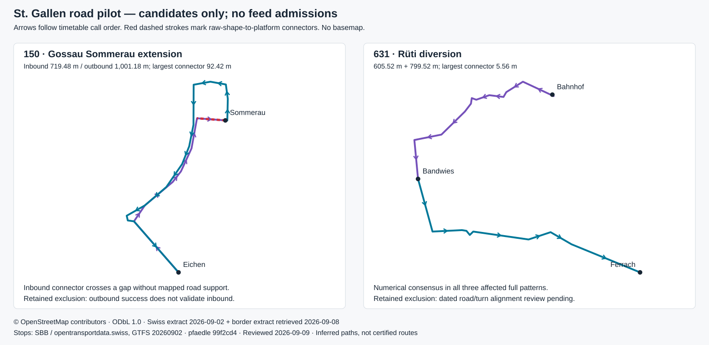

# St. Gallen: OSM road geometry pilot

The pilot finds numerical road candidates for the four missing directed pairs on lines **150 and 631**. It routes every complete pattern on those two routes, including already admitted controls: **153 Friday / 69 Sunday source trips**, **14 distinct geometry patterns** across both dates. **No road geometry is admitted.** The existing regional feed remains **10,652 Friday / 7,325 Sunday trips**, with **1,004 / 773 complete directed patterns**.

The pilot separates numerical coverage from evidence of the actual bus alignment. Inbound Sommerau has a **92.42 m** connector without support from the retained mapped road edges. Rüti has short connectors and consistent candidates, but its temporary road/turn alignment still needs a dated review. These findings refine the [service-change review](ST-GALLEN-SERVICE-CHANGE-REVIEW.md); they do not replace the official AL_OEV source adapter or relax its admission policy.



## Complete-pattern scope and geometry coverage

| Route identity | Agency | Friday trips / geometry patterns | Sunday trips / geometry patterns | Distinct patterns across both dates |
| --- | --- | ---: | ---: | ---: |
| `92-150-A-j26-1`, line 150 | 896, Regiobus Gossau SG | 58 / 4 | 0 / 0 | 4 |
| `92-631-j26-1`, line 631 | 772, Busbetrieb Rapperswil-Eschenbach-Rüti ZH | 95 / 9 | 69 / 8 | 10 |

These are full geometry-pattern identities: source route ID plus every ordered platform ID and original coordinate. They differ from the regional feed's directed-pattern identities, which also distinguish direction ID and call rules. Friday/Sunday pattern counts overlap and must not be added to obtain the distinct total. Full cross-canton calls and preceding-day times are retained; only a whole-day time shift is permitted in the synthetic routing input to make negative times nonnegative. The delivered timetable is untouched.

The matcher and importer accept all **3,029 trip-weighted segment occurrences** in this narrow pilot: 288 on line 150 and 2,741 on line 631. Across all complete contexts, **56 distinct route/platform pairs** have byte-identical accepted paths. This is diagnostic numerical coverage, not 100% cantonal coverage or proof of operator use. The four pairs being investigated affect **102 Friday / 33 Sunday excluded trips**; the other pilot trips provide full-route controls.

| Missing directed pair | Candidate length | Largest raw endpoint connector | Complete geometry contexts | Decision |
| --- | ---: | ---: | ---: | --- |
| 150: Eichen → Sommerau | 719.48 m | 92.42 m | 1 | Retain exclusion: unsupported inbound connector |
| 150: Sommerau → Eichen | 1,001.18 m | 6.35 m | 1 | Retain exclusion: outbound success does not validate both directions of the extension |
| 631: Bahnhof → Bandwies | 605.52 m | 5.56 m | 3 | Retain exclusion pending dated diversion-alignment review |
| 631: Bandwies → Ferrach | 799.52 m | 4.82 m | 3 | Retain exclusion pending dated diversion-alignment review |

The two Rüti rows share the same three full-pattern contexts. Their original GTFS stop coordinates, platform IDs and source call order remain unchanged. The [May construction notice](https://www.zh.ch/content/dam/zhweb/bilder-dokumente/themen/planen-bauen/tiefbau/baustellen/grosse-baustellen/rueti/R%C3%BCti%20-%20Baustelleninfo%20Ferrachstr%20H%C3%A4rtiplatz%20Dorfstr%2001.06.2026%20bis%20Ende%20Okt.%2026.pdf), effective June–October, corroborates the replacement stop on Bandwiesstrasse. It does not supply a complete bus path for every inferred road and turn. The separate August 24–28 closure does not cover either fixture.

At Sommerau, the inbound raw shape ends at **9.236350, 47.422546**, while the original timetable platform is **9.23757370, 47.42248438**. The importer adds the 92.42 m connector and therefore passes its 120 m numerical snap limit. The visual review of the retained OSM road extract shows no supporting mapped road edge along that connector. The outward candidate instead uses the road loop to the north. This is a concrete reason to retain the inbound exclusion even though the matcher reports no fallback warning. Obtain an updated extension alignment or corroborated road access before admission; do not move the stop to make it fit.

## Source dates and attribution

Reviewed **9 September 2026, Europe/Zurich**. Timetable fixtures are **Friday 4 September** and **Sunday 6 September 2026**. The pilot uses the existing, hash-verified national road extract; it does not claim a newly downloaded historical OSM snapshot.

| Input | Date / version | SHA-256 or pinned revision |
| --- | --- | --- |
| Swiss timetable | SBB GTFS `20260902`; valid 2025-12-14–2026-12-12 | `d325fd0954a91ac50005ad53db1976b8e528ebb1c388e4e8fd5a4415e4139a1e` (original archive) |
| [Geofabrik Switzerland](https://download.geofabrik.de/europe/switzerland.html) plus OSM border supplement | Swiss extract 2026-09-02; border retrieved 2026-09-08 | `d5c675456e935cfbcab88fe894fe9145dc5bd1fbd4318cea30ffd838a9aad02b` (combined filtered PBF) |
| [pfaedle](https://github.com/ad-freiburg/pfaedle) | `v0.1.6-208-g99f2cd4` | commit `99f2cd466696ecc6bdb73b2b3bb9008557fcb84a`; binary `6d193a755bc22c45516f8bce7594bb30e07a2632a5ef049a95915b262406cbd8` |
| Retained bus routing profile | Same profile as the existing national road pipeline | `31deee35fee9cb6fadc89cc5298e501a95cc4e8d78d7ae7fe6b60932cbf23db4` |

The combined extract includes a border supplement retrieved **after both fixtures**. These pilot gaps lie in Switzerland, but the combined input is not represented as a historical September 4 or September 6 road-state certification. Construction restrictions may be absent or stale. Source dates do not establish operation on a particular road.

Road geometry and the diagram are derived from **© OpenStreetMap contributors**, under [ODbL 1.0](https://www.openstreetmap.org/copyright). Timetable and stops: **SBB / opentransportdata.swiss**. Service-change evidence: **Stadt Gossau / gossau24.ch** and **Kanton Zürich, Baudirektion, Tiefbauamt**. Evidence publication/retrieval dates and byte hashes remain in the [service-change audit](../data/st-gallen-endpoint-followup.json). Existing official-source attribution and publisher redistribution restrictions remain documented in the [canton study](ST-GALLEN-STUDY.md). This separate OSM attribution does not clear rights to publish the combined regional feed.

## Reproduction and validation

The [pilot policy](../data/st-gallen-road-pilot-policy.json) pins route/agency identities, dates, original timetable hash, OSM input, matcher binary, configuration, cache, four candidate hashes and raw connector evidence. Its `admissionEnabled` field must remain false. No production adapter imports the pilot cache.

The [machine-readable report](../data/st-gallen-road-pilot-review.json) retains complete-pattern counts, original endpoint exclusions, service-change intervals, per-context raw shape hashes and connector measurements, matcher provenance and unchanged feed hashes. The local cache retains every original `patterns.json`, `matching.log`, `shapes.txt`, `trips.txt`, `stop_times.txt` and `routing-run.json` file in compressed evidence bundles. They remain in the ignored source directory.

```sh
# Recreate every complete routing input; retain the pinned original timetable.
node scripts/review-st-gallen-roads.mjs prepare

# Run once per real agency, with the exact pinned binary and PBF.
for agency in 896 772; do
  node scripts/match-postbus-roads.mjs \
    --pfaedle /private/tmp/gleislicht-pfaedle/build/pfaedle \
    --osm /private/tmp/gleislicht-postbus-roads.osm.pbf \
    --config data/st-gallen-road-pilot/pfaedle.cfg \
    --feed data/st-gallen-sources/local/road-pilot/prepared/$agency \
    --output data/st-gallen-sources/local/road-pilot/matched/$agency
done
node scripts/review-st-gallen-roads.mjs import

# Replay retained evidence and compare the report and diagram.
node scripts/review-st-gallen-roads.mjs --check
node scripts/check-st-gallen-region.mjs --audit-only
```

A fresh matcher run changes timestamped logs and may change binary/platform output. Re-importing does **not** silently update the reviewed cache hash: inspect differences and explicitly repin the pilot policy before generating a replacement review. For routine verification, run the two check commands against the retained evidence without rerouting. The source-replay command verifies original fallback warnings, exact shape-distance slices, all complete-pattern identities and trip multiplicities, connector hashes, strict consensus and every regional manifest, morning payload and chunk hash. The tracked-only regional checker rejects missing pairs, stale source/feed bindings and changes to the recorded exclusion decisions. Focused tests cover scope preservation and audit tampering.

Next geometry work is specific: corroborate Sommerau's inbound road access, and validate the two Rüti candidate alignments against the June–October road/turn regime before considering a separately reviewed admission policy.
