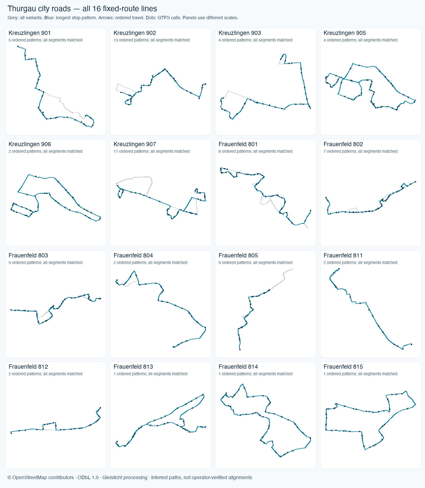

# Thurgau canton transit study

Audit date: **8 September 2026**. Starting point: [Swiss transit source inventory](SWISS-TRANSIT-SOURCE-INVENTORY.md#tg).

The complete canton-scoped GTFS inventory contains **132 route records across 15 agency identities**, with calls in all **five districts**. The regional feed admits **4243 Friday journeys and 2649 Sunday journeys**, each retaining every original call and a validated path for every directed segment. **This is partial geometry coverage, not a complete canton service feed.** 100 route records have all dated journeys admitted, 2 have partial admission, 9 are excluded, and 21 are inactive on both validation dates.

## Deliverables

- [Regional feed index](../public/data/thurgau-region/index.json): Friday **2026-09-04** and Sunday **2026-09-06**, each with a full civil-day manifest, twelve two-hour chunks and a 06:45–08:45 extract.
- [Complete route inventory](THURGAU-ROUTE-INVENTORY.md): every selected annual route, operator, source join, dated admission and exclusion reason.
- [Audit summary](../data/thurgau-audit/summary.json), [route records](../data/thurgau-audit/routes.json), [Friday patterns/pairs](../data/thurgau-audit/2026-09-04.json), [Sunday patterns/pairs](../data/thurgau-audit/2026-09-06.json).
- [All source line records](../data/thurgau-audit/source-lines.json), [all 718 source stops](../data/thurgau-audit/source-stops.json), [canton GTFS stop inventory](../data/thurgau-audit/stops.json), [reviewed route crosswalk](../data/thurgau-line-crosswalk.json).
- [Source metadata and request hashes](../data/thurgau-sources/sources.json), [raw request receipts](../data/thurgau-sources/requests.json). Original responses, boundary rows and the selected timetable fixture are preserved as gzip files in the repository.
- [SBB border source](../data/thurgau-sbb-rail-sources/sources.json), [explicit Konstanz joins](../data/thurgau-sbb-rail-policy.json), [all SBB candidate records and exclusions](../data/thurgau-audit/sbb-rail-source-segments.json), and [lake-source screening](../data/thurgau-water-review/review.json).
- [Federal rail source](../data/thurgau-rail-sources/source.json), [exact rail policy](../data/thurgau-rail-policy.json) and [all federal source segments](../data/thurgau-audit/rail-source-segments.json).
- [Regional bus road evidence](../data/thurgau-regional-roads/sources.json), [review notes](../data/thurgau-regional-roads/review-sources.json), and [OSM-derived regional path database](../public/data/thurgau-region/regional-road-paths.json).
- [City road source evidence](../data/thurgau-city-roads/sources.json), [OSM-derived city path database](../public/data/thurgau-region/city-road-paths.json), and [16-line geometry review](assets/thurgau-city-road-review.png).

## Whole-canton membership

The scanner reads **all 2,143,227 trip records and 34,499,152 stop-time records** in the pinned national archive. A route belongs to the inventory if any original call falls in the unsimplified swissBOUNDARIES3D **2026-01** Thurgau polygon. No operator whitelist or rectangular crop selects membership. Parent/platform records are kept distinct; 1686 in-canton platform/stop IDs are actually called by these routes. Polygon membership, not the source bus-stop list, defines the denominator.

| District | Called GTFS stop IDs | Annual route records |
| --- | --- | --- |
| Weinfelden | 359 | 45 |
| Frauenfeld | 589 | 60 |
| Arbon | 250 | 37 |
| Kreuzlingen | 333 | 36 |
| Münchwilen | 155 | 27 |

District route counts overlap. Journeys retain **every call outside Thurgau**, including Swiss and foreign termini; a route passing through without any in-canton stop does not enter this stop-based census. Full patterns extending beyond the available geometry are excluded, not shortened at the border. This includes the Lake Constance/Rhine services of URh, SBS, BSB and the Reichenau solar ferry. City, replacement, night and seasonal route records remain inventoried even when geometry is absent or no service operates on these dates.

| Agency ID | GTFS identity | Annual routes | Friday admitted / total | Sunday admitted / total |
| --- | --- | --- | --- | --- |
| 11 | Schweizerische Bundesbahnen SBB | 9 | 144 / 144 | 106 / 106 |
| 22 | Appenzeller Bahnen (ab) | 1 | 98 / 98 | 82 / 82 |
| 65 | THURBO | 23 | 677 / 677 | 707 / 707 |
| 138 | Bus Ostschweiz | 18 | 916 / 946 | 492 / 521 |
| 193 | Schweiz. Schifffahrtsgesellschaft Untersee und Rhein AG | 1 | 0 / 17 | 0 / 17 |
| 195 | Schweizerische Bodensee-Schifffahrt AG | 3 | 0 / 37 | 0 / 34 |
| 360 | Bodensee-Schiffsbetriebe GmbH | 2 | 0 / 20 | 0 / 18 |
| 727 | Verkehrsbetriebe Kreuzlingen | 6 | 487 / 487 | 200 / 200 |
| 744 | Automobildienst Appenzeller Bahnen | 2 | 1 / 1 | 0 / 0 |
| 797 | Stadtbus Frauenfeld | 11 | 574 / 589 | 194 / 224 |
| 801 | PostAuto AG | 40 | 1288 / 1325 | 868 / 868 |
| 896 | Regiobus Gossau SG | 1 | 58 / 58 | 0 / 0 |
| 3182 | Solarfährbetrieb Thomas Geiger Reichenau | 1 | 0 / 18 | 0 / 18 |
| 7231 | SBB Infrastruktur AG Bahnersatz | 13 | 0 / 0 | 0 / 0 |
| 7252 | Appenzeller Bahnen Ersatzverkehr | 1 | 0 / 0 | 0 / 0 |

Four official call-taxi polygons are separately recorded in the audit: Bischofszell (Schweizersholz/Halden), Hohentannen (Heldswil), Erlen (Buchackern/Eppishausen), and one unnamed feature. The first three carry **80.945**. They define service areas, not fixed movements, and are excluded from the vehicle feed. A fixed-stop GTFS scan cannot prove completeness for services absent from the archive or for unrepresented flexible-service areas.

## Sources, dates and attribution

| Source | Pinned evidence / vintage | Credit and reuse |
| --- | --- | --- |
| National GTFS | Feed 20260902; valid 2025-12-14–2026-12-12. SHA-256 d325fd0954a91ac50005ad53db1976b8e528ebb1c388e4e8fd5a4415e4139a1e | SBB / Open data platform mobility Switzerland; opentransportdata.swiss terms, not a blanket CC licence |
| Thurgau WFS | Full original GML responses acquired 2026-09-08; EPSG:2056. Geometry effective date UNKNOWN. | © Kanton Thurgau, Abteilung Öffentlicher Verkehr; Amt für Geoinformation. CC BY 4.0 declared by the cantonal dataset catalogue |
| Cantonal catalogue | Modified 2026-07-31T18:00:13+00:00; creation 2000-01-01 is not a geometry vintage | Pinned catalogue.json records the dataset-specific licence and publisher |
| Thurgau general terms | 2018-02-20; preserved alongside the catalogue declaration | Visible attribution on publication/redistribution; retain dataset-specific CC BY evidence |
| swissBOUNDARIES3D | 2026-01; all original canton and district geometry rows retained | © swisstopo; free-geodata terms |
| Federal rail network | Checksum-verified FOT XTF; catalogue 2021-07-06, asset updated 2025-01-18, reused 2026-09-08; used segment Stand dates 2021-07-06 | © Federal Office of Transport (FOT); opendata.swiss terms_by, source attribution required; retain proprietary catalogue label without relabelling it CC |
| SBB graphical lines | Pinned selected responses reused 2026-09-08; catalogue modified 2026-07-29T06:16:28+00:00, data processed 2026-09-02T03:01:34+00:00; no feature survey date supplied | SBB Infrastructure / data.sbb.ch; terms_by, commercial and non-commercial use with attribution |
| Bregenz OSM rail corridor | Historical Overpass query 2026-09-02T00:00:00Z; acquired 2026-09-08; 521 ways individually inventoried | © OpenStreetMap contributors; separate border path database under ODbL 1.0 |
| City and regional road supplements | Geofabrik Switzerland 2026-09-02 plus OSM border extract 2026-09-08; pinned PBF SHA d5c675456e935cfbcab88fe894fe9145dc5bd1fbd4318cea30ffd838a9aad02b | © OpenStreetMap contributors; derived path database under ODbL 1.0 |

Official references: [national GTFS dataset](https://data.opentransportdata.swiss/en/dataset/timetable-2026-gtfs2020), [national terms](https://opentransportdata.swiss/en/terms-of-use/), [Thurgau catalogue API](https://data.tg.ch/api/explore/v2.1/catalog/datasets/netz-des-offentlichen-verkehrs), [Thurgau WFS](https://ows.geo.tg.ch/geofy_access_proxy/oev?Request=GetCapabilities&Service=WFS&Version=2.0.0), [general terms](https://shop.geo.tg.ch/sites/default/files/pdf/Nutzungsbedingungen_Geodaten.pdf), [CC BY 4.0](https://creativecommons.org/licenses/by/4.0/), [swisstopo terms](https://www.swisstopo.admin.ch/en/terms-of-use-free-geodata-and-geoservices).

The WFS layer metadata supplies no effective geometry date. Neither its response timestamp, the catalogue's July modification, nor its placeholder 2000 creation date proves a 2026 timetable alignment. This study explicitly labels the geometry vintage unknown. The [official 2026 eastern Switzerland rail map](https://www.thurbo.ch/fileadmin/user_upload/1_Reisen/Reiseinfos/L-11_SBB-RV-Ostschweiz-A1-26-SID.pdf) provides a network review aid (including S10 Wil–Weinfelden–Romanshorn and S15 Wil–Wängi–Frauenfeld); it is not used as digitized geometry or redistributed here.

Gleislicht authors the processed feed. Modifications comprise route selection, source graph construction, stop projection, bounded stop-access connectors, conversion to WGS84, output rounding and scheduled interpolation. The feed carries attribution, licence/terms URLs and local copies of the Thurgau licence evidence. It is an archival study, not current operational or realtime data; a refresh requires a new source snapshot and full revalidation.

## Source adapter and exclusions

| WFS layer | Records | Role |
| --- | --- | --- |
| buslinie | 337 | Route-attributed bus centreline segments |
| bahnlinie_takt | 17 | 17 rail corridor segments, including two explicitly labelled S15 |
| buslinie_takt | 337 | Frequency-rendering duplicate; acquired and inventoried, not a second geometry source |
| bushalte | 718 | DiDok + line + operator evidence |
| sammeltaxi | 4 | Service-area inventory; excluded from fixed movements |
| dist_bahn / dist_bus | Not downloaded | Advertised accessibility-distance layers; excluded because they are not vehicle paths |

All **354 bus/rail geometry records** are retained in the line audit; 239 have route-crosswalk candidates. These are segmented source features, not that many passenger lines. Candidate status does not mean every vertex is used or every joined route is admitted.

Bus joins require an exact prefixed line number, a reviewed operator label, and at least **two distinct shared DiDok stops** between the source stop layer and the canton-scoped GTFS route. Reviewed source labels are PostAuto → 801, Bus Ostschweiz → 138 and REGO → 896. Each route's evidence IDs are saved. The GTFS line names alone are not unique operator identities. Prefix 70 is explicitly assigned only to 605/806; other reviewed regular bus codes use 80. A source token **20.207** is retained as written and is never silently corrected to 80.207.

Comma-separated source numbers are parsed independently. Parenthetical **nur zeitweise**, **Abendkurs** and **Kantibus** tokens are excluded from that route's graph because no operating-time rule is supplied; an unqualified token for another line on the same feature can still be used. **BN820** is not assumed to mean the GTFS line 820. Day and night labels are respected. The official line source lacks Frauenfeld and Kreuzlingen city routes; the separate OSM supplement below covers their fixed-route patterns. Replacement route records remain inventoried; the dated fixed service of operator 744 receives an independently identified GTFS/OSM pattern in the regional supplement.

For rail, SBB/THURBO use the 15 unlabelled regional corridor features as a routing graph; these are not preassigned GTFS line shapes. AB **S15** uses only its two explicitly labelled Frauenfeld–Wängi–Wil features, separately from the other rail graph. Full stop-chain geometry tests determine admission. Incomplete SBB/THURBO patterns can use the separately audited federal rail supplement below; complete cantonal paths remain unchanged. Lake services have no acquired water-compatible geometry and receive no road or rail substitute.

Original **EPSG:2056 east/north** vertices form the graph. The parser asserts CRS, axis ranges, unique IDs and full WFS returned/matched counts. Exact source vertices define connectivity; no gap is bridged and no near-coincident tracks are merged. The established swisstopo approximate LV95/WGS84 conversion has metre-level precision. Output coordinates round to seven decimals.

Every directed segment must project within **80 m for bus / 120 m for rail**. The path follows existing source edges; inferred connectors link the actual platform coordinates to the source line within those limits. Detours may not exceed the larger of 4.5 × straight-line distance and 1,200 m (bus) / 3,000 m (rail). Alternative projections can differ by at most 5 m from the nearest projection. No simplification or automatic connector between disconnected source parts is added.

Direction comes from the ordered GTFS platform chain, not a source road-direction field. This does **not** certify one-way access, a specific running track, bridge/tunnel correctness, a loop's exact operational alignment, or temporary diversions. Shortest source-path inference and bounded stop-access connectors remain model assumptions. Complete geometry is necessary for admission; it is not observed movement.

## City road supplement

The initial official-geometry feed admitted 376 Friday / 293 Sunday journeys. The city supplement adds **1061 / 394 journeys**, bringing the earlier city-stage totals to **1437 / 687** before the regional extension below. All **six Kreuzlingen fixed routes (901, 902, 903, 905, 906, 907)** and **ten Frauenfeld fixed routes (801–805, 811–815)** are now admitted for both dates when scheduled. These account for 77 unique routing patterns across the two dates, with 16,980 scheduled segment occurrences and no matcher rejections. Per-day pattern counts can differ because the regional audit also preserves GTFS direction IDs.

The [official Frauenfeld timetable](https://www.frauenfeld.ch/wohnen-mobilitaet/mobilitaet/stadtbus/fahrplan.html/680), valid from 14 December 2025, distinguishes daytime 801–805 from evening/Sunday 811–815. Its night taxi drops passengers at requested destinations; **NT stays excluded**, including 15 Friday and 30 Sunday civil-day instances. The [Kreuzlingen city page](https://www.kreuzlingen.ch/lebenslagen/mobilitaet/oeffentlicher-verkehr) confirms six lines and Sunday service. These pages establish service scope, not street geometry. [Review notes](../data/thurgau-city-roads/review-sources.json) distinguish web-readable evidence from a failed direct HTML download; no unacquired source snapshot is claimed.

Road geometry uses pinned **pfaedle 99f2cd466696ecc6bdb73b2b3bb9008557fcb84a**, its unmodified bus profile, and the existing hashed Swiss/border OSM extract. The run enables **--no-trie -W** so every fallback hop is reported. Original pattern index, matcher log, shapes, stop times, trips and run hashes are preserved for each city. Offline verification reimports those outputs and requires exact equality with the derived cache. Maximum road snaps are **71.2 m Kreuzlingen / 38.8 m Frauenfeld** (rounded upwards), below the 120 m road limit; detour guard is max(6 × direct distance, 1,500 m), with 5 m simplification. These are separate from the tighter cantonal bus limits above.

Cache identity includes the exact GTFS route ID, complete ordered platform IDs and coordinates. Missing/changed patterns fail the build; no stop-pair or reverse-direction cache borrowing is allowed. Repeated loop calls are sliced with monotone source shape distances. Each journey retains its own pattern's geometry even where a directed pair has several path variants. Official source paths are preserved; the road supplement applies only to agencies 727 and 797. The resulting city database is OSM-derived **ODbL 1.0**, separately attributed from the cantonal CC BY geometry. The complete derived city database is distributed beside the regional feed.



The plot was inspected for all 16 lines, including opposite directions, branches, termini and evening loops. It is a geometry overview without a basemap; it does not independently certify every street restriction or actual operator routing. The matcher uses supported OSM bus access, one-way and turn restrictions, whose accuracy and temporary changes remain source limitations.

## Regional bus road supplement

The regional supplement adds **2108 Friday / 1251 Sunday journeys** to the city-stage feed. It routes the complete, uncropped dated patterns for fixed buses operated by **Bus Ostschweiz (138), Automobildienst Appenzeller Bahnen (744), PostAuto (801) and Regiobus (896)**. GTFS operator and route IDs establish these road-pattern identities directly; this does not assert a previously unresolved cantonal line crosswalk or alter original WFS labels.

| Agency | Routing patterns | Complete road patterns | Rejected segments | Maximum snap (m) |
| --- | --- | --- | --- | --- |
| 138 | 67 | 67 | 0 | 89.13 |
| 744 | 1 | 1 | 0 | 26.74 |
| 801 | 226 | 222 | 4 | 108.01 |
| 896 | 2 | 2 | 0 | 33.99 |

Across **59 fixed route records**, **292 of 296** routing patterns pass every road-segment check. Matcher runs on **8 September 2026** use the same pinned binary, unmodified bus configuration and Swiss/border OSM source as the city supplement. The 120 m snap, max(6 × direct, 1,500 m) detour and 5 m simplification limits are unchanged. Original patterns, log, shapes, trips, stop times and run receipts are preserved separately for each operator. Verification pins binary/config/source hashes and reimports every accepted and rejected segment from those original outputs. These are inferred road shapes, not newly acquired operator alignment data.

Complete official patterns retain their original paths. For an incomplete official pattern, the road supplement must provide the **entire exact ordered platform-and-coordinate chain**; it cannot patch a gap with another pattern's segment. Missing cache identities fail the build. Known rejected road patterns retain their official geometry diagnostics and remain excluded as whole journeys. Each admitted train keeps its own pattern geometry, even when another pattern traverses the same directed stop pair differently.

**Wittenbach Zentrum:** four PostAuto routing patterns on 200 and 207 give distinct platforms 73966:0:341297 and 73966:0:256909 identical matcher shape distances (0.0). The importer cannot extract a positive-length road segment. Their **37 Friday journeys** remain excluded with missing-shape evidence; neither call is dropped and no connector is invented.

**RUB:** route 92-8-Y-j26-1 is GTFS type **715**, which denotes demand-responsive bus service in the [extended GTFS route reference](https://developers.google.com/transit/gtfs/reference/extended-route-types), last updated 16 October 2024 and checked 8 September 2026. Ordinary pickup/drop-off flags alone do not establish fixed operation. Its **30 Friday and 29 Sunday** instances remain excluded, alongside Frauenfeld NT. [Review notes](../data/thurgau-regional-roads/review-sources.json) preserve the source interpretation; they do not claim an original HTML snapshot.

A [fresh Wittenbach replay](../data/thurgau-audit/wittenbach-review.json) confirms the four failed patterns against the preserved matcher stop-times: distinct platforms 2 and 1 are 17.85 m apart, but both shape distances are 0.0. Their 37 Friday journeys remain excluded pending evidenced turnaround geometry. Reproduce with `python3 scripts/review-thurgau-wittenbach.py`.

The review plots overlay all 296 routing patterns across 59 route records: [page 1](assets/thurgau-regional-road-review-1.png), [page 2](assets/thurgau-regional-road-review-2.png), [page 3](assets/thurgau-regional-road-review-3.png), [page 4](assets/thurgau-regional-road-review-4.png). Every panel was inspected for branch shapes and endpoint loops. Grey paths include valid segments from incomplete patterns; their presence in a review plot is not feed admission. The plots have no basemap and do not certify temporary diversions or physical street restrictions. The complete regional derived database is distributed under **ODbL 1.0**, credited to **OpenStreetMap contributors**, separately from the cantonal CC BY geometry.

## Federal rail supplement

The federal-only infrastructure supplement adds **476 Friday and 490 Sunday journeys** to the preceding 3545 / 1938 feed. Its 169 unique newly admitted full patterns cover 17 route identities across the two dates. The policy inventories all **32** annual SBB/THURBO rail route identities; inactive records remain visible. The original AB S15 and complete SBB/THURBO cantonal paths are preserved byte-for-byte.

The reused **Federal Office of Transport railway network** contains **3210 operating points and 3424 infrastructure segments**. Original XTF, collection and asset metadata are retained. The uncompressed XTF SHA-256 is **2895811c6c338cdc3d32e946d2861ce58ca72ddde7d700fe9b73f2c393f7b828**, matching the published STAC asset checksum. This extension reuses the previously acquired bytes; it does not claim a new network download. The catalogue date is **6 July 2021**, the asset update is **18 January 2025**, and every segment used by this extension has **Stand 2021-07-06**. These dates do not establish alignment validity for the September 2026 timetable.

**319 distinct source segments** appear in admitted supplemental paths. The [complete source-segment inventory](../data/thurgau-audit/rail-source-segments.json) retains gauge, source Stand, validity interval, infrastructure operator, endpoint-attachment distance and exclusion reason for all 3424 records. Gauge is **1435 mm** for the reviewed SBB (11) and THURBO (65) routes. Mixed-gauge segments must explicitly include 1435 mm. Future/expired segments, other gauges and excessive source endpoint gaps are excluded from the graph.

Each original platform is joined by exact operating-point number, with a **350 m station-to-operating-point limit**. Source geometry can attach to its explicitly referenced topology nodes within **120 m**; this is not a nearest-coordinate merge between separate networks. Paths may not exceed **max(3000 m, 4.5 × direct distance)** including station attachments. Source vertices receive **5 m LV95 simplification** and the established approximate swisstopo conversion, rounded to six decimals before final output. The largest accepted station attachment is **302.0 m** and topology attachment **90.6 m** (rounded upwards). These station-centre attachments are a different model from the 120 m cantonal rail projection limit; no existing cantonal threshold was increased.

The complete ordered stop chain constrains every directed search: other scheduled operating points are blocked until their turn. The matcher cannot pass a later call early just to shorten a path. The entire supplemental pattern must pass; no individual successful segment is borrowed to repair another failed pattern. Per-pattern evidence records ordered source segment IDs, directed topology endpoints, station attachment distances and hashes of the derived paths. The feed retains the original platform IDs, times and outside-canton calls.

**Interlaken Ost IC81:** the generic operating point 8507492 is disconnected from the standard-gauge graph. FOT separately identifies **8519309 / ch14uvag00165678** as **Interlaken Ost [Gleis 5-8]**, connected to the 1435 mm Interlaken West segment **ch14uvag00087489**. The policy maps only original IC81 platforms **ch:1:sloid:7492:0:460848 (7)** and **ch:1:sloid:7492:0:581416 (5)** to that source node. Source number, node name, gauge, route and platform labels are asserted; a changed or different platform cannot inherit the mapping. This admits all **15 Friday IC81 journeys**, preserving every original call. It is an explicit platform-group crosswalk, not a name or proximity guess.

**Rail coverage is complete for the two dated fixtures:** all **919 Friday / 895 Sunday rail journeys** retain every call and a path for every segment, including Konstanz and both St. Margrethen platforms for Bregenz. This is cartographic admission for those dates, not year-round or running-track certification. The primary federal source still lacks Bregenz and the 26 schematic SBB candidate records remain excluded as source geometry.

The [rail review overview, page 1](assets/thurgau-rail-review-1.png) and [page 2](assets/thurgau-rail-review-2.png) overlay all 169 newly admitted patterns. Both were inspected for complete branches, termini and the long cross-canton IC8/IC81/IC9 paths. These are infrastructure-centreline inferences, not certified running tracks, actual train positions or temporary diversion geometry. The plots have no basemap. Timetable precision and physically plausible speeds remain separate from geometric admission.

Credit is **© Federal Office of Transport (FOT), Railway network**, with the [source asset](https://data.geo.admin.ch/ch.bav.schienennetz/schienennetz/schienennetz_2056_de.xtf) and [source-attribution terms](https://opendata.swiss/terms-of-use/#terms_by). The collection's literal licence field is **proprietary**, while its licence link selects **terms_by**; this audit preserves both rather than assigning a Creative Commons licence. The [official terms page](https://opendata.swiss/en/terms-of-use), checked 8 September 2026, allows commercial and non-commercial reuse under that attribution condition. Source metadata and catalogue declarations accompany the feed in its rail-sources directory. The federal rail component retains these terms separately from the ODbL road databases and CC BY cantonal geometry.

## Konstanz SBB border supplement

The SBB supplement adds **212 Friday / 207 Sunday journeys**, covering **61 unique complete patterns** across six exact GTFS route identities: THURBO RE1, S14, SN14, S44, RE75 and SBB IR75. Friday has 51 patterns and Sunday 39; SN14 operates here only on Sunday. All original foreign and Swiss calls, platform identities, times and call permissions remain intact. Every previously admitted cantonal, road and federal-only path is regression-checked byte-for-byte.

The [SBB graphical line dataset](https://data.sbb.ch/explore/dataset/linie-mit-polygon/) supplies two detailed normal-gauge curves: line **822 KRGR–KODB** (43 vertices) and line **824 KHGR–KODB** (42 vertices). Exact source feature identities include line number, operating-point codes and kilometre endpoints. The policy joins **KRGR / Kreuzlingen Grenze** to FOT **8518047 / ch14uvag00089372**, and **KHGR / Kreuzlingen Hafen Grenze** to **8518048 / ch14uvag00089349**. The two border nodes remain distinct. **KODB / Konstanz** is explicitly crosswalked to GTFS **8014586**; the graph station coordinate is the line 822 endpoint, with a bounded connector from line 824. Source-node connectors must be at most **10 m**; both border joins are under one metre and the Konstanz inter-source connector is about five metres. The original Konstanz timetable stop has an approximately **78 m** inferred station attachment.

The full ordered call chain is routed through the combined FOT/SBB graph only when the primary pattern is incomplete and its route identity is explicitly reviewed. Every segment must pass the unchanged federal gauge, stop-order, station-attachment and detour limits. Pattern evidence identifies every SBB segment and each segment's original federal failure. Admitted mixed paths are labelled **fot-sbb-rail-inference**. Both SBB approaches have validated travel in both directions. No two-point schematic segment is admitted. The 59-record preserved Konstanz/Como response is fully inventoried: two records are used and 57 are excluded; the separate Bregenz query contributes 26 further exclusions.

The SBB source catalogue was modified **29 July 2026** and data processed **2 September 2026**; the selected Konstanz response was acquired and reused **8 September 2026**. These are publication/processing dates, with **no individual feature survey or alignment-validity date established**. All SBB vertices are retained before seven-decimal output rounding; unlike FOT geometry, they receive no LV95 conversion or 5 m simplification. Credit is **SBB Infrastructure / data.sbb.ch**. The pinned dataset metadata explicitly declares **terms_by** and **NonCommercialAllowed-CommercialAllowed-ReferenceRequired**, with the [SBB licence page](https://data.sbb.ch/page/licence/) as its terms reference. Original responses, metadata, terms HTML and hashes accompany the feed under sbb-rail-sources, separately from FOT and ODbL components.

The [six-route review](assets/thurgau-sbb-rail-review-1.png) overlays all 61 newly admitted patterns; the [border detail](assets/thurgau-sbb-border-review.png) shows both source curves and the Konstanz stop attachment. These are reviewed cartographic centreline inferences, not running-track, temporary-diversion or actual-movement certification.

## Bregenz OSM border rail supplement

This extension admits **10 Friday / 14 Sunday S7 journeys**, through **St. Margrethen SG platforms 2 and 3**, with complete original calls and successful federal segments unchanged. The [derived border path database](../public/data/thurgau-region/border-rail-paths.json), [source archive](../data/thurgau-border-rail-sources/sources.json), [route/station policy](../data/thurgau-border-rail-policy.json) and [source inventory](../data/thurgau-border-rail-sources/inventory.json) retain attribution, geometry and selection evidence. The [review plot](assets/thurgau-border-rail-review.png) compares the accepted directed border paths, the reviewed station connection and the earlier rejected reversal.

The Overpass query requests the historical state at **2026-09-02T00:00:00Z**, acquired **8 September 2026**; the server's database timestamp is separate from that requested snapshot. Original query and response bytes are preserved. All **521 rail ways** are inventoried: **240** are eligible standard-gauge main/branch tracks or crossovers explicitly tagged as main track. One additional exact passenger connector, reviewed below, brings the scoped graph to **241 eligible ways**. Other sidings, yards, spurs and other gauges remain excluded. All used ways carry gauge **1435**, and way version/timestamp evidence is retained. Original OSM node IDs define connectivity; equal coordinates on separate nodes do not create a junction.

Station identity requires exact **uic_ref** and reviewed OSM station IDs: **4886725252 / 8506314 / St. Margrethen SG** and **2459480034 / 8102336 / Bregenz**. Original timetable coordinates remain unchanged. Station identity must be within **350 m**, track projection within **60 m**, and an alternative projection within **5 m** of the nearest. Paths are capped at **18 km**; direction changes greater than **120°** are rejected to prevent instantaneous reversal at switches. The accepted border path is approximately **12.281 km**, with track attachments **1.91 m** at St. Margrethen platform 3 and **0.51 m** at Bregenz. No coordinate merge joins this network to FOT: each original adjacent stop pair is matched independently within the full S7 call chain, and the whole pattern must pass.

**Platform 2 is now resolved through an explicit source review.** OSM way **122064965**, version **10**, dated **2024-02-15T22:14:42Z**, has mixed tags: **service=siding**, **passenger_lines=1**, **gauge=1435**, **maxspeed=95** and **operator=SBB**. Its eight-node curve connects source nodes **1364831182** and **1364831187**, shared with the 883 main track (**275975818**) and 880 main track (**122064981**). This is a source-drawn connection, not a coordinate bridge or platform substitution. The policy pins the complete feature hash, endpoint IDs, adjoining main tracks and passenger/gauge/operator tags. A changed feature or connection requires a new review.

The additional way is available only after the primary graph fails, and only for the original pair **ch:1:sloid:6314:2:2 ↔ 8102336** within a reviewed full S7 pattern. Previously successful platform-3 paths are returned unchanged. The new platform-2 path is **12.280 km** and passes the original **120° turn**, **60 m projection**, **5 m alternative** and **18 km length** guards in both directions, adding the remaining **5 Friday / 6 Sunday journeys**. The policy does not generally admit sidings. The original graph without this connection still fails; relaxing its turn guard still produces the rejected reversing movement, which remains in the review evidence. Physical running-track selection, legal direction, signalling and diversions remain unverified even for admitted patterns.

The **Vorarlberg WFS** was fully acquired with **136 rail records**, count checks, source attributes and dataset metadata. The metadata declares **CC BY 4.0**, describes digitisation from **2012 aerial imagery**, and records revision **17 February 2025** and metadata date **29 July 2026**. Those later metadata dates do not establish an updated border alignment. [ÖBB's project account](https://infrastruktur.oebb.at/en/projekte-fuer-oesterreich/bahnstrecken/arlbergstrecke-innsbruck-bregenz/ausbau-st-margrethen-lauterach) documents the replacement Rhine crossing in March 2013. These records remain candidate evidence, with no geometry admitted from them. The [ÖBB Geo Netz catalogue](https://data.oebb.at/de/datensaetze~geo-netz~) lists its 12-2024 release as valid only through **13 December 2025**, so that alternative is also excluded from the 2026 feed.

The admitted OSM-derived border database is distributed separately under **ODbL 1.0**, credited **© OpenStreetMap contributors**, with the [OSM copyright and licence page](https://www.openstreetmap.org/copyright). Patterns using it are labelled **fot-osm-border-rail-inference**. FOT geometry retains its own attribution and terms. This is an inferred archival rail path, not a certified train trajectory.

## Lake and Rhine source screening

All **92 Friday / 87 Sunday boat journeys** remain excluded, retaining their complete dock chains. The [reproducible screening](../data/thurgau-water-review/review.json) preserves the existing local FOEN/swisstopo lake display artifact and its hash. Its metadata labels the reference edition **2007** and shoreline simplification **60 m**. Among the **34** called dock IDs, **24** lie outside the display lake polygon and **17** are more than 150 m from it. These measurements describe the display polygon, not verified dock access.

The [original FOEN feature review](../data/thurgau-water-review/original-source-review.json) now preserves the unsimplified Lake Constance response: **8,714 vertices**, acquired **8 September 2026**, credited **© FOEN, swisstopo**. It tests every original dock and all **66 directed boat pairs** against shoreline and island intersections. **17 docks** still lie more than 150 m from this lake feature. Straight projected paths yield only **three candidate pairs and zero complete journeys**; these are screening candidates, not admitted paths. Acquisition does not establish a newer shoreline vintage. Constrained harbour routing and connected Untersee/Rhine geometry remain necessary. Reproduce with `node scripts/review-thurgau-water-source.mjs`. No water geometry is enabled in the feed. A lake polygon alone does not establish shipping routes; the water router cannot supply missing river channels or justify discarding distant calls.

## Weekday and Sunday directed validation

The date model is **local civil day 00:00–24:00**, including previous-service-day spillover (Thursday into Friday and Saturday into Sunday). Calendar exceptions apply. Frequency expansion and reservation permissions are handled; this selected fixture has zero active frequency templates. Original calls and pickup/drop-off permissions remain in exported journeys. A reservation/on-demand call, type-715 route or any failed segment excludes the entire journey.

The admitted feeds retain **8920 / 4714 zero-duration segment occurrences (Friday / Sunday)** where different stops share a timetable minute. No artificial seconds are inserted and no finite speed is assigned to those segments. Each day's timing diagnostics also retain the largest positive-duration implied speed by mode; the Sunday rail maximum is about 215 km/h on an SN30 segment. These are source-timing/model limitations, not measured or certified operating speeds. Geometry admission does not establish physically realistic timing at every call.

Pattern identity is GTFS **route ID + direction_id + full ordered original platform IDs**, including repeated calls and out-of-canton stops. Stop pairs remain ordered and route-scoped. A matched directed pair means at least one pattern context has a path. Segment-occurrence coverage is counted from each pattern’s own paths; a successful context does not confer coverage on a failed context of the same pair. Both include otherwise excluded incomplete journeys and must not be confused with admitted-feed counts.

| Measure | Friday 4 September | Sunday 6 September |
| --- | --- | --- |
| Dated journeys | 4417 | 2795 |
| Admitted journeys | 4243 (96.1%) | 2649 (94.8%) |
| Complete admitted patterns / all patterns | 527 / 563 | 411 / 442 |
| Matched directed pairs / all directed pairs | 3365 / 3529 (95.4%) | 3272 / 3425 (95.5%) |
| Matched scheduled segments / all occurrences | 63689 / 64684 (98.5%) | 40081 / 41271 (97.1%) |
| Segments in admitted journeys | 63207 | 40081 |
| Carry-in journeys: admitted / total | 55 / 58 | 129 / 167 |
| Night-labelled journeys: admitted / total | 0 / 15 | 75 / 105 |
| Patterns revisiting platforms: admitted / total | 19 / 21 | 11 / 13 |

**305 patterns are shared**, **258 occur only on Friday**, and **137 occur only on Sunday**. Both direction IDs 0 and 1 are evaluated. All exported journeys have geometry for 100% of their segments; this does not turn canton-wide coverage into 100%.

| Unmatched directed-pair reason | Friday | Sunday |
| --- | --- | --- |
| missing-line | 153 | 153 |
| endpoint-gap | 6 | 0 |
| disconnected-line | 4 | 0 |
| collapsed-path | 1 | 0 |
| implausible-detour | 0 | 0 |

Endpoint gaps can reflect source extent, missing termini, stop offsets or stale alignment; disconnections reflect exact source topology. No threshold was increased to hide these failures. All rejected pairs, their endpoint names and gap diagnostics are saved in each day's audit.

## Admitted routes

Counts below refer only to the two validated civil dates. Multiple records can share a passenger-facing number.

| Agency | Line | GTFS route ID | Friday admitted / total | Sunday admitted / total |
| --- | --- | --- | --- | --- |
| 11 | IC8 | 91-8-E-j26-1 | 23 / 23 | 38 / 38 |
| 11 | IC9 | 91-9-P-j26-1 | 0 / 0 | 1 / 1 |
| 11 | IC81 | 91-81-A-j26-1 | 15 / 15 | 0 / 0 |
| 11 | IR75 | 91-75-j26-1 | 35 / 35 | 34 / 34 |
| 11 | S12 | 91-12-j26-1 | 34 / 34 | 0 / 0 |
| 11 | S23 | 91-23-B-j26-1 | 4 / 4 | 0 / 0 |
| 11 | S24 | 91-24-j26-1 | 33 / 33 | 33 / 33 |
| 22 | S15 | 91-15-I-j26-1 | 98 / 98 | 82 / 82 |
| 65 | RE1 | 91-1-P-j26-1 | 32 / 32 | 32 / 32 |
| 65 | RE8 | 91-8-N-j26-1 | 1 / 1 | 0 / 0 |
| 65 | RE75 | 91-75-B-j26-1 | 4 / 4 | 4 / 4 |
| 65 | S1 | 91-1-C-j26-1 | 94 / 94 | 94 / 94 |
| 65 | S5 | 91-5-B-j26-1 | 80 / 80 | 79 / 79 |
| 65 | S7 | 91-7-B-j26-1 | 82 / 82 | 82 / 82 |
| 65 | S10 | 91-10-C-j26-1 | 75 / 75 | 45 / 45 |
| 65 | S14 | 91-14-B-j26-1 | 122 / 122 | 117 / 117 |
| 65 | S29 | 91-29-A-j26-1 | 71 / 71 | 72 / 72 |
| 65 | S30 | 91-30-A-j26-1 | 48 / 48 | 49 / 49 |
| 65 | S35 | 91-35-j26-1 | 47 / 47 | 81 / 81 |
| 65 | S44 | 91-44-C-j26-1 | 19 / 19 | 19 / 19 |
| 65 | S82 | 91-82-j26-1 | 2 / 2 | 0 / 0 |
| 65 | SN3 | 91-3-I-j26-1 | 0 / 0 | 4 / 4 |
| 65 | SN14 | 91-14-I-j26-1 | 0 / 0 | 6 / 6 |
| 65 | SN21 | 91-21-F-j26-1 | 0 / 0 | 7 / 7 |
| 65 | SN30 | 91-30-L-j26-1 | 0 / 0 | 7 / 7 |
| 65 | SN71 | 91-71-B-j26-1 | 0 / 0 | 4 / 4 |
| 65 | SN72 | 91-72-B-j26-1 | 0 / 0 | 5 / 5 |
| 138 | 702 | 92-702-D-j26-1 | 114 / 114 | 24 / 24 |
| 138 | 706 | 92-706-C-j26-1 | 52 / 52 | 36 / 36 |
| 138 | 722 | 92-722-A-j26-1 | 27 / 27 | 40 / 40 |
| 138 | 732 | 92-732-M-j26-1 | 99 / 99 | 60 / 60 |
| 138 | 732 | 92-732-N-j26-1 | 0 / 0 | 5 / 5 |
| 138 | 733 | 92-733-I-j26-1 | 68 / 68 | 40 / 40 |
| 138 | 734 | 92-734-K-j26-1 | 53 / 53 | 39 / 39 |
| 138 | 735 | 92-735-C-j26-1 | 53 / 53 | 39 / 39 |
| 138 | 736 | 92-736-A-j26-1 | 44 / 44 | 0 / 0 |
| 138 | 739 | 92-739-B-j26-1 | 60 / 60 | 0 / 0 |
| 138 | 820 | 92-820-A-j26-1 | 0 / 0 | 6 / 6 |
| 138 | 940 | 92-940-B-j26-1 | 120 / 120 | 56 / 56 |
| 138 | 941 | 92-941-A-j26-1 | 68 / 68 | 38 / 38 |
| 138 | 942 | 92-942-A-j26-1 | 59 / 59 | 55 / 55 |
| 138 | 943 | 92-943-A-j26-1 | 99 / 99 | 42 / 42 |
| 138 | N50 | 92-N50-A-j26-1 | 0 / 0 | 6 / 6 |
| 138 | N90 | 92-N90-B-j26-1 | 0 / 0 | 6 / 6 |
| 727 | 901 | 92-901-j26-1 | 162 / 162 | 72 / 72 |
| 727 | 902 | 92-902-j26-1 | 162 / 162 | 71 / 71 |
| 727 | 903 | 92-903-j26-1 | 78 / 78 | 0 / 0 |
| 727 | 905 | 92-905-j26-1 | 9 / 9 | 9 / 9 |
| 727 | 906 | 92-906-j26-1 | 9 / 9 | 2 / 2 |
| 727 | 907 | 92-907-j26-1 | 67 / 67 | 46 / 46 |
| 744 | 841 | 92-841-j26-1 | 1 / 1 | 0 / 0 |
| 797 | 801 | 92-801-A-j26-1 | 119 / 119 | 0 / 0 |
| 797 | 802 | 92-802-A-j26-1 | 118 / 118 | 0 / 0 |
| 797 | 803 | 92-803-A-j26-1 | 116 / 116 | 0 / 0 |
| 797 | 804 | 92-804-A-j26-1 | 58 / 58 | 0 / 0 |
| 797 | 805 | 92-805-C-j26-1 | 137 / 137 | 0 / 0 |
| 797 | 811 | 92-811-B-j26-1 | 6 / 6 | 54 / 54 |
| 797 | 812 | 92-812-A-j26-1 | 8 / 8 | 56 / 56 |
| 797 | 813 | 92-813-B-j26-1 | 4 / 4 | 28 / 28 |
| 797 | 814 | 92-814-B-j26-1 | 4 / 4 | 28 / 28 |
| 797 | 815 | 92-815-B-j26-1 | 4 / 4 | 28 / 28 |
| 801 | 200 | 96-220-5-j26-1 | 48 / 79 | 76 / 76 |
| 801 | 200 | 96-220-A-j26-1 | 0 / 0 | 7 / 7 |
| 801 | 201 | 96-250-A-j26-1 | 72 / 72 | 0 / 0 |
| 801 | 205 | 96-221-4-j26-1 | 20 / 20 | 0 / 0 |
| 801 | 207 | 96-220-6-j26-1 | 6 / 12 | 0 / 0 |
| 801 | 210 | 96-250-8-j26-1 | 66 / 66 | 35 / 35 |
| 801 | 211 | 96-220-8-j26-1 | 68 / 68 | 37 / 37 |
| 801 | 211 | 96-220-B-j26-1 | 0 / 0 | 5 / 5 |
| 801 | 605 | 96-189-4-j26-1 | 32 / 32 | 26 / 26 |
| 801 | 722 | 96-202-0-j26-1 | 20 / 20 | 19 / 19 |
| 801 | 740 | 96-228-3-j26-1 | 38 / 38 | 35 / 35 |
| 801 | 740 | 96-228-B-j26-1 | 0 / 0 | 5 / 5 |
| 801 | 806 | 96-184-9-j26-1 | 18 / 18 | 0 / 0 |
| 801 | 807 | 96-185-1-j26-1 | 12 / 12 | 10 / 10 |
| 801 | 819 | 96-202-7-j26-1 | 26 / 26 | 24 / 24 |
| 801 | 822 | 96-200-2-j26-1 | 33 / 33 | 30 / 30 |
| 801 | 823 | 96-200-3-j26-1 | 47 / 47 | 31 / 31 |
| 801 | 825 | 96-200-4-j26-1 | 52 / 52 | 40 / 40 |
| 801 | 826 | 96-200-6-j26-1 | 54 / 54 | 39 / 39 |
| 801 | 829 | 96-200-8-j26-1 | 41 / 41 | 41 / 41 |
| 801 | 831 | 96-201-4-j26-1 | 18 / 18 | 0 / 0 |
| 801 | 832 | 96-201-3-j26-1 | 18 / 18 | 16 / 16 |
| 801 | 833 | 96-200-7-j26-1 | 31 / 31 | 26 / 26 |
| 801 | 834 | 96-200-9-j26-1 | 54 / 54 | 38 / 38 |
| 801 | 836 | 96-201-2-j26-1 | 46 / 46 | 30 / 30 |
| 801 | 837 | 96-202-5-j26-1 | 39 / 39 | 38 / 38 |
| 801 | 838 | 96-201-0-j26-1 | 33 / 33 | 30 / 30 |
| 801 | 847 | 96-204-0-j26-1 | 29 / 29 | 26 / 26 |
| 801 | 848 | 96-203-9-j26-1 | 18 / 18 | 0 / 0 |
| 801 | 908 | 96-203-0-j26-1 | 60 / 60 | 26 / 26 |
| 801 | 920 | 96-203-1-j26-1 | 30 / 30 | 20 / 20 |
| 801 | 921 | 96-203-2-j26-1 | 33 / 33 | 30 / 30 |
| 801 | 923 | 96-203-3-j26-1 | 60 / 60 | 28 / 28 |
| 801 | 924 | 96-203-5-j26-1 | 35 / 35 | 26 / 26 |
| 801 | 925 | 96-203-6-j26-1 | 9 / 9 | 11 / 11 |
| 801 | 931 | 96-203-8-j26-1 | 30 / 30 | 14 / 14 |
| 801 | 932 | 96-202-1-j26-1 | 33 / 33 | 20 / 20 |
| 801 | 944 | 96-203-7-j26-1 | 34 / 34 | 15 / 15 |
| 801 | 950 | 96-228-7-j26-1 | 25 / 25 | 12 / 12 |
| 801 | N65 | 96-185-9-j26-1 | 0 / 0 | 2 / 2 |
| 896 | 731 | 92-731-j26-1 | 58 / 58 | 0 / 0 |

## Reproduction and checks

Run from the repository root with Node, installed project dependencies, Python 3 and unzip. Source preparation uses Python's standard library; downloading additionally uses curl.

```sh
# Re-decode preserved original GML and boundary rows without network access.
python3 scripts/prepare-thurgau-sources.py

# Full canton census and build from the pinned national archive (two complete
# stop-times scans; no city/operator whitelist). The crosswalk must reproduce.
node --max-old-space-size=8192 scripts/build-thurgau-region.mjs \
  --archive /private/tmp/GTFS_FP2026_20260902.zip

# Faster identical build from the preserved selected timetable fixture.
node scripts/build-thurgau-region.mjs \
  --archive /private/tmp/GTFS_FP2026_20260902.zip \
  --timetable-cache data/thurgau-audit/timetable-cache.json.gz

# Recompute crosswalk evidence and every directed match; compare every exported
# stop, path, edge and journey; reconcile routes, groups, patterns and chunks.
node scripts/check-thurgau-region.mjs
node scripts/document-thurgau-study.mjs
npx vitest run scripts/thurgau-border-rail.test.mjs scripts/thurgau-sbb-rail.test.mjs scripts/thurgau-rail-geometry.test.mjs scripts/luzern-rail-geometry.test.mjs scripts/thurgau-regional-roads.test.mjs scripts/thurgau-region.test.mjs scripts/thurgau-city-roads.test.mjs scripts/bern-region.test.mjs
python3 scripts/test_thurgau_sources.py
```

For a new acquisition, use `python3 scripts/prepare-thurgau-sources.py --download --boundary PATH_TO_2026_GPKG`, run `node --max-old-space-size=8192 scripts/thurgau-timetable.mjs PATH_TO_PINNED_GTFS`, then `node scripts/crosswalk-thurgau.mjs` and review changes before rebuilding. A new source snapshot invalidates the old timetable cache. Do not reuse an unreviewed geometry vintage or relax admission rules merely to increase counts.

To rebuild the city supplement, run `node scripts/prepare-thurgau-city-roads.mjs`, then `scripts/match-postbus-roads.mjs` separately for agency directories 727 and 797 with the pinned binary/config/PBF described in [PostBus road geometry](POSTBUS-ROAD-GEOMETRY.md). Use `--output /private/tmp/thurgau-city-road-matched/AGENCY`, then run `node scripts/import-thurgau-city-roads.mjs` and `node scripts/check-thurgau-city-roads.mjs`. The plot generator `scripts/review-thurgau-city-roads.py` uses Pillow and the macOS Helvetica font. Review every changed path before replacing the committed complete-pattern supplement.

To rebuild the regional supplement, run `node scripts/prepare-thurgau-regional-roads.mjs`, then the same matcher separately for agency directories 138, 744, 801 and 896, using input `/private/tmp/thurgau-regional-road-feeds/AGENCY` and output `/private/tmp/thurgau-regional-road-matched/AGENCY`. Run `node scripts/import-thurgau-regional-roads.mjs`, `node scripts/check-thurgau-regional-roads.mjs` and `scripts/review-thurgau-regional-roads.py` with a Pillow-enabled Python, inspect every panel and rejection, then rebuild and check the regional feed. Pinned review notes distinguish source dates and admission decisions.

To reproduce federal rail preparation from the existing pinned national snapshot, run `node scripts/prepare-thurgau-rail.mjs data/aargau-rail-sources`, then rebuild and run the Thurgau checker. The committed `data/thurgau-rail-sources` files already support an entirely offline feed build; the Aargau directory is only the default acquisition-reuse input. Generate the supplemental review with `scripts/review-thurgau-rail.py` using a Pillow-enabled Python. Reproduce SBB preparation with `node scripts/prepare-thurgau-sbb-rail.mjs`, using the already preserved Bregenz query; plot with `scripts/review-thurgau-rail.py --sbb`. Reproduce border source preparation offline with `node scripts/prepare-thurgau-border-rail.mjs`, generate path diagnostics with `node scripts/review-thurgau-border-rail.mjs` and its plot with `scripts/review-thurgau-border-rail.py`. Reproduce the water screening offline with `node scripts/review-thurgau-water.mjs`. The checker replays all rail paths and additionally proves every previously admitted cantonal/city/regional-road and federal-only path unchanged.

Validation covers source hashes, GML counts/axes/IDs, full canton/district membership, operator/line identity, direction and loop preservation, midnight spillover, whole-pattern rejection, repeated geometry replay, exact exported paths, complete calls, finite ordered times, all 24 chunk hashes and trip identities. **Two September days do not establish public-holiday, winter, summer-only or year-round completeness.** Temporary diversions and physical one-way/track legality remain unverified.
