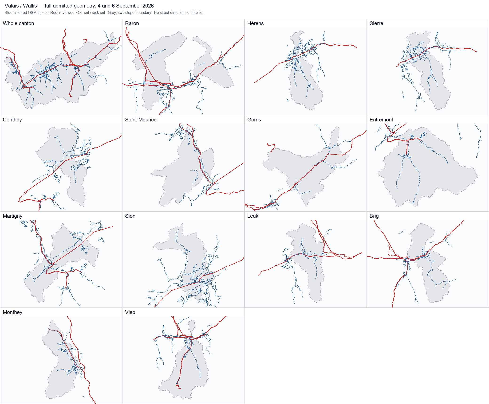

# Valais / Wallis — initial regional study

Reviewed 8 September 2026. **385 annual route records, 78 GTFS agency identities, all 13 districts.** The initial application feed admits **5'102 Friday journeys and 3'445 Sunday journeys**, retaining every original call, time and permission. This is a complete census of the scoped pinned timetable and a **partial geometry study**, not a complete canton service feed.

## Application and artifacts

Choose **VS / Valais** in the study browser or network controls. Both **2026-09-04** and **2026-09-06** have a date selector, full civil-day playback, morning extract, original station search and shareable date/time links. The displayed scope and model identify the initial selection and inferred geometry. [Feed index](../public/data/valais-region/index.json), [source attribution](../public/data/valais-region/sources.json), [complete OSM-derived road database](../public/data/valais-region/road-paths.json), [coverage summary](../data/valais-audit/summary.json), [every route and its exclusions](VALAIS-ROUTE-INVENTORY.md).

## Census denominator and complete journeys

The shared streaming census reads **2'143'227 national trip records and 34'499'152 stop-time rows** in GTFS feed **20260902**, valid 14 December 2025–12 December 2026. Membership requires at least one original call inside the **unsimplified swissBOUNDARIES3D 2026-01 Valais polygon**. There is no operator whitelist or rectangular selection. Separate polygon parts, holes and all 13 district features are preserved as original GeoPackage rows. Parent/platform IDs remain distinct. A bounding rectangle only limits the expensive boundary-distance diagnostic.

The [called and uncalled in-canton stop inventory](../data/valais-audit/stops.json) and each route's full annual in-canton stop/district list establish geographical coverage. Conversion of GTFS WGS84 coordinates to LV95 uses the shared approximate swisstopo formula; original platforms within 10 m of either side of the boundary are flagged in the census. Routes supported only by those calls are marked boundary-sensitive. Jungfraujoch calls bring Jungfraubahn into the Valais census; a station name is never used to assume canton membership.

Whole journeys extend beyond the canton, including foreign termini. A non-stopping train merely passing through does not enter this stop-based census. Geometry gaps outside the canton exclude the **whole journey**. The source call order, repeats, route and agency identities, pickup/drop-off permissions, source-trip IDs and source-service dates survive export. The two-hour chunks repeat overlapping journeys intact; they do not split them into shortened movements. The morning extract is inclusive at its 06:45 and 08:45 boundaries, following the shared chunk library.

| District | Called platform IDs | Annual routes | Routes with admitted journeys |
| --- | --- | --- | --- |
| Raron | 207 | 54 | 21 |
| Hérens | 366 | 24 | 13 |
| Sierre | 494 | 54 | 30 |
| Conthey | 234 | 23 | 10 |
| Saint-Maurice | 147 | 46 | 23 |
| Goms | 140 | 20 | 10 |
| Entremont | 236 | 39 | 18 |
| Martigny | 343 | 53 | 26 |
| Sion | 442 | 49 | 33 |
| Leuk | 128 | 31 | 21 |
| Brig | 386 | 54 | 29 |
| Monthey | 368 | 38 | 23 |
| Visp | 512 | 88 | 39 |

District route counts overlap; every district has admitted initial journeys. This does not mean every valley branch or mode is represented in the movement feed. The all-year route states are **159 admitted-all-dated-trips**, **22 partially-admitted**, **103 inactive-on-validation-dates**, **101 excluded**. Inactive routes remain explicit, including seasonal, night and replacement records.

## Official local-source investigation

The retained [request receipts and hashes](../data/valais-sources/research/requests.json) and [review](../data/valais-sources/research/review.json) record successful acquisition of the current public sources:

- The [cantonal geodata inventory](https://www.vs.ch/documents/17311/17591/Inventaire%2Bdes%2Bg%C3%A9odonn%C3%A9es%2B-%2BInventar%2Bder%2BGeodaten/2fd849d0-ab9f-4bfc-965a-3920ebd18a08), generated **26 August 2026**, lists SDM dataset **376, Transport en commun / Öffentlicher Verkehr**, dated **5 July 2018**. The downloaded PDF's publication and distribution cells are blank. A search-engine snippet suggests a different row state; the preserved actual PDF governs this review.
- The [official geoservices page](https://geo.vs.ch/geoservices) now links a **13 May 2026** internet-geodata access list and the CC_GEO_Publisher catalogue. All **247 public catalogue items** were acquired in three pages, with total, pagination and unique-ID checks. No attributed operational passenger-line export was established.
- The [Route MapServer](https://sit.vs.ch/arcgis/rest/services/Route/MapServer?f=pjson) exposes **12 layers**: road axes/classification, tonnage, traffic sections, projects, cycling, administrative road areas and locality names. Those are not identified bus routes.
- [PDc_mobilite](https://services1.arcgis.com/rMlsWo8szOzlrpCq/arcgis/rest/services/PDc_mobilite/FeatureServer?f=pjson) has nine strategic planning layers, including cable infrastructure and projected rail lines. They do not certify current passenger movements. The tempting zones_dessertes service concerns **electricity networks**, not flexible bus areas.

**No Valais operational line vectors were acquired or used.** Public metadata access is not a vector licence. The unresolved follow-up is a current dataset 376 export from SDM/SGI with operator/line keys, geometry effective date, direction semantics and redistribution terms. No request, order or message has been sent. [TPC's 2026 timetable index](https://tpc.ch/horaires-et-plans-tpc-trains-bus-mobichablais/horaires-a-telecharger/), [TPC network access characteristics](https://tpc.ch/wp-content/uploads/caracteristiques-essent-acces-au-reseau.pdf) and [RegionAlps corridor description](https://www.regionalps.ch/train-valais/martigny-chable-orsieres-1576.html) support route-identity review; schematic maps have not been digitised or represented as coordinate sources.

## Reviewed federal rail infrastructure

The study reuses the retained national **FOT Schienennetz** source, 3210 exact operating-point nodes and 3424 source segments. Its current [STAC item](https://data.geo.admin.ch/api/stac/v1/collections/ch.bav.schienennetz/items/schienennetz) still advertises the retained XTF checksum. Catalogue vintage is **6 July 2021**; asset update is **18 January 2025**. Neither timestamp establishes 2026 operational alignment. Every source segment retains Stand and validity fields in the [infrastructure audit](../data/valais-audit/rail-infrastructure.json).

| Reviewed network | Gauge | GTFS agencies | FOT operator scope |
| --- | --- | --- | --- |
| standard | mm1435 | 11, 33, 74 | SBB CFF FFS, BLS, BLSN, TMR, SNCF, DB, DBZ, ÖBB-I, SOB, THURBO |
| mgb | mm1000 | 48, 93 | MGB, MGI, RhB FR VR |
| tmr-mc | mm1000 | 61, 87_LEX | TMR, SNCF |
| tpc | mm1000 | 23 | TPC |
| gornergrat | mm1000 | 121 | GGB |
| jungfrau | mm1000 | 124 | JB |

The policy pins **58 annual rail route identities**, including route ID, agency and passenger label. Standard-gauge SBB/BLS/RegionAlps can use the specified shared infrastructure operators; MGB FO and BVZ remain separate timetable identities. RhB infrastructure allows complete Glacier Express patterns. Mont Blanc Express and TPC use their own reviewed metre-gauge graphs. Gornergrat and Jungfrau rack rail use separate GGB/JB graphs. DFB heritage rail and VerticAlp tourist rail are inventoried but lack a reviewed initial adapter. Replacement buses never inherit a rail path.

Matching uses exact DiDok/operating-point identities, **350 m** maximum station attachment, **120 m** maximum source-node attachment, **5 m** geometry simplification and a path ceiling of max(**4.5× direct distance**, **1,200 m**). Source validity intervals and gauge are checked. Infrastructure paths cannot pass another called node out of order. No generic nearest-line joining or missing-network bridge is added. Original calls select direction on undirected infrastructure; this does not certify a running track.

The review rejected one additional Sunday IC journey: **Olten–Aarau** inferred **40.947 km via Aarburg, Zofingen Nord, Suhr, Lenzburg West and Rupperswil**, against an 11-minute interval. It passed the broad distance bound but lacks credible corridor/diversion evidence. The exact pattern, candidate geometry hash and directed source segment chain are retained; its entire Brig–Zürich journey is excluded. Large Gornergrat hairpins and Entremont curves are different cases, supported by their specific single-operator source corridors. No threshold was widened to improve counts.

## Attributed OSM bus matching

All **994 distinct complete bus patterns**, covering 161 route records active on the two civil days, were prepared together with real agency identities. Pattern identity includes exact route ID and the complete ordered platform IDs **and coordinates**, including repeated stops and foreign calls. The delivered audit additionally distinguishes GTFS direction ID and call permissions. A successful pair in one pattern is never borrowed for a failing pattern, and different path variants remain attached to their original journey.

Roads are the pinned **Geofabrik Switzerland 2 September 2026 + border extract acquired 8 September 2026**, not a mutable latest download. Combined PBF SHA-256: `d5c675456e935cfbcab88fe894fe9145dc5bd1fbd4318cea30ffd838a9aad02b`. Matcher: **pfaedle 99f2cd466696ecc6bdb73b2b3bb9008557fcb84a**, unmodified bus profile, **--no-trie -W** so every fallback hop is explicitly logged. The wrapper preserves binary/configuration/source/input/output hashes and [complete compressed matcher evidence](../data/valais-road-evidence). Offline validation reimports every accepted/rejected segment and compares it to the cache.

The retained run reports **117.2 m** as its maximum accepted stop snap and **147 rejected pattern segments**. The importer slices repeated/loop stops by monotone shape distances, rejects every logged straight-line fallback, and enforces **120 m** road snaps, max(**6× direct**, **1,500 m**) detour and **5 m** simplification. Stop-access connectors are bounded inferences. Supported OSM bus access, one-way and turn restrictions guide matching, but source errors and temporary diversions remain possible; these are not operator-certified routes.

The initial feed includes Rhône-valley city services, PostAuto side valleys, TPC/TMR/RegionAlps buses, Leukerbad, Sierre-Montana-Crans and Zermatt electric buses where complete patterns pass. Matcher failures include remote mountain access, termini and cross-border extents; all are retained in pattern audits. The full OSM-derived path database is distributed under **ODbL 1.0**, separately from federal geometry and timetable terms.



The plot presents the complete admitted path set on both days, including side-valley branches, against unsimplified district boundaries. It is a source-geometry overview, without a street basemap; it cannot independently certify every road restriction or temporary routing.

## Coverage against all candidates

| Measure | Friday 4 September | Sunday 6 September |
| --- | --- | --- |
| All civil-day instances | 45'930 | 49'818 |
| Exact scheduled instances | 7'071 | 5'117 |
| Representative headway instances | 38'859 | 44'701 |
| Admitted complete journeys | 5'102 | 3'445 |
| Admitted / scheduled candidates | 72.2% | 67.3% |
| Bus admitted / candidate | 4'494 / 4'841 | 2'833 / 3'085 |
| Rail admitted / candidate | 608 / 978 | 612 / 895 |
| Admitted / all directed patterns | 1037 / 1402 | 776 / 1115 |
| All-context matched / directed pairs | 6134 / 6509 | 5923 / 6299 |
| Partially matched directed pairs | 4 | 4 |
| Matched / all segment occurrences | 81'664 / 127'015 | 56'565 / 107'266 |
| Matched / scheduled segment occurrences | 81'664 / 84'788 | 56'565 / 59'197 |
| Segments in admitted journeys | 70'683 | 48'531 |
| Admitted / carry-in journeys | 30 / 52 | 81 / 107 |
| Admitted / night-labelled journeys | 4 / 4 | 17 / 18 |
| Admitted / repeated-stop patterns | 32 / 42 | 22 / 27 |
| Admitted outside-canton platform IDs | 295 | 300 |

Matched segments in otherwise failed journeys count toward **candidate geometry coverage**, not admitted movements. Four route-scoped pairs have mixed outcomes across their full-pattern contexts; the audit counts their actual matched occurrences instead of assigning the whole pair a successful state. Both direction IDs are evaluated. **805** patterns are shared between the days, **597** are Friday-only and **310** Sunday-only.

Civil days include preceding service-day carry-in, calendar exceptions and frequency expansion. Headway instances are representative grids, not exact departures; **none are admitted in this initial geometry scope**. All 105 annual cableway routes, six funicular routes, the water route and tram route stay in the inventory, with inactive/excluded status per date. Services absent from GTFS and unrepresented flexible service areas are outside what this census can prove. Two September dates do not validate winter/holiday/seasonal operation.

### Timing diagnostics

| Diagnostic | Friday | Sunday |
| --- | --- | --- |
| Zero-duration admitted segment occurrences | 5874 | 4301 |
| Maximum positive-duration rail km/h | 151.1 | 151.1 |
| Maximum positive-duration bus km/h | 157.3 | 194.3 |

Minute-resolution and equal-timestamp calls are preserved. No artificial seconds are inserted. Friday's bus maximum is Gamsen, Landmauer → Eyholz, Ritikapelle; Sunday's is Le Châtelard VS, gare → Tête-Noire, each assigned one minute in the archive. These high implied speeds remain explicit source timing/model limitations, not measured or certified speeds. A geometry pass does not establish physically precise movement at every call.

## Reuse and reproducibility

| Source | Attribution / reuse | Pinned SHA-256 |
| --- | --- | --- |
| GTFS | SBB / opentransportdata.swiss; publisher terms, not blanket CC | d325fd0954a91ac50005ad53db1976b8e528ebb1c388e4e8fd5a4415e4139a1e |
| Boundary | © swisstopo; free-geodata terms | 1f122cb7a06f2d312a84b7c0a91116348ba907054d487f0a70b9d2302984e6fc |
| Federal rail | © FOT; terms_by link in retained STAC collection, proprietary label preserved | 2895811c6c338cdc3d32e946d2861ce58ca72ddde7d700fe9b73f2c393f7b828 |
| OSM derived cache | © OpenStreetMap contributors; ODbL 1.0 | 6e3386832211b5dbf5dbffcebcf16a274a5233df9d5df2818e5935659617ceca |

Terms: [timetable](https://opentransportdata.swiss/en/terms-of-use/), [FOT attribution terms](https://opendata.swiss/terms-of-use/#terms_by), [swisstopo](https://www.swisstopo.admin.ch/en/terms-of-use-free-geodata-and-geoservices), [OSM](https://www.openstreetmap.org/copyright). Gleislicht's transformations include full-canton selection, source projection, bounded connectors, path inference, simplification, coordinate conversion and scheduled interpolation. No local operational Valais geometry licence is implied. Raw local-source research responses and their retrieval timestamps are kept in the repository; source publication timestamps are never substituted for geometry vintage.

The compact timetable fixture, policy, source rows, matcher evidence, route/pattern/pair audits and complete derived roads are retained. The large national ZIP and filtered PBF remain external inputs and are checked by hash when used. Pinned [national download](https://data.opentransportdata.swiss/dataset/3d2c18f9-9ef1-463f-a249-5c67604efd74/resource/c09aba2a-41e9-4117-88af-3fdfe589d64a/download/gtfs_fp2026_20260902.zip).

```sh
# Offline boundary decoding, build, exhaustive evidence/candidate/artifact checks.
python3 scripts/prepare-valais-sources.py
npm run data:valais
npm run data:valais:check
npm run data:valais:docs
npx vitest run scripts/valais-region.test.mjs scripts/luzern-region.test.mjs
npm run build

# Re-scan the pinned national archive (do not replace it with latest).
npm run data:valais:census -- /path/GTFS_FP2026_20260902.zip data/valais-audit/timetable-cache.json.gz
# Re-run roads with the exact pinned software/PBF; changed hashes require review.
node scripts/valais-road-geometry.mjs prepare data/valais-audit/timetable-cache.json.gz /tmp/valais-input
node scripts/match-postbus-roads.mjs --pfaedle /path/pfaedle --osm /path/pinned.osm.pbf --config /path/pfaedle.cfg --feed /tmp/valais-input/all --output /tmp/valais-output/all
node scripts/valais-road-geometry.mjs import /tmp/valais-input /tmp/valais-output
```

The checker reconstructs geometry from every bus and rail candidate, compares original full-call identities and permissions against every exported journey, reconciles every annual route's status, checks all 24 chunk hashes and full-day/morning identity, verifies catalogue pagination and response hashes, and reimports original matcher outputs. Tests cover whole-journey rejection, loops/reverse calls, reservation permissions, pattern-dependent failures and Valais deep links/translations. A source or policy change requires rebuilding and rerunning these checks.

## Operator inventory

| Agency ID | GTFS identity | Annual routes | Friday admitted / all | Sunday admitted / all |
| --- | --- | --- | --- | --- |
| 11 | Schweizerische Bundesbahnen SBB | 27 | 153 / 237 | 178 / 214 |
| 23 | Transports Publics du Chablais | 1 | 0 / 73 | 0 / 49 |
| 33 | BLS AG (bls) | 8 | 15 / 43 | 20 / 40 |
| 48 | Matterhorn Gotthard Bahn (fo) | 3 | 9 / 46 | 9 / 46 |
| 61 | Transports de Martigny et Régions (mc) | 1 | 0 / 44 | 0 / 38 |
| 74 | Regionalps | 12 | 191 / 191 | 171 / 171 |
| 87_EVA | Evian | 1 | 0 / 0 | 0 / 0 |
| 87_LEX | Société Nationale des Chemins de fer Français | 2 | 0 / 0 | 0 / 0 |
| 93 | Matterhorn Gotthard Bahn (bvz) | 3 | 116 / 179 | 110 / 173 |
| 121 | Gornergratbahn | 1 | 54 / 54 | 54 / 54 |
| 124 | Jungfraubahn | 1 | 70 / 70 | 70 / 70 |
| 142 | Sierre-Montana-Crans | 9 | 295 / 387 | 276 / 368 |
| 160 | Dampfbahn Furka-Bergstrecke | 1 | 0 / 9 | 0 / 8 |
| 184 | CGN SA | 1 | 0 / 12 | 0 / 12 |
| 211 | Raron-Unterbäch | 3 | 0 / 68 | 0 / 68 |
| 212 | Chalais-Briey-Vercorin | 2 | 20 / 20 | 6 / 6 |
| 217 | Portes du Soleil Suisse SA | 4 | 0 / 914 | 0 / 2'774 |
| 220 | Touristische Unternehmung Grächen AG | 1 | 0 / 960 | 0 / 960 |
| 227 | Téléphérique Riddes-Isérables | 1 | 0 / 68 | 0 / 50 |
| 229 | Leukerbad-Gemmipass | 1 | 0 / 40 | 0 / 40 |
| 234 | Saastal Bergbahnen AG | 9 | 0 / 3'840 | 0 / 3'840 |
| 244 | Gampel-Jeizinen | 1 | 0 / 38 | 0 / 36 |
| 245 | Remontées Mécaniques Crans-Montana-Aminona | 5 | 0 / 2'966 | 0 / 2'966 |
| 258 | Funiculaire St-Luc-Chandolin | 2 | 0 / 996 | 0 / 996 |
| 262 | Aletsch Bahnen AG | 16 | 0 / 5'131 | 0 / 5'126 |
| 263 | Fürgangen-Bellwald | 1 | 0 / 92 | 0 / 90 |
| 274 | Blatten-Belalp | 3 | 0 / 46 | 0 / 46 |
| 276 | Rosswald Bahnen AG | 1 | 0 / 40 | 0 / 40 |
| 277 | Téléphérique Dorénaz-Champex d'Alesse/Commune de Dorénaz | 1 | 0 / 52 | 0 / 42 |
| 280 | Stalden-Gspon | 2 | 1 / 71 | 1 / 71 |
| 290 | Turtmann-Unterems-Oberems | 1 | 0 / 70 | 0 / 36 |
| 291 | Staldenried-Gspon | 1 | 0 / 70 | 0 / 70 |
| 294 | Remontées Méc. du Wildhorn Anzère | 1 | 0 / 900 | 0 / 900 |
| 297 | Torrent-Bahnen Leukerbad-Albinen AG | 3 | 0 / 792 | 0 / 792 |
| 299 | Zermatt Bergbahnen AG | 8 | 0 / 6'152 | 0 / 6'152 |
| 306 | Lauchernalp Bergbahnen AG | 3 | 0 / 38 | 0 / 38 |
| 310 | Luftseilbahn Kalpetran-Embd | 1 | 0 / 94 | 0 / 86 |
| 311 | Téléverbier | 12 | 0 / 3'432 | 0 / 6'390 |
| 314 | Télécabine Vercorin-Crêt-du-Midi | 1 | 0 / 945 | 0 / 945 |
| 315 | Bergbahnen Hohsaas AG | 1 | 0 / 1'723 | 0 / 1'723 |
| 332 | Raron-Eischoll | 1 | 0 / 76 | 0 / 52 |
| 337 | Remontées Mécaniques Grimentz-Zinal SA | 4 | 0 / 2'852 | 0 / 2'852 |
| 708 | Elektrobus Zermatt | 2 | 146 / 146 | 146 / 146 |
| 713 | Bus urbain de Martigny | 2 | 84 / 84 | 44 / 44 |
| 714 | Bus Sierrois | 4 | 350 / 350 | 0 / 0 |
| 765 | PostAuto AG (Bus Commune Sion) | 5 | 274 / 334 | 32 / 56 |
| 801 | PostAuto AG | 90 | 2'169 / 2'388 | 1'565 / 1'733 |
| 803 | VerticAlp Vallée du Trient SA | 4 | 0 / 967 | 0 / 967 |
| 814 | RegionAlps Bus | 5 | 106 / 106 | 40 / 40 |
| 818 | Transports Publics du Chablais (Bus) | 12 | 457 / 469 | 232 / 241 |
| 835 | Service d'automobiles TMR | 21 | 268 / 295 | 203 / 230 |
| 851 | Automobildienst Matterhorn Gotthard Bahn (fo auto) | 2 | 25 / 28 | 24 / 26 |
| 853 | Theytaz Excursions Sion | 6 | 36 / 49 | 34 / 43 |
| 855 | Auto Leuk-Leukerbad | 8 | 239 / 239 | 184 / 184 |
| 3002 | Aletsch-Express Riederalp-Bettmeralp | 1 | 18 / 18 | 18 / 18 |
| 3020 | Télé-Torgon SA | 1 | 0 / 0 | 0 / 0 |
| 3024 | TéléLaFouly-ChampexLac SA | 1 | 0 / 990 | 0 / 990 |
| 3028 | Remontées mécaniques SA | 8 | 0 / 1'800 | 0 / 2'814 |
| 3031 | Télé-Thyon SA | 4 | 0 / 0 | 0 / 0 |
| 3032 | Theytaz Excursions Sion | 1 | 0 / 106 | 0 / 106 |
| 3033 | Télésiège Lana-La Meina | 1 | 0 / 915 | 0 / 915 |
| 3040 | Téléovronnaz SA | 1 | 0 / 930 | 0 / 930 |
| 3050 | Sportbahnen Unterbäch AG | 1 | 0 / 810 | 0 / 810 |
| 3052 | Sesselbahn Visperterminen-Giw | 1 | 0 / 900 | 0 / 900 |
| 3054 | Seilbahngenossenschaft Embd-Schalb | 1 | 0 / 30 | 0 / 28 |
| 3063 | Bellwald Sportbahnen AG | 1 | 0 / 0 | 0 / 0 |
| 3121 | Kraftwerk Sanetsch AG | 1 | 0 / 102 | 0 / 102 |
| 7005 | Riffelalp Resort AG Zermatt | 1 | 0 / 24 | 0 / 24 |
| 7061 | Ortsbus Saas-Fee | 4 | 0 / 0 | 0 / 0 |
| 7065 | Bus de la commune de Riddes | 2 | 0 / 0 | 0 / 0 |
| 7067 | Busbetrieb Oberems-Gruben | 1 | 6 / 6 | 8 / 8 |
| 7230 | BLS Netz AG Ersatzverkehr | 1 | 0 / 0 | 0 / 0 |
| 7231 | SBB Infrastruktur AG Bahnersatz | 14 | 0 / 0 | 14 / 14 |
| 7249 | Matterhorn Gotthard Bahn Ersatzverkehr | 8 | 0 / 13 | 6 / 19 |
| 7253 | Transports Publics du Chablais Ersatzverkehr | 1 | 0 / 0 | 0 / 0 |
| 7257 | Transports de Martigny et Régions Ersatzverkehr | 4 | 0 / 0 | 0 / 0 |
| 7261 | Alplift AG Ersatzverkehr | 3 | 0 / 0 | 0 / 0 |
| 7280 | Stalden-Gspon Ersatzverkehr | 1 | 0 / 0 | 0 / 0 |
