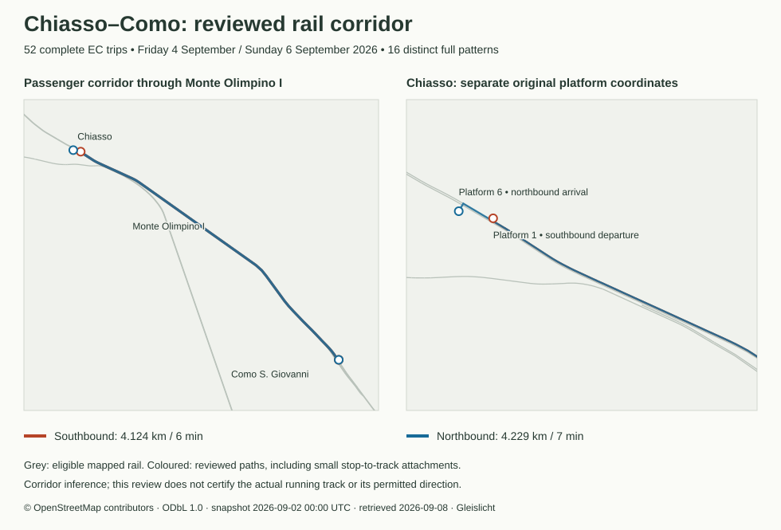

# Zug canton: source adapter, regional feed and admission audit

Inventory and source review: **8 September 2026**. Start point: [Swiss transit source inventory](SWISS-TRANSIT-SOURCE-INVENTORY.md#zg).

**The annual timetable inventory covers the whole canton. The regional bus, rail, funicular and shipping feed has partial geometry coverage, including explicitly attributed OSM bus and border-rail inference.** It admits only complete directed stop patterns passing the numerical source checks, on Friday **4 September 2026** and Sunday **6 September 2026**. Admission is not certification of a current 2026 alignment, one-way street, running track or temporary diversion.

## Scope and evidence

All **77 annual route records**, **9 feed agencies**, **22'676 annual trip records** and all **11 municipalities** are inventoried. The census streams **34'499'152 national stop-time rows**, without an operator whitelist. It selects every annual trip with at least one stop inside the complete official Zug multipolygon, then retains the whole selected trip including out-of-canton and foreign termini. No-stop through traffic is outside this passenger-service scope.

The polygon contains **945 GTFS stop records**, of which **620** have annual calls. These are source records, including platform/station identities, not a count of unique physical stations. Annual route-to-canton-stop membership is retained even for routes inactive on both test dates. A census of this feed does not establish coverage of private, unrepresented or demand-responsive services.

- [Machine audit](../data/zug-study-audit.json): every route, source feature/line membership, municipality, directed pattern, pair, exclusion, geometry hash, operator/mode denominator and daily occurrence count.
- [Pinned extracted timetable](../data/zug-timetable.json.gz): complete calls and times for both civil days, annual route membership and source hashes.
- [Source catalogue](../data/zug-sources/sources.json), [preserved acquisition records](../data/zug-sources/acquisition.json), [policy and identity crosswalk](../data/zug-policy.json).
- [Friday feed](../public/data/zug-region/2026-09-04/zug-region-day-manifest.json), [Sunday feed](../public/data/zug-region/2026-09-06/zug-region-day-manifest.json). Each has twelve two-hour chunks and a 06:45–08:45 morning snapshot. The existing compact network schema is used. UI selection, scheduled refresh and deployment are not part of these artifacts.

## Dates, attribution and source reconciliation

The national timetable is release **20260902**, valid **20251214–20261212**, SHA-256 **d325fd0954a91ac50005ad53db1976b8e528ebb1c388e4e8fd5a4415e4139a1e**. [Official GTFS dataset](https://data.opentransportdata.swiss/en/dataset/timetable-2026-gtfs2020), [pinned archive](https://data.opentransportdata.swiss/dataset/3d2c18f9-9ef1-463f-a249-5c67604efd74/resource/c09aba2a-41e9-4117-88af-3fdfe589d64a/download/gtfs_fp2026_20260902.zip), [timetable terms](https://opentransportdata.swiss/en/terms-of-use/). Credit: **SBB / opentransportdata.swiss**. Gleislicht publishes the derived results under its own authorship. The feed has no shapes.txt.

The [official Buslinien archive](https://services.geo.zg.ch/datarepo/Buslinien/data.zip) is preserved as [buslinien.zip](../data/zug-sources/buslinien.zip), SHA-256 **bcc43b676a4459a6cfa6b330fbe24dd7d66a84238aee4dd9e72a9b95628337a5**. It contains **175 LineStrings**, **29 distinct line labels** and **388 feature/line memberships**. Comma-separated labels identify shared segments, not complete directed route shapes. The archive's HTTP Last-Modified is **2025-09-18T12:11:55Z**; the GeoPackage's internal last_change is **2024-03-26T15:27:03.260Z**. Neither is a proven 2026 alignment date.

The complete current WFS tooltip layer and its independent hits count both contain **175** records. Every t_id, exact line-label string, vertex count and ordered LV95 coordinate matches the archive within **1 mm** (maximum ordinate difference **0.000956368 m**). WFS feature IDs differ from GeoPackage row IDs, so they are not used as a crosswalk. Raw [WFS](../data/zug-sources/wfs.gml), [hits](../data/zug-sources/wfs-hits.xml) and [capabilities](../data/zug-sources/capabilities.xml) are retained with retrieval times and hashes. The current WFS repeats old geometry; its retrieval date is not a new vintage. Planning/vehicle-length layers are not mixed into this source.

Credit for bus geometry: **Quelle: GIS Kanton Zug**. The [official terms](https://zg.ch/de/planen-bauen/geoinformation/geoinformationen-nutzen/nutzungsbedingungen) permit commercial and noncommercial use with source credit; no generic Creative Commons licence is assigned. [Terms snapshot](../data/zug-sources/terms.html). Canton boundary: current official swisstopo feature 9, retained losslessly as returned; its API attributes do not declare an edition. Municipal polygons: **swissBOUNDARIES3D 2026-01**, all eleven original GeoPackage rows retained in [municipality-rows.json.gz](../data/zug-sources/municipality-rows.json.gz). Credit: **© swisstopo**, [terms](https://www.swisstopo.admin.ch/en/terms-of-use-free-geodata-and-geoservices).

The [ZVB 2026 line directory](https://www.zvb.ch/fahrplan/fahrplan-zvb-2026/) is retained for identity review. GTFS agency 839 maps to the explicitly listed ZVB source line labels; 801 maps only to PostAuto 73, 110 and 280. There is no prefix/substring matching, agency-wide geometry admission or automatic renumbering. Historic source line **528** has no annual Zug-calling GTFS route and is not silently assigned to 525/526.

## Federal rail expansion

The [preserved federal rail source](../data/zug-rail-sources/source.json) adds **529 Friday** and **431 Sunday** complete SBB/SOB trips to the bus baseline. Source credit: **© Federal Office of Transport (FOT)**. The source collection links [attribution terms](https://opendata.swiss/terms-of-use/#terms_by); its literal STAC licence field is retained as proprietary, without substituting a Creative Commons licence. The [catalogue](../data/zug-rail-sources/catalogue.json), [collection metadata](../data/zug-rail-sources/collection.json) and [original compressed XTF](../data/zug-rail-sources/network.xtf.gz) are preserved. [Official federal dataset](https://data.geo.admin.ch/api/stac/v1/collections/ch.bav.schienennetz/items/schienennetz).

The XML SHA-256 is **2895811c6c338cdc3d32e946d2861ce58ca72ddde7d700fe9b73f2c393f7b828**, verified against the published multihash. Catalogue datetime is **2021-07-06T00:00:00Z**, asset-updated timestamp **2025-01-18T04:23:13.735821Z**, catalogue checked **2026-09-08**. All **3,424 source segments** carry an internal Stand of **2021-07-06**. These timestamps do not prove September 2026 validity. The audit records every segment's gauge, infrastructure operator, validity fields, endpoint attachment and admission disposition: **1,814** segments enter the candidate graph, **1,604** fail standard-gauge selection and **6** exceed the source topology attachment limit. Funiculars are not in this dataset.

The adapter admits only explicitly inventoried SBB/SOB route identities and **mm1435** source segments. It uses exact Swiss operating-point numbers, rejecting missing/ambiguous identities; there is no name or nearest-station fallback. Source endpoints connect through declared node references with attachments at most **120 m**; GTFS stations may attach to their exact operating point within **350 m**. Source linework is simplified at **5 m in LV95** and transformed by the existing parser to six-decimal WGS84 coordinates. These operating-point and station connectors are inferred geometry.

Each adjacent-call search blocks all other known scheduled operating points in the full pattern, preventing a shortcut through a later or earlier call. The detour limit is **max(3,000 m, 4.5 × direct distance)**, including station attachments. Each accepted pair retains ordered source segment IDs and node references. Rail contexts with different complete stop sequences remain distinct in the cache and audit. This validates numerical corridor continuity and stop order, not actual running-track choice, freight/passenger access rights, temporary diversions or observed movement. International trip calls are retained in full even when their missing foreign geometry causes exclusion.

## SBB graphical rail supplement

The [SBB graphical network](https://data.sbb.ch/explore/dataset/linie-mit-polygon/) provides a separate official source for two failed corridors. Four selected source records retain their full curves, with no edits to the federal graph or its gauge attributes. This adds **62 Friday / 66 Sunday trips**, completing every fixture pattern of **S26, RE6 and IR75**. Their full trips and all out-of-canton calls are retained.

The source investigation distinguishes three findings:

- The original federal segment **ch14uvag00087837**, Däniken SO–Däniken Ost, carries **mm1000** over kilometre 45.673–46.100. The [current federal API response](../data/zug-sbb-rail-sources/federal-daeniken.json) repeats that value. The existing standard-gauge filter correctly excludes it. SBB's graphical records classify the same corridor as **N**, explicitly defined by the [retained schema](../data/zug-sbb-rail-sources/metadata.json) as normal gauge. The alternative uses complete SBB DK–DKO and DKO–SCOE curves on infrastructure line 540, leaving the conflicting federal record unchanged.
- SBB line 822 supplies continuous **KR–KRGR–KODB** geometry, including the crossing from Kreuzlingen Grenze into Konstanz. The policy explicitly crosswalks GTFS operating-point IDs **8506131 / 8014586** to SBB codes **KR / KODB**. The federal source's lack of a foreign operating point is preserved as the failed primary attempt.
- The separate SBB dataset named **linie** represents line 540 with only two endpoint coordinates; it is not usable alignment evidence. The graphical dataset also contains schematic foreign records: the Como S. Giovanni–Chiasso Olimpino I portion has only two vertices. Such records cannot close EC's full Chiasso–Como gap. Both rejected source investigations remain preserved.

The acquisition retains all **seven** line-540 records and all **59** records returned by the Konstanz/Como search, with returned totals checked against page lengths and duplicate identities rejected. Every one of these 66 records has an inventory entry; only four are selected. Source keys combine infrastructure line number, start/end operating-point codes and kilometre interval. No public-service line-number guess selects geometry. Both selected corridors are contiguous at exactly equal source endpoint coordinates; geometric crossings or proximity cannot join them.

| Infrastructure line | From → to | Source vertices | Selected corridor |
| --- | --- | --- | --- |
| 540 | Däniken Ost → Schönenwerd SO | 204 | daeniken-schoenenwerd |
| 540 | Däniken SO → Däniken Ost | 44 | daeniken-schoenenwerd |
| 822 | Kreuzlingen Grenze → Konstanz | 43 | kreuzlingen-konstanz |
| 822 | Kreuzlingen → Kreuzlingen Grenze | 76 | kreuzlingen-konstanz |

Däniken–Schönenwerd uses reviewed GTFS IDs **8502111 / 8502112** and SBB codes **DK / SCOE**. The policy allows only SBB agency 11's exact S26/RE6 route records there and its exact IR75 route record at Konstanz. Ordered timetable calls orient the full source curve. Source features provide short operating-point codes; the numeric GTFS-to-code mappings are explicit reviewed crosswalks, not source-supplied numeric joins or name-based fallback. Endpoint connectors are measured and must stay within **100 m**, stricter than the base rail adapter's 350 m limit. Paths must remain below **max(1,500 m, twice the direct distance)**. Each pair retains source keys, corridor, endpoint attachment lengths, numeric stop identities, a geometry hash and its original federal failure. Successful pre-existing pair paths remain unchanged. These are inferred operating-point/platform attachments, not certified running-track choices or observed movements.

[Source catalogue](../data/zug-sbb-rail-sources/sources.json), [line 540 records](../data/zug-sbb-rail-sources/line540.json), [foreign review](../data/zug-sbb-rail-sources/foreign-review.json), [rejected schematic line](../data/zug-sbb-rail-sources/schematic-line540.json) and [terms snapshot](../data/zug-sbb-rail-sources/terms.html) are retained with original URLs and hashes. Publisher: **SBB Infrastructure**. Credit: **SBB Infrastructure / data.sbb.ch**. Metadata rights allow commercial and noncommercial use with reference required (terms_by); [SBB terms](https://data.sbb.ch/page/licence/) require citing data.sbb.ch and publishing derived work under the user's own authorship. The regional feed is a dated Gleislicht derivation.

Graphical dataset modified timestamp: **2026-07-29T06:16:28+00:00**; data processed: **2026-09-02T03:01:34+00:00**; metadata processed: **2026-09-08T03:00:20.208000+00:00**; retrieved: **2026-09-08**. These are publication/processing timestamps, not individual alignment survey dates or a guarantee that September diversions are represented. Any refresh must preserve new evidence and revalidate the explicit crosswalks and source paths.

## Zugerbergbahn federal alignment

The federal cableway layer adds **72 Friday** and **70 Sunday** complete Zugerbergbahn trips, covering both directed two-stop patterns on each civil day. Admission requires the exact GTFS route 93-256-6-j26-1, agency 158, line 2566 and type 1400, mapped to installation **61.051**, operator **ZBB**, LineString **676**. The entire bounded API response contains this line and its two terminal point features, **3254 / 3248**; every feature is retained and inventoried. The original 22-vertex WGS84 curve remains intact. No intermediate stop, interpolated elevation, cable sag or observed vehicle position is invented.

The two source operating-point numbers **8502291 (Schönegg)** and **8502292 (Zugerberg)** match the GTFS DiDok identities exactly. Both source station coordinates equal the line's endpoints. Each path includes an explicit short connector from its exact GTFS stop coordinate to that endpoint (approximately 1.3 m, with a **25 m** rejection limit), the full curve in source-call order, then the connector to the other GTFS stop. Reverse calls reverse the curve; names and nearest-station guesses cannot select an installation. Length must stay below **max(1,500 m, twice the direct distance)**. Each accepted pair records installation, feature, operating-point identities, attachment lengths and a geometry hash.

[Original API response](../data/zug-mountain-sources/identify.json), [layer schema](../data/zug-mountain-sources/layer.json), [collection metadata](../data/zug-mountain-sources/collection.json) and [source catalogue with query URLs and hashes](../data/zug-mountain-sources/sources.json) are retained. Retrieval: **2026-09-08**. Collection temporal date: **2025-11-07T00:00:00Z**; collection updated: **2026-01-29T06:50:29.460765Z**. The API features have no individual source date; these collection timestamps do not establish September 2026 alignment validity. Attribution: **© Federal Office of Transport (FOT)**. The collection's literal licence is **proprietary**, with linked [attribution terms](https://opendata.swiss/en/terms-of-use/#terms_by). No alternate generic licence is assigned. [Official collection](https://data.geo.admin.ch/api/stac/v1/collections/ch.bav.seilbahnen-bundeskonzession).

## Chiasso–Como: complete EC patterns

The [Como source catalogue](../data/zug-como-rail-sources/sources.json) adds a separately attributed OSM corridor after the federal and SBB attempts fail. It admits **26 EC trips on each date**, completing **13 Friday / 11 Sunday patterns**, comprising **16 distinct full patterns** across the two fixtures. This includes Sunday’s Arth-Goldau → Rotkreuz → Zürich variant and the Basel Bad Bf extensions. Every source call, platform, pickup/drop-off rule, source trip ID and timestamp is retained. All rail trips represented on these two fixtures now pass; this does not validate the annual set of rail patterns.

The historical Overpass query requests **2 September 2026 at 00:00 UTC**, retrieved **8 September 2026**. Its **715 railway ways** are fully inventoried: **100** meet the standard-gauge main/branch or explicitly main-track crossover graph rule; **615** are excluded from the candidate graph. The two actual paths use **13 / 14 ways**, all tagged standard-gauge main rail with passenger service and no siding/service tag. No siding exception is allowed. Original OSM node IDs establish connectivity; adjacent tracks and geometric crossings cannot become junctions through coordinate proximity. The requested historical snapshot is distinct from the response database timestamp. Individual way and node versions, edit timestamps and original tags remain in the raw extract.

Exact UIC tags bind **8505307** to OSM Chiasso station **3092179807** and **8301307** to Como San Giovanni station **4126950607**. Only the two reviewed directed platform pairs may use this fallback, and only inside the exact EC route/agency and complete-pattern scope. Both require the pinned **Monte Olimpino I way 25148357**; the longer bypass cannot silently replace it. Station identity is checked within **350 m**, original stop-to-track projection within **60 m**, alternative projections within **5 m** of the closest, and the full path within **8 km**, with a **45°** maximum graph turn. These OSM limits do not change the federal adapter. Directed source way/node chains and geometry hashes are replayed by the checker.

| Direction / source platform | Full path | Track attachments | Source interval / mean speed | Trips Friday / Sunday |
| --- | --- | --- | --- | --- |
| Chiasso platform 1 → Como | 4.124 km | 6.71 m / 9.43 m | 6 min / 41.24 km/h | 13 / 13 |
| Como → Chiasso platform 6 | 4.229 km | 9.43 m / 23.54 m | 7 min / 36.25 km/h | 13 / 13 |

The independent [Lombardia mobility layer](https://www.cartografia.servizirl.it/expo/rest/services/gpt/infrastrutture_mobilita/MapServer/3) supplies **eight** complete corridor-envelope rail records, reconciled against a separate object-ID query. Five records describe the Chiasso–Como approach/tunnel corridor; all their original vertices lie within **37.74 m** of the OSM southbound path. This is a vertex-to-polyline comparison, not a continuous Hausdorff bound or running-track certification. The other three records cover the Como Lago branch, onward southern line and longer tunnel bypass. All eight records, their properties and comparison distances are retained. The GeoJSON request failed; the native ArcGIS JSON request succeeded. No Lombardia coordinate is spliced into the feed.

Lombardia’s metadata revision is **27 June 2024**, scale **1:10,000**; that is not an individual alignment survey date. Credit for the comparison source: **Regione Lombardia**. The retrieved dataset metadata does not identify a specific licence and the generic legal page lists several alternatives, so no licence is inferred. Feed geometry is solely the independently acquired OSM derivation, credited **© OpenStreetMap contributors**, under [ODbL 1.0](https://www.openstreetmap.org/copyright). The original federal failure and rejected SBB schematics remain visible. A successful corridor match does not certify which running track or permitted direction the operator used.



## Zugersee and Ägerisee shipping inference

The [swissTLMRegio transportation layer](https://api3.geo.admin.ch/rest/services/ech/MapServer/ch.swisstopo.vec200-transportation-oeffentliche-verkehr?lang=en) supplies generalized passenger-shipping linework. We retain all **35 shipping records** in the regional envelope and independently reconcile **11 Zugersee** and **seven Ägerisee** records against tighter lake queries. Other transportation sublayers may be capped; these queries establish the reviewed regional shipping inventory, not a national transportation census. All original responses, schema, catalogue, shoreline metadata, terms, URLs and SHA-256 hashes are in [the boat source catalogue](../data/zug-boat-sources/sources.json).

The source has no GTFS operator or passenger-line identity. The adapter therefore uses explicit reviewed lake/route mappings: **agency 186 / line 3660 / route 94-366-0-j26-1**, and **agency 179 / line 3661 / route 94-366-1-j26-1**, both type 1000. Each mapping lists the exact allowed GTFS dock IDs. It never selects another lake by nearest geometry or a matching name. Shared source vertices create an undirected graph; crossings and nearby endpoints add no connection. Source-call order determines direction. Every repeated Ägerisee call survives. The graph matcher rounds output to seven decimal places, retains source bends, and adds explicit GTFS dock connectors. Per-pair candidate feature IDs describe the whole lake graph, not a claim that every candidate segment was traversed.

The mode-specific attachment limit is **200 m** (largest admitted snap **157.82 m**); detours must stay below **max(1,200 m, three times direct distance)**. The bus tolerance remains 120 m. A source line is insufficient by itself: every path segment is split at every intersection with the unsimplified Vector25 shoreline, including island holes and all polygon parts. Zugersee uses both source records **91 and 92**, GEWISS 9175; Ägerisee uses **116**, GEWISS 9270. An outside-water interval is allowed only when both ends lie inside the same **200 m zone around an actual endpoint dock**. These are disclosed cartographic dock-area discrepancies, not claims of water containment or current dock access. The largest individual admitted outside interval is **78.85 m**. Intervals away from docks reject the pair and every complete trip requiring it; the adapter does not invent a replacement water path.

| Lake / line | Friday admitted / all trips | Sunday admitted / all trips | Friday admitted / all patterns | Sunday admitted / all patterns |
| --- | --- | --- | --- | --- |
| zugersee / 3660 | 5/6 | 8/10 | 5/6 | 6/8 |
| aegerisee / 3661 | 3/3 | 3/3 | 2/2 | 2/2 |

This adds **eight Friday trips and eleven Sunday trips**. Across all boat candidates, **20/21 Friday** and **25/27 Sunday** unique directed pairs pass. Zug Bahnhofsteg → Walchwil remains excluded on both dates; Risch → Zug Bahnhofsteg also fails on Sunday. Their selected source paths have approximately **159 m / 153 m** outside the shoreline away from either endpoint dock. The rejected path hash and exact outside intervals remain in the machine audit. All three Ägerisee trips and both complete repeat-stop patterns pass on each date.

Shipping credit: **© swisstopo**; shoreline validation: **© FOEN, swisstopo**. The [swisstopo free-geodata terms](https://www.swisstopo.admin.ch/en/terms-of-use-free-geodata-and-geoservices) require source attribution; the preserved STAC catalogue's literal licence remains **proprietary**, not an invented Creative Commons licence. These are Gleislicht cartographic inferences, not operator-certified lanes or navigation instructions.

Retrieved **2026-09-08**. Shipping collection temporal extent: **2020-01-01T00:00:00Z – 2025-12-02T00:00:00Z**; collection updated: **2026-06-25T20:00:03.726130Z**. Shipping features supply no individual vintage. The [shoreline layer metadata](../data/zug-boat-sources/shoreline-legend.html) states **1 January 2007**; the [FOEN product description](https://www.bafu.admin.ch/en/the-swiss-hydrographic-network) identifies the Vector25 reference network. Neither retrieval nor collection processing timestamps establish September 2026 geometry validity. Seasonal shipping dates remain outside this two-day validation.

| Shipping source UUID | Vertices | Selected lake / exclusion |
| --- | --- | --- |
| {F2C01986-10B5-4D16-A69E-75EB7CD60BF7} | 18 | zugersee |
| {CC29D0D8-77E3-476B-A588-8677A05BEDF2} | 17 | zugersee |
| {BAE44A61-7D5D-4874-AA70-C52FCF696BB6} | 24 | zugersee |
| {6F3AD20F-AB43-4959-9A48-B3FBED4A7C60} | 17 | zugersee |
| {5246552B-F5B7-4E7A-B2F2-28B3FE453997} | 30 | zugersee |
| {B24DABD8-93FC-4DA2-A7B4-3246777F7B9B} | 2 | zugersee |
| {A5179079-C79F-4AF1-A804-350E36B186E2} | 7 | zugersee |
| {D0A3DF63-616B-41D6-B1B6-936BEFD9D442} | 34 | outside the two reviewed lake graphs |
| {3BFDD847-D642-4B23-97B2-E0958645625A} | 17 | outside the two reviewed lake graphs |
| {9D8E673A-273C-4FE0-8AC5-467CB4B7B32C} | 2 | outside the two reviewed lake graphs |
| {444DBC92-5647-4F94-947D-D6EA31624463} | 44 | outside the two reviewed lake graphs |
| {1C603F06-D2F7-4BD4-A8B7-743356E6FCD6} | 27 | outside the two reviewed lake graphs |
| {65FC3CD0-715B-4214-9153-73F921583F58} | 23 | outside the two reviewed lake graphs |
| {D3645B86-9FC2-4345-A277-4806ED4195B9} | 12 | outside the two reviewed lake graphs |
| {2A96AF0E-87C6-4F45-B6D7-41D1FD7C3D2C} | 17 | outside the two reviewed lake graphs |
| {ED10650F-50BE-4088-B0C7-BA87EA1C50A9} | 28 | outside the two reviewed lake graphs |
| {502E5573-7F32-4332-B494-8FFC511BAA88} | 24 | outside the two reviewed lake graphs |
| {A10B5EDB-E2CE-4C73-A576-E540B0F6DC80} | 35 | outside the two reviewed lake graphs |
| {F3D9A0CC-60B0-49DE-9502-07BC7ABA2DF8} | 8 | aegerisee |
| {A7355E67-01B7-43C7-BABE-3D07E4D16927} | 17 | aegerisee |
| {DBC8BFE2-C39F-4133-8B94-A40516D4DE9C} | 17 | aegerisee |
| {FC1E2E8A-CD03-46B0-8EEC-5E1DCC530F1F} | 11 | aegerisee |
| {3C4E3C1B-E441-41BB-A9BE-559857EE4589} | 9 | aegerisee |
| {B0954DA5-E83B-4741-BBAD-C57BF22FEFE2} | 16 | aegerisee |
| {05522A6C-E31A-4FC9-B857-4687907F2CC4} | 13 | aegerisee |
| {513829A5-D1F4-444C-AF54-6ADC6BCD39A9} | 22 | zugersee |
| {3A40FEF0-F2C9-414D-9C19-B920FF298F3C} | 56 | zugersee |
| {D9C23C21-24AE-40F0-968B-AF4D0C326C9A} | 43 | outside the two reviewed lake graphs |
| {EBC24FD9-B1BB-47FE-AA62-CDC24B555E58} | 33 | outside the two reviewed lake graphs |
| {B63E2D8C-E027-4C81-91D1-3B1045D153F1} | 2 | outside the two reviewed lake graphs |
| {19D6B5B1-F311-4EAD-9E36-A4DD490DD319} | 39 | zugersee |
| {008BE2BB-D96B-445A-B50F-273D5AB2B7D1} | 11 | outside the two reviewed lake graphs |
| {733EC523-E18E-4082-83EF-00729DA6FB2F} | 46 | outside the two reviewed lake graphs |
| {1DB1599B-4EF7-44AA-8A8C-A80CAE55D94C} | 40 | zugersee |
| {8AE7811A-C535-4CF2-8173-A83F3B4B1DF4} | 65 | outside the two reviewed lake graphs |

### Water-aware alternate paths remain excluded

The [alternate-path review catalogue](../data/zug-boat-review-sources/sources.json) pins the original shipping/shoreline catalogue and frozen timetable, plus the [operator fleet specifications](https://www.zugersee-schifffahrt.ch/ueber-uns/unsere-schiffe/) retrieved **8 September 2026**. The page gives maximum speeds of **27 km/h for MS Zug** and **28 km/h for MS Rigi**; it has no declared publication date or trip-specific vessel assignment. Credit: **Schifffahrtsgesellschaft für den Zugersee AG**. The retained HTML supports this review; no republication licence is inferred.

For each failed directed pair, the diagnostic removes **four of 261 original lake-network edges** that cross land outside either actual endpoint's dock zone, then repeats the original matcher with unchanged snap, detour and dock-zone limits. The graph retains the other **257 edges**, exact source vertices and existing junctions. It adds no water shortcuts or junctions at crossings. Removed edge indices, source UUIDs, coordinates and exact shoreline intervals are retained. Whole-edge removal is conservative: this experiment does not exhaust every possible clipped-edge route.

| Directed pair | Graph-only length | Full path including connectors | Frozen interval | Implied mean | Decision |
| --- | --- | --- | --- | --- | --- |
| Zug Bahnhofsteg (See) → Walchwil (See) | 14.719 km | 14.934 km | 33 min | 27.15 km/h | water-valid; service path unresolved |
| Risch (See) → Zug Bahnhofsteg (See) | 16.484 km | no accepted candidate | 20 min | ≥ 49.45 km/h (graph only) | implausible-detour |

Zug Bahnhofsteg → Walchwil has a water-valid **14.934 km** full candidate, but it loops through the southern lake before reaching Walchwil. Both fixtures allocate **33 minutes**, implying a **27.15 km/h** mean before allowing for manoeuvring. This is near the published vessel maxima, but is not proof of a speed violation or of which vessel operated. A valid line through water alone does not establish the service's actual path. Risch → Zug Bahnhofsteg remains an **implausible detour** under the original limit; its reported **16.484 km** excludes dock connectors, already implying at least **49.45 km/h** over the Sunday source interval of **20 minutes**. No failed-detour replacement geometry is emitted or claimed water-valid.

The checker recomputes every trial and every affected source interval. The water-valid candidate and its hash remain diagnostic audit evidence only. **No trial is admitted**: the same one Friday and two Sunday trips remain excluded, and previously admitted paths and directed patterns are unchanged.


## Neighbouring official bus source

Five exact-identity Luzern bus features were evaluated against the entire Zug timetable scope. The [supplement catalogue](../data/zug-luzern-sources/sources.json) preserves original URL, retrieval time and SHA-256 for the complete **114-feature** upstream page, its independent ID list, the operator enumeration, metadata and terms. The five selected features are checked byte-for-value against that page; no geometry edits or new connections are introduced. Source vintage is **26 May 2026**, all five FP_JAHR values are **2026**, and acquisition was **8 September 2026**. This is a reviewed source vintage, not a guarantee that every September diversion is represented.

Credit: **© rawi Kanton Luzern; © Verkehrsverbund Luzern**, **Open-By**. [Official product metadata](https://daten.geo.lu.ch/produkt/oevxxxxx_col_v5), [terms](https://geoportal.lu.ch/Nutzungsbedingungen). The service performs EPSG:2056 to WGS84 conversion; its returned GeoJSON coordinates are retained without simplification. Local TU codes 11/3/4 map explicitly to GTFS agencies 820/801/839; TU=11 must not be mistaken for SBB agency 11.

Successful original Zug pairs remain unchanged. Only a failed pair can use the entire adjacent-call path of its exact mapped Luzern operator/line. The tolerance remains 120 m; source graphs are never spliced at a midpoint or joined to fill a gap. Source changes occur only at preserved GTFS stops, whose coordinates anchor both paths. Every attempt retains its original Zug failure and the supplemental result, including failures. This adds **156 Friday trips** and **94 Sunday trips** to the preceding bus/rail release (2,767 / 1,680 trips).

| Source feature | Agency / line | Friday trips using source | Sunday trips using source | Disposition |
| --- | --- | --- | --- | --- |
| A23 | 820 / 23 | 24 | 0 | complete trips admitted |
| B073 | 801 / 73 | 80 | 66 | complete trips admitted |
| B110 | 801 / 110 | 52 | 28 | complete trips admitted |
| B653 | 839 / 653 | 126 | 60 | complete trips admitted |
| B973 | 801 / N73 | 0 | 2 | complete trips admitted |

For 73, the Luzern corridor supplies the missing Luzern end while existing Zug geometry supplies Rotkreuz stop pairs that fail projection against Luzern alone. For 110, the supplement supplies the Hochdorf station pair. Line 23 has no original Zug line identity and uses the complete mapped Luzern route. The official source still fails for 653 around Hohle Gasse/Ebnet and the weekday Plaza/station branch, and for N73 around Luzernerhof/Brüelstrasse. These failed official attempts remain in the inventory; the separately reviewed OSM fallback below completes those patterns. Trip counts in this table mean use of successful Luzern segments and overlap the OSM-assisted trip counts; they must not be added together. Source-feature, route, per-day attempted/matched pair and occurrence totals are retained in supplementInventory.

## Complete-pattern road fallback for 653 and N73

The [Zug road cache](../data/zug-road-cache.json) is produced from a fresh, scoped matcher run, not a reuse of a successful long branch for an untested short branch. It covers **all six complete 653 patterns** and **both N73 patterns** across the two civil dates, including the Küssnacht station/Plaza variants and both full Weggis extensions. All ordered platform identities, coordinates and cross-canton calls enter the matcher. Policy pins exact route, agency and GTFS type (653: 700; N73: 705). A missing or changed complete pattern rejects cache reuse.

Source: **Geofabrik Switzerland 2026-09-02 plus OSM border extract retrieved 2026-09-08**; OSM extract SHA-256 **d5c675456e935cfbcab88fe894fe9145dc5bd1fbd4318cea30ffd838a9aad02b**. Attribution **© OpenStreetMap contributors**, **ODbL-1.0**, [licence and attribution](https://www.openstreetmap.org/copyright), [Geofabrik source](https://download.geofabrik.de/europe/switzerland.html). These are inferred road paths, not operator-verified route shapes or proof that September diversions are represented. The new matcher run was made **8 September 2026**, using pfaedle commit **99f2cd466696ecc6bdb73b2b3bb9008557fcb84a**, bus mode, explicit fallback warnings and disabled trie aggregation. The matcher configuration and per-agency original input, warning log, shapes, trip/stop-time mapping and run hashes are retained in [road evidence](../data/zug-road-evidence/). The pinned PBF and matcher binary are needed only to rerun matching; ordinary validation reimports the retained matcher outputs offline.

Only pairs failing both available official sources can use the road fallback. Every complete input-pattern occurrence of a route-specific directed stop pair must produce a valid **byte-identical path**; one failed or conflicting occurrence rejects the shared candidate. Import rejects matcher fallback hops, distant endpoints, collapsed paths and excess detours. Final paths keep the existing **max(1,200 m, 4.5 × direct distance)** ceiling; imported linework has a 5 m simplification tolerance and is anchored to the exact timetable stop coordinates. Source changes occur at GTFS calls. The audit retains the original Zug failure and the Luzern failure under officialFailure for every road attempt, alongside road pattern IDs, context counts and geometry hashes. Existing successful official pair hashes were compared with the preceding committed release and remain unchanged.

This admits **126 additional Friday trips** (all 653), and **62 additional Sunday trips** (60 on 653 and two N73). Both N73 trips belong to the preceding service day and intersect the Sunday civil day; neither is converted into a new Sunday service departure. Both directions are represented, with **six additional Friday directed patterns** and **four Sunday patterns**. Six Friday and four Sunday directed pairs use roads; two 653 pairs occur on both dates, so there are eight distinct road pairs overall.

| Line | From → to | Inferred length | Complete-pattern contexts |
| --- | --- | --- | --- |
| 653 | Immensee, Hohle Gasse → Küssnacht am Rigi, Ebnet | 809.3 m | 3 |
| 653 | Küssnacht am Rigi, Hauptplatz → Küssnacht am Rigi, Plaza | 332.1 m | 1 |
| 653 | Küssnacht am Rigi, Plaza → Küssnacht am Rigi, Bahnhof | 667.8 m | 1 |
| 653 | Küssnacht am Rigi, Bahnhof → Küssnacht am Rigi, Plaza | 643.2 m | 1 |
| 653 | Küssnacht am Rigi, Plaza → Küssnacht am Rigi, Hauptplatz | 320.9 m | 1 |
| 653 | Küssnacht am Rigi, Ebnet → Immensee, Hohle Gasse | 777.3 m | 3 |
| N73 | Luzern, Luzernerhof → Luzern, Brüelstrasse | 2289.4 m | 1 |
| N73 | Luzern, Brüelstrasse → Luzern, Haldensteig | 1890.9 m | 1 |

## Remaining bus branches and night services

A second, separately pinned [road cache](../data/zug-road-expansion-cache.json) and [matcher evidence](../data/zug-road-expansion-evidence/) cover **all 19 remaining incomplete bus route records**: 18 ZVB routes and GTFS agency 7231's EV1 replacement bus. The preparation retains **73 complete patterns** (71 ZVB, two EV1), including already-admitted branches on those routes. All original calls, coordinates, carry-in service dates and call rules survive admission. Road source date, ODbL attribution, binary/configuration hashes, import limits and consensus rules are the same as above. Each agency was independently matched on **8 September 2026**. The two road cache scopes must be disjoint; the original 653/N73 evidence remains unchanged.

The original expansion supplies at least one pair to **304 Friday** and **205 Sunday** admitted trips (including trips completed by the later N6 context review). The current combined feed contains **3'529 / 2'223**. Road paths replace only failed official adjacent-call paths, so a complete trip may still use successful official geometry elsewhere. Every previously matched pair from the preceding committed feed retains its geometry hash. Scope here is the two source civil dates, not a claim of seasonal bus completeness or verified September diversions.

| Agency / line | Friday admitted / source | Sunday admitted / source | Remaining reasons |
| --- | --- | --- | --- |
| 839 / 525 | 36 / 36 | 36 / 36 | none on fixtures |
| 839 / 526 | 11 / 11 | 0 / 0 | none on fixtures |
| 839 / 602 | 98 / 98 | 76 / 76 | none on fixtures |
| 839 / 604 | 66 / 133 | 38 / 76 | road-matcher-rejected |
| 839 / 609 | 84 / 84 | 53 / 53 | none on fixtures |
| 839 / 619 | 38 / 38 | 25 / 25 | none on fixtures |
| 839 / 626 | 8 / 8 | 0 / 0 | none on fixtures |
| 839 / 627 | 18 / 18 | 0 / 0 | none on fixtures |
| 839 / 631 | 97 / 97 | 77 / 77 | none on fixtures |
| 839 / 632 | 86 / 86 | 0 / 0 | none on fixtures |
| 839 / 648 | 135 / 135 | 74 / 74 | none on fixtures |
| 839 / 652 | 64 / 64 | 0 / 0 | none on fixtures |
| 7231 / EV1 | 0 / 0 | 6 / 6 | none on fixtures |
| 839 / N1 | 0 / 0 | 6 / 6 | none on fixtures |
| 839 / N2 | 0 / 0 | 6 / 6 | none on fixtures |
| 839 / N3 | 0 / 0 | 6 / 6 | none on fixtures |
| 839 / N4 | 0 / 0 | 6 / 6 | none on fixtures |
| 839 / N5 | 0 / 0 | 7 / 7 | none on fixtures |
| 839 / N6 | 0 / 0 | 6 / 6 | none on fixtures |

The remaining bus exclusions are specific:

- **604, Zug Grienbach:** the official stop projection fails at roughly 155 m. The road matcher places Grienbach **188.7 m** from its returned shape, beyond the unchanged 120 m limit. Both adjacent pairs fail; **67 Friday / 38 Sunday** complete trips remain excluded.
- **619, original run:** both Chlösterli hops are rejected as matcher fallbacks. The scoped service-road review below resolves these **8 Friday / 9 Sunday** trips; the earlier **30 / 16** successful trips keep their previous paths.
- **N6, original shared-pair check:** complete input patterns disagree at the Sins Bahnhof approach. The full-pattern review below preserves each of the three original successful contexts and admits the three previously excluded Sunday trips. The pair remains unsuitable for context-free reuse.

The raw road run also rejects two Walchwil 626 segments (missing shape and a 149.2 m snap), but the official Zug source already supplies those pairs successfully. The road fallback supplies only its different, previously collapsed official pair; all eight complete Friday 626 trips therefore pass the combined source checks. This distinction is preserved in the road cache's import report and the feed's per-pair provenance.

## Grienbach: controlled trials remain excluded

The [Grienbach review catalogue](../data/zug-grienbach-review-sources/sources.json) preserves a new control run and two diagnostic configurations, each using **all four complete line 604 patterns**, **209 civil-day trip instances** and **3,534 segment occurrences**. All runs use identical GTFS input, the same original OSM extract and the same pfaedle binary. Their original logs, shapes, trips, stop times, input patterns and run hashes are retained in separate compressed evidence bundles and reimported during every audit check.

The control reproduces the **188.67 m** Grienbach offset. The bus configuration distinguishes an OSM station-candidate radius (**200 m**) from a road-edge projection radius (**100 m**); the importer independently rejects offsets above **120 m**. Trial one changes only the station-candidate radius from 200 to **100 m**. Trial two instead disables OSM station-node candidates, leaving GTFS-coordinate road projection and all other settings intact. Both trials pass the geometry importer and full-pattern pair consensus; neither changes any GTFS coordinate, call, time or source road.

| Run | Matched / all occurrences | Importer maximum accepted snap | Grienbach → V-Zug length | Implied mean over 60 seconds | Admission |
| --- | --- | --- | --- | --- | --- |
| control | 3324/3534 | 56.44 m | rejected | — | excluded |
| station-radius-100 | 3534/3534 | 56.44 m | 993.58 m | 59.61 km/h | excluded |
| coordinate-only | 3534/3534 | 100.51 m | 981.38 m | 58.88 km/h | excluded |

Both diagnostic Grienbach → V-Zug paths still travel north to a roundabout and return south, retaining repeated source vertices. The frozen timetable allocates **60 seconds** to that adjacent-call interval in **all 105 affected trips** (**67 Friday / 38 Sunday**). The approximately **981–994 m** candidate paths imply mean speeds of roughly **59–60 km/h**, before making any allowance for the roundabout or other slow movements. Timetable rounding means this is not proof of a speed-limit violation. It does leave the platform placement, directed approach and time allocation unreconciled. A smaller projection error alone is therefore insufficient to admit these paths.

**No trial geometry enters the regional feed.** The review module exposes no matching API, and all original successes and exclusions stay unchanged. Every trial records its exact configuration change, complete-pattern IDs, geometry hashes, loop evidence and implied timing. The original rejection remains visible alongside the new finding; it is not silently replaced with a chosen trial path.

Source geometry: Geofabrik Switzerland **2026-09-02** plus the border extract retrieved **2026-09-08**, with the original OSM SHA-256 retained in every run. Trials executed and reviewed **2026-09-08**. Attribution: **© OpenStreetMap contributors**, **ODbL-1.0**; [licence and attribution](https://www.openstreetmap.org/copyright). The matcher source commit and binary/configuration/input hashes are preserved. The September 11–14 works notices described below occur after the two fixtures and cannot reconcile this frozen-source mismatch retrospectively. Resolving it requires evidence for the actual stop placement and directed approach on the fixture dates, or a separately reviewed dated timetable refresh.


### Platform coordinates and dated direction evidence

The expanded [Grienbach source catalogue](../data/zug-grienbach-review-sources/sources.json) preserves an independent historical stop extract requested for **2 September 2026 at 00:00 UTC**, the operator’s 2026 line-604 page, the city’s **27 May 2025** direction notice and its published construction story. Retrieval: **8 September 2026**. The construction story’s item-modified timestamp is **2026-09-02T13:09:55.000Z**; this is a publication timestamp, not a platform survey date. Original HTML, the public construction-map response, OSM versions/timestamps, query and file hashes are retained. Credits: **© OpenStreetMap contributors (ODbL 1.0)**, **Zugerland Verkehrsbetriebe AG**, and **Baudepartement der Stadt Zug**. Operator/city pages are review evidence; no geometry-reuse licence is inferred.

The bounded OSM response contains **20 public-transport elements**, including two same-UIC positions for each of **V-Zug, Grienbach and Oberallmend**. All six adjacent GTFS platform records are compared; candidate positions are selected by exact station UIC, never merely by a nearby name. A shared station UIC does **not** identify a particular SLOID platform or its direction.

| Original GTFS platform | Stop | Nearest same-UIC OSM position | Friday / Sunday calls |
| --- | --- | --- | --- |
| ch:1:sloid:87279:0:1 | Zug, V-Zug | 6.60 m | 67 / 38 |
| ch:1:sloid:87279:0:2 | Zug, V-Zug | 7.55 m | 66 / 38 |
| ch:1:sloid:87280:0:1 | Zug, Oberallmend | 5.68 m | 67 / 38 |
| ch:1:sloid:87280:0:2 | Zug, Oberallmend | 198.27 m | 66 / 38 |
| ch:1:sloid:93448:0:1 | Zug, Grienbach | 188.51 m | 67 / 38 |
| ch:1:sloid:93448:0:2 | Zug, Grienbach | 3.67 m | 66 / 38 |

The source calls and operator stop lists independently establish **Oberallmend → Grienbach → V-Zug** as the inbound sequence. Its original Grienbach coordinate, **8.52270338, 47.18488868**, lies **188.51–199.50 m** from the two mapped positions carrying UIC **8593448**. The outbound coordinate, **8.52342203, 47.18319750**, lies **3.67 m** from one mapped position on Grienbachstrasse. The discrepancy concerns **67 Friday / 38 Sunday inbound trips**. The matrix also records the outbound Oberallmend discrepancy; a numerical geometry match does not certify construction-period direction or stop placement.

The city notice distinguishes inbound traffic on Grienbachstrasse from outbound traffic diverted via Industriestrasse and the Tangente. ZVB’s outbound Industriestrasse relocation applies **18 August 2025–31 October 2026**, covering both fixtures. The inbound relocation announced in September instead starts **11 September**, after both fixtures. The construction story’s **28 August 2026** announcement likewise schedules full closure for **11–13 September**, with bus diversions in both directions; ZVB gives its replacement-stop interval through **14 September at 05:00**. These later restrictions cannot justify moving the September 4/6 inbound coordinate.

This supports a **suspected coordinate/direction inconsistency**, not an authoritative corrected platform mapping. Neither station-level OSM identity nor the public construction map provides the missing exact replacement SLOID coordinate. An unrelated Breitenbach popup in that map is explicitly recorded and ignored. The checker replays the distance matrix, full source-call contexts, operator stop order and dated evidence. **Zero coordinates are corrected and zero trips are admitted by this review.** The frozen raw source, all prior admitted paths and the 105 inbound exclusions remain unchanged.

## N6: preserve the complete Sins Bahnhof approach contexts

The retained road evidence contains three full N6 patterns with **Hünenberg Dorf → Sins Bahnhof**: one terminates at Sins and two continue to Mühlau through different later stop sequences. All three original matcher occurrences pass individually, but the route/stop-pair consensus rejects their two different shapes. This is a scope-of-reuse conflict, not a failed matcher hop. The new review admits **three additional Sunday trips**, completing **all six Sunday N6 trips**; Friday has no N6 source trips.

The adapter preserves each original path under its **complete ordered GTFS stop-pattern identity**. It reviews every containing context, rejects missing contexts or any failed occurrence, and verifies each path hash against the original pinned cache. A pair may be reused only inside its reviewed input pattern; dropping a preceding stop, borrowing a terminating branch for a through trip, or selecting just one convenient successful context cannot satisfy the review. The audit key also includes the full directed pattern and call rules, so the variants do not overwrite each other. Other successful pairs remain unchanged.

The variants share **35 initial vertices**. Every remaining vertex, including the last common vertex, lies within **97.0 m** of the GTFS Sins Bahnhof stop, below the explicit **110 m** review bound. The terminating variant has **38 vertices / 3,926.0 m**, and both continuing contexts have **37 vertices / 3,926.8 m**. No coordinates, matcher settings, snap limits or detour limits were changed. Each admitted contextual pair retains the rejected shared-pair assessment, original official failure, full road-pattern ID and geometry hash. This localized difference is accepted as cartographic inference, not certification of a particular bus bay or an operator-approved turning movement.

[Review catalogue](../data/zug-road-context-sources/sources.json) records every full-pattern ID, terminus and geometry hash. The underlying geometry remains the original [expanded road cache](../data/zug-road-expansion-cache.json) and [matcher evidence](../data/zug-road-expansion-evidence/839.json.gz): Geofabrik Switzerland **2026-09-02** plus the border extract retrieved **2026-09-08**, matched September 8. A separate [bounded station-area OSM inspection](../data/zug-road-context-sources/roads.json.gz), [query](../data/zug-road-context-sources/roads.overpass), has base timestamp **2026-09-08T19:32:42Z**. It documents Bahnhofstrasse and nearby service-road topology; it does not replace the original matcher paths or establish historical operational validity. Both sources carry **© OpenStreetMap contributors**, **ODbL-1.0**; [licence and attribution](https://www.openstreetmap.org/copyright).

| Full road-pattern ID | Terminus GTFS ID | Vertices | Length |
| --- | --- | --- | --- |
| 1ff59d6a9e4656878dda0cf3 | ch:1:sloid:77128:0:1 | 38 | 3926.0 m |
| 9d32c97f91ef3c4600c384ec | ch:1:sloid:10455:0:1 | 37 | 3926.8 m |
| a507e30d23ea5058e1e2a075 | ch:1:sloid:10455:0:1 | 37 | 3926.8 m |

## Geometry and directed stop-pattern method

Decode the original EPSG:2056 GeoPackage with strict geometry/schema checks. Transform XY with the existing swisstopo approximate LV95-to-WGS84 polynomial at full floating precision; no simplification. Graph identity uses seven decimal places. Shared source vertices connect only within the exact mapped line. Geometric crossings do not create junctions. The source has no direction attribute: shortest connected source corridors are oriented by the ordered GTFS calls and remain inferred alignments.

Every pair must pass **120 m** maximum stop projection, connectivity, and a detour bound of **max(1,200 m, 4.5 × direct distance)**. Alternative source-part projections may add at most **5 m** to the nearest projection. Paths include the short stop-to-source projection connectors; those are inferred access geometry, not measured trajectories. Collapsed paths fail. Full repeated-stop sequences, branches, direction_id and pickup/drop-off rules form distinct patterns. A failure in any pair excludes the entire pattern. Prior-arrangement pickup/drop-off codes 2/3 also exclude a pattern from unconditional animation; none occur in these fixtures.

Three explicitly reviewed source discontinuities are joined by short inferred connectors, pinned to exact source feature IDs and vertex indices. Each includes an existing source endpoint, stays within identical line memberships, connects distinct original components and is less than one metre. No general nearest-neighbour gap filling is enabled.

| Join | Lines | Length | Source vertices |
| --- | --- | --- | --- |
| riedmatt | 606, 607, 616 | 0.127 m | feature 133 / vertex 0 → feature 72 / vertex 0 |
| birkenhalde | 606, 616, 636 | 0.668 m | feature 80 / vertex 29 → feature 79 / vertex 20 |
| cham-bahnhof | 641 | 0.602 m | feature 85 / vertex 142 → feature 149 / vertex 25 |

The audit and feed metadata retain the join policy; affected pairs carry geometryRepairIds and inferredJoinMetres. **570 Friday trips** and **240 Sunday trips** use these connectors. Their small lengths do not establish lawful street direction. The initial bus-only release admitted 1,668 Friday trips and 1,009 Sunday trips without these connectors; the joins raised its bus admission to 2,238 and 1,249. The subsequent rail expansion is counted separately below.

## Weekday and Sunday results

Calendar exceptions and preceding service-day spillover are applied. The civil day is 00:00–24:00 Europe/Zurich. Source identities and negative carry-in times are preserved; no source call is trimmed. Friday after-midnight night departures belonging to Friday service fall on Saturday's civil day; Sunday's N1–N6 and N73 departures include Saturday service carry-in. Calendar active-source counts therefore differ from civil-day counts. Frequency templates would retain source-anchored headway semantics; both selected fixtures contain zero representative headway trips.

| Measure | 2026-09-04 | 2026-09-06 |
| --- | --- | --- |
| Civil-day trips | 3'597 | 2'263 |
| Admitted / excluded trips | 3'529 / 68 | 2'223 / 40 |
| Admitted / all directed patterns | 367 / 370 | 311 / 314 |
| Matched / all routing-context pairs | 3674 / 3677 (99.92%) | 3285 / 3289 (99.88%) |
| Fully matched / all unique directed route-stop pairs | 1672 / 1675 | 1672 / 1676 |
| Matched / all scheduled segment occurrences | 51'545 / 51'680 (99.74%) | 33'179 / 33'257 (99.77%) |
| All / admitted carry-in trips | 68 / 67 | 133 / 132 |

Rail pair routing depends on the complete ordered pattern, so days[].directedPairs and group pair counts include pattern context for rail. Bus pairs retain the route/from/to key. The separate uniqueDirectedRouteStopPairs count collapses context; fullyMatchedUniqueDirectedRouteStopPairs requires success in every tested context. These denominators must not be confused when comparing the original bus-only release with this expansion. Matched occurrences include good pairs on ultimately excluded patterns. They are not a percentage of admitted full trips. All modes and excluded operators stay in the denominator. Every emitted trip has a non-null, correctly oriented path for every adjacent source call.

| Date | Agency / mode | Trips admitted / all | Patterns admitted / all | Pairs matched / all | Occurrences matched / all |
| --- | --- | --- | --- | --- | --- |
| 2026-09-04 | 11:rail — Schweizerische Bundesbahnen SBB | 599 / 599 | 207 / 207 | 2370 / 2370 | 8184 / 8184 |
| 2026-09-04 | 82:rail — Schweizerische Südostbahn (sob) | 18 / 18 | 11 / 11 | 184 / 184 | 324 / 324 |
| 2026-09-04 | 820:bus — Verkehrsbetriebe Luzern AG | 24 / 24 | 2 / 2 | 38 / 38 | 456 / 456 |
| 2026-09-04 | 839:bus — Zugerland Verkehrsbetriebe | 2624 / 2691 | 122 / 124 | 903 / 905 | 39220 / 39354 |
| 2026-09-04 | 158:mountain — Zugerbergbahn | 72 / 72 | 2 / 2 | 2 / 2 | 72 / 72 |
| 2026-09-04 | 186:boat — Schifffahrtsgesellschaft für den Zugersee AG | 5 / 6 | 5 / 6 | 13 / 14 | 18 / 19 |
| 2026-09-04 | 179:boat — Ägerisee Schifffahrt AG | 3 / 3 | 2 / 2 | 7 / 7 | 22 / 22 |
| 2026-09-04 | 801:bus — PostAuto AG | 184 / 184 | 16 / 16 | 157 / 157 | 3249 / 3249 |
| 2026-09-06 | 11:rail — Schweizerische Bundesbahnen SBB | 506 / 506 | 178 / 178 | 1979 / 1979 | 7331 / 7331 |
| 2026-09-06 | 82:rail — Schweizerische Südostbahn (sob) | 17 / 17 | 12 / 12 | 204 / 204 | 304 / 304 |
| 2026-09-06 | 839:bus — Zugerland Verkehrsbetriebe | 1481 / 1519 | 92 / 93 | 851 / 853 | 22892 / 22968 |
| 2026-09-06 | 7231:bus — SBB Infrastruktur AG Bahnersatz | 6 / 6 | 2 / 2 | 2 / 2 | 6 / 6 |
| 2026-09-06 | 158:mountain — Zugerbergbahn | 70 / 70 | 2 / 2 | 2 / 2 | 70 / 70 |
| 2026-09-06 | 186:boat — Schifffahrtsgesellschaft für den Zugersee AG | 8 / 10 | 6 / 8 | 18 / 20 | 34 / 36 |
| 2026-09-06 | 179:boat — Ägerisee Schifffahrt AG | 3 / 3 | 2 / 2 | 7 / 7 | 22 / 22 |
| 2026-09-06 | 801:bus — PostAuto AG | 132 / 132 | 17 / 17 | 222 / 222 | 2520 / 2520 |

Failures are also broken down by operator/mode, reason, unique directed route-stop pair, scheduled occurrence, affected pattern and trip in days[].groups[].failures. A trip can have several reasons; affected-trip counts across reasons must not be summed.

## Line 619: scoped service-road review

A separate local OSM run completes both **Unterägeri Zentrum → Chlösterli** and **Chlösterli → Zentrum**, adding **eight Friday** and **nine Sunday** trips. All **38 Friday / 25 Sunday** line 619 trips now pass, including the previously admitted Klinik Adelheid branches. The accepted paths are reverse orientations of the same approximately **1,055.3 m** inferred road alignment; their direct endpoint distance is **807.8 m**. Their source GTFS calls, times, platform identities and complete patterns are unchanged.

The failure was reproducible: the original bus configuration does not retain ordinary service roads. [OSM way 27823989](https://www.openstreetmap.org/way/27823989), Chlösterlistrasse, is tagged **highway=service** and connects the Chlösterli stop to Bühlstrasse. Its retained version is **7**, timestamp **2020-07-03T10:31:36Z**, with no access or bus prohibition tag. This supports reviewing service-road inclusion for this specific mapped destination; it does not certify the operator's route or current access rights.

Both experiments use the same fresh local roads, identical full four-pattern GTFS input and the same matcher binary. The control retains the original configuration and rejects both Chlösterli hops, covering **46/63** trip-segment occurrences. The amended configuration adds only **highway=service** to the bus/coach keep filter and covers **63/63** occurrences without fallback warnings. Existing drop filters, routing direction/restriction settings and numerical limits are unchanged. The importer still enforces **120 m** maximum snap and **5 m** simplification; the largest snap in the complete trial is **32.88 m**. Zug's subsequent consensus/detour checks also remain unchanged.

The loader reimports **both original matcher outputs**, verifies that they used the same complete route scope, asserts the exact one-line configuration change, and requires the control to reject each admitted exception. It permits only the two explicit route/stop-ID pairs after the prior matcher failure. Successful official or earlier road paths remain untouched. Every new pair retains the previous road failure, the underlying official failure, the new control failure, complete road-pattern ID and geometry hash. All other line 619 input patterns remain in the experiment even though their earlier successful geometry is used in the feed.

[Source catalogue](../data/zug-service-road-sources/sources.json), [local OSM JSON](../data/zug-service-road-sources/roads.json.gz), [routing XML](../data/zug-service-road-sources/roads.osm.gz), [query](../data/zug-service-road-sources/roads.overpass), [configuration](../data/zug-service-road-sources/pfaedle.cfg), [trial cache](../data/zug-service-road-sources/cache.json), [control cache](../data/zug-service-road-sources/control-cache.json) and both compressed matcher-evidence bundles are preserved. The bounded query includes road ways, their nodes, public-transport nodes, local restriction relations and their recursive members: **8938 OSM elements**. Road source timestamp: **2026-09-08T19:33:43Z**; retrieved **2026-09-08**. This is a September 8 snapshot, not proof that every road element was identical on September 4 or 6. Credit: **© OpenStreetMap contributors**, **ODbL-1.0**, with [attribution/licence requirements](https://www.openstreetmap.org/copyright).

### Remaining bus evidence

The [retained ZVB notices](../data/zug-service-road-sources/zvb-notices.html), retrieved September 8, distinguish publication dates from effective dates. The Zug-bound Grienbach/Oberallmend notices posted September 7 apply **September 11–14**, after both fixtures. They do not justify changing the two fixture stop coordinates or relaxing Grienbach's projection limit. Baar-bound relocations apply **August 18, 2025–October 31, 2026**. Grienbach therefore remains a specific unresolved geometry/stop-location mismatch in the frozen source.

N6 has differing complete-pattern paths into Sins Bahnhof. The reviewed variants below are admitted only under their exact full-pattern identities; they remain unsuitable for context-free reuse. The same operator page also reports the Langweid closure affecting N6 through October 31. We preserve the pinned GTFS calls and distinguish this scheduled-source model from current operational advice; these notices do not supply replacement route geometry. [Live operator notices](https://www.zvb.ch/fahrplan/betriebsmeldungen/).

## All municipalities

Counts overlap: a whole trip or annual route can serve several municipalities. These rows must not be summed into a canton total. Stop counts include uncalled source stop records. Source polygons retain holes and all parts; all 945 canton stop records have municipal membership.

| Municipality | Source stops | Annual route records | Friday admitted / all trips | Sunday admitted / all trips |
| --- | --- | --- | --- | --- |
| Risch | 97 | 31 | 897 / 897 | 495 / 496 |
| Hünenberg | 42 | 7 | 538 / 538 | 240 / 240 |
| Neuheim | 22 | 3 | 183 / 183 | 83 / 83 |
| Steinhausen | 41 | 9 | 514 / 514 | 253 / 253 |
| Oberägeri | 89 | 8 | 432 / 432 | 303 / 303 |
| Baar | 164 | 25 | 1196 / 1263 | 759 / 797 |
| Zug | 262 | 47 | 1916 / 1984 | 1320 / 1360 |
| Menzingen | 33 | 5 | 271 / 271 | 197 / 197 |
| Cham | 109 | 17 | 922 / 922 | 481 / 481 |
| Walchwil | 59 | 5 | 127 / 128 | 86 / 88 |
| Unterägeri | 27 | 6 | 308 / 308 | 225 / 225 |

Neuheim now has admitted Sunday service: road inference completes 631 and N2 patterns beyond the old official line geometry. Municipality counts include full trips calling in each area and may overlap across municipalities.

## Complete annual route admission/exclusion inventory

Each row is an exact GTFS route_id, not a unique passenger-facing line. Counts are admitted/all civil-day trips; “inactive” means no trip overlaps that day, not nonexistent or excluded from the annual census.

| GTFS route ID | Agency | Line / mode | Annual trips | Friday | Sunday | Failure reasons |
| --- | --- | --- | --- | --- | --- | --- |
| 91-1-A-j26-1 | 11 | S1 / rail | 2268 | 153/153 | 84/84 | — |
| 91-2-C-j26-1 | 11 | S2 / rail | 343 | 68/68 | 40/40 | — |
| 91-2-G-j26-1 | 11 | IC2 / rail | 802 | 23/23 | 19/19 | — |
| 91-2-P-j26-1 | 11 | RE2 / rail | 72 | inactive | inactive | — |
| 91-21-D-j26-1 | 11 | IC21 / rail | 17 | inactive | inactive | — |
| 91-24-j26-1 | 11 | S24 / rail | 1524 | 81/81 | 72/72 | — |
| 91-26-j26-1 | 11 | S26 / rail | 2168 | 80/80 | 80/80 | — |
| 91-2A-Y-j26-1 | 11 | EC / rail | 682 | 26/26 | 26/26 | — |
| 91-2L-Y-j26-1 | 11 | RE / rail | 59 | 1/1 | 1/1 | — |
| 91-35-Y-j26-1 | 11 | IR / rail | 132 | 6/6 | 1/1 | — |
| 91-46-C-j26-1 | 11 | IR46 / rail | 28 | inactive | 2/2 | — |
| 91-46-j26-1 | 82 | IR46 / rail | 678 | 18/18 | 17/17 | — |
| 91-5-C-j26-1 | 11 | S5 / rail | 1177 | 83/83 | 84/84 | — |
| 91-5-G-j26-1 | 11 | SN5 / rail | 1 | inactive | inactive | — |
| 91-5F-Y-j26-1 | 11 | IC / rail | 227 | inactive | 5/5 | — |
| 91-5G-Y-j26-1 | 11 | EXT / rail | 24 | 1/1 | inactive | — |
| 91-6-W-j26-1 | 11 | RE6 / rail | 68 | inactive | 6/6 | — |
| 91-70-A-j26-1 | 11 | IR70 / rail | 1635 | 37/37 | 37/37 | — |
| 91-75-j26-1 | 11 | IR75 / rail | 1602 | 40/40 | 40/40 | — |
| 91-A6-Y-j26-1 | 82 | EXT / rail | 10 | inactive | inactive | — |
| 91-AI-Y-j26-1 | 11 | EXT / rail | 8 | inactive | inactive | — |
| 91-AP-Y-j26-1 | 11 | EXT / rail | 3 | inactive | inactive | — |
| 91-AS-Y-j26-1 | 11 | EXT / rail | 1 | inactive | inactive | — |
| 91-AW-Y-j26-1 | 11 | EXT / rail | 8 | inactive | 1/1 | — |
| 91-D8-Y-j26-1 | 11 | S / rail | 84 | inactive | inactive | — |
| 91-N7-j26-1 | 11 | N7 / rail | 134 | inactive | 8/8 | — |
| 91-VAE-j26-1 | 82 | VAE / rail | 42 | inactive | inactive | — |
| 92-23-j26-1 | 820 | 23 / bus | 44 | 24/24 | inactive | — |
| 92-525-j26-1 | 839 | 525 / bus | 108 | 36/36 | 36/36 | — |
| 92-526-j26-1 | 839 | 526 / bus | 22 | 11/11 | inactive | — |
| 92-601-A-j26-1 | 839 | 601 / bus | 382 | 140/140 | 115/115 | — |
| 92-602-A-j26-1 | 839 | 602 / bus | 257 | 98/98 | 76/76 | — |
| 92-602-C-j26-1 | 839 | 602 / bus | 1 | 1/1 | inactive | — |
| 92-603-B-j26-1 | 839 | 603 / bus | 414 | 148/148 | 127/127 | — |
| 92-604-B-j26-1 | 839 | 604 / bus | 348 | 66/133 | 38/76 | road-matcher-rejected |
| 92-605-A-j26-1 | 839 | 605 / bus | 128 | 50/50 | 37/37 | — |
| 92-606-j26-1 | 839 | 606 / bus | 392 | 145/145 | 115/115 | — |
| 92-607-j26-1 | 839 | 607 / bus | 214 | 115/115 | inactive | — |
| 92-609-j26-1 | 839 | 609 / bus | 192 | 84/84 | 53/53 | — |
| 92-610-A-j26-1 | 839 | 610 / bus | 172 | 60/60 | 50/50 | — |
| 92-611-B-j26-1 | 839 | 611 / bus | 764 | 143/143 | 117/117 | — |
| 92-612-C-j26-1 | 839 | 612 / bus | 31 | 31/31 | inactive | — |
| 92-613-C-j26-1 | 839 | 613 / bus | 325 | 129/129 | 71/71 | — |
| 92-614-j26-1 | 839 | 614 / bus | 318 | 66/66 | 27/27 | — |
| 92-616-A-j26-1 | 839 | 616 / bus | 62 | 46/46 | inactive | — |
| 92-619-j26-1 | 839 | 619 / bus | 88 | 38/38 | 25/25 | — |
| 92-626-A-j26-1 | 839 | 626 / bus | 8 | 8/8 | inactive | — |
| 92-627-j26-1 | 839 | 627 / bus | 18 | 18/18 | inactive | — |
| 92-631-A-j26-1 | 839 | 631 / bus | 250 | 97/97 | 77/77 | — |
| 92-632-j26-1 | 839 | 632 / bus | 136 | 86/86 | inactive | — |
| 92-634-j26-1 | 839 | 634 / bus | 248 | 97/97 | 76/76 | — |
| 92-636-j26-1 | 839 | 636 / bus | 283 | 125/125 | 48/48 | — |
| 92-641-A-j26-1 | 839 | 641 / bus | 350 | 139/139 | 77/77 | — |
| 92-642-j26-1 | 839 | 642 / bus | 250 | 97/97 | 71/71 | — |
| 92-643-j26-1 | 839 | 643 / bus | 362 | 135/135 | 74/74 | — |
| 92-648-j26-1 | 839 | 648 / bus | 284 | 135/135 | 74/74 | — |
| 92-651-j26-1 | 839 | 651 / bus | 176 | 90/90 | inactive | — |
| 92-652-A-j26-1 | 839 | 652 / bus | 118 | 64/64 | inactive | — |
| 92-653-j26-1 | 839 | 653 / bus | 314 | 126/126 | 60/60 | — |
| 92-A04-R-j26-1 | 7231 | EV1 / bus | 10 | inactive | inactive | — |
| 92-A0A-N-j26-1 | 7231 | EV2 / bus | 1 | inactive | inactive | — |
| 92-A0A-W-j26-1 | 158 | EV1 / bus | 36 | inactive | inactive | — |
| 92-EV1-Z-j26-1 | 7231 | EV1 / bus | 203 | inactive | 6/6 | — |
| 92-EV2-S-j26-1 | 7231 | EV2 / bus | 5 | inactive | inactive | — |
| 92-N1-D-j26-1 | 839 | N1 / bus | 6 | inactive | 6/6 | — |
| 92-N2-D-j26-1 | 839 | N2 / bus | 6 | inactive | 6/6 | — |
| 92-N3-E-j26-1 | 839 | N3 / bus | 6 | inactive | 6/6 | — |
| 92-N4-C-j26-1 | 839 | N4 / bus | 6 | inactive | 6/6 | — |
| 92-N5-A-j26-1 | 839 | N5 / bus | 8 | inactive | 7/7 | — |
| 92-N6-A-j26-1 | 839 | N6 / bus | 7 | inactive | 6/6 | — |
| 93-256-6-j26-1 | 158 | 2566 / mountain | 71 | 72/72 | 70/70 | — |
| 94-366-0-j26-1 | 186 | 3660 / boat | 10 | 5/6 | 8/10 | boat-land-crossing |
| 94-366-1-j26-1 | 179 | 3661 / boat | 3 | 3/3 | 3/3 | — |
| 96-180-1-j26-1 | 801 | 280 / bus | 1244 | 52/52 | 36/36 | — |
| 96-352-3-j26-1 | 801 | 73 / bus | 143 | 80/80 | 66/66 | — |
| 96-357-7-j26-1 | 801 | 110 / bus | 53 | 52/52 | 28/28 | — |
| 96-359-A-j26-1 | 801 | N73 / bus | 2 | inactive | 2/2 | — |

Principal exclusions: rail patterns on both fixtures now pass, including all EC calls through the separately reviewed OSM Chiasso–Como corridor. The federal missing-point failure and rejected SBB schematic remain preserved. S26, RE6 and IR75 use the explicit SBB supplement. Zugersee retains one Friday and two Sunday trips with remote shoreline crossings; every Ägerisee trip on the two fixtures passes the shipping checks. Bus exclusions remain limited to the specific 604 failures above. Full pair details, source call identities and stop names are in the machine audit.

## Every source line label

| Source label | Segment memberships | Mapped agencies | Annual matched route IDs |
| --- | --- | --- | --- |
| 73 | 4 | 801 | 96-352-3-j26-1 |
| 110 | 5 | 801 | 96-357-7-j26-1 |
| 280 | 5 | 801 | 96-180-1-j26-1 |
| 528 | 11 | unmapped | none |
| 601 | 24 | 839 | 92-601-A-j26-1 |
| 602 | 17 | 839 | 92-602-A-j26-1, 92-602-C-j26-1 |
| 603 | 24 | 839 | 92-603-B-j26-1 |
| 604 | 18 | 839 | 92-604-B-j26-1 |
| 605 | 16 | 839 | 92-605-A-j26-1 |
| 606 | 31 | 839 | 92-606-j26-1 |
| 607 | 19 | 839 | 92-607-j26-1 |
| 609 | 3 | 839 | 92-609-j26-1 |
| 610 | 3 | 839 | 92-610-A-j26-1 |
| 611 | 21 | 839 | 92-611-B-j26-1 |
| 612 | 15 | 839 | 92-612-C-j26-1 |
| 613 | 12 | 839 | 92-613-C-j26-1 |
| 614 | 14 | 839 | 92-614-j26-1 |
| 616 | 19 | 839 | 92-616-A-j26-1 |
| 626 | 4 | 839 | 92-626-A-j26-1 |
| 631 | 11 | 839 | 92-631-A-j26-1 |
| 632 | 13 | 839 | 92-632-j26-1 |
| 634 | 15 | 839 | 92-634-j26-1 |
| 636 | 16 | 839 | 92-636-j26-1 |
| 641 | 5 | 839 | 92-641-A-j26-1 |
| 642 | 13 | 839 | 92-642-j26-1 |
| 643 | 10 | 839 | 92-643-j26-1 |
| 648 | 14 | 839 | 92-648-j26-1 |
| 651 | 17 | 839 | 92-651-j26-1 |
| 653 | 9 | 839 | 92-653-j26-1 |

## Reproduction and verification

The durable source bytes and extracted two-day timetable are in the repository. No live service or credentials are needed for offline reproduction. Refreshing a source is a new review: preserve new bytes, reconcile versions, recheck terms and identity mapping, and update the pinned policy deliberately.

```sh
# Decode and reconcile the preserved archive and WFS; no network.
npm run data:zug:sources

# Optional full national re-census (requires the pinned archive).
npm run data:zug:census -- /private/tmp/GTFS_FP2026_20260902.zip \
  data/zug-sources/boundary.json data/zug-timetable.json.gz

npm run data:zug
npm run data:zug:check
npm run data:zug:report
python3 -m unittest discover -s scripts -p test_prepare_zug_sources.py
node scripts/render-zug-como-review.mjs
npx vitest run scripts/zug-como-rail.test.mjs scripts/thurgau-border-rail.test.mjs scripts/review-zug-boats.test.mjs scripts/review-zug-grienbach.test.mjs scripts/zug-road-contexts.test.mjs scripts/zug-service-road-geometry.test.mjs scripts/zug-boat-geometry.test.mjs scripts/zug-sbb-rail-supplement.test.mjs scripts/zug-road-geometry.test.mjs scripts/luzern-road-geometry.test.mjs scripts/enrich-postbus-roads.test.mjs scripts/zug-mountain-geometry.test.mjs scripts/zug-region.test.mjs scripts/zug-bus-supplement.test.mjs scripts/zug-rail-geometry.test.mjs scripts/luzern-region.test.mjs \
  scripts/civil-day.test.mjs scripts/gtfs-frequencies.test.mjs
```

To regenerate only the scoped road evidence, prepare with the pinned timetable/policy, run the matcher for each listed agency, then import. Changing matcher outputs requires reviewing and updating the cache hash in policy; it never silently refreshes a committed source.

```sh
node scripts/zug-road-geometry.mjs prepare data/zug-timetable.json.gz data/zug-policy.json /private/tmp/zug-road-feed
# Repeat for agencies 839 and 801:
node scripts/match-postbus-roads.mjs --pfaedle /private/tmp/gleislicht-pfaedle/build/pfaedle \
  --osm /private/tmp/gleislicht-postbus-roads.osm.pbf --config data/zug-road-evidence/pfaedle.cfg \
  --feed /private/tmp/zug-road-feed/839 --output /private/tmp/zug-road-matched/839
node scripts/zug-road-geometry.mjs import /private/tmp/zug-road-feed /private/tmp/zug-road-matched \
  data/zug-road-cache.json data/zug-road-evidence
# The independent expansion uses policy key roadExpansion:
node scripts/zug-road-geometry.mjs prepare data/zug-timetable.json.gz data/zug-policy.json /private/tmp/zug-road-expansion-feed roadExpansion
# Match agencies 839 and 7231 into /private/tmp/zug-road-expansion-matched as above.
node scripts/zug-road-geometry.mjs import /private/tmp/zug-road-expansion-feed /private/tmp/zug-road-expansion-matched \
  data/zug-road-expansion-cache.json data/zug-road-expansion-evidence
```

The checker verifies source/policy/timetable hashes, annual census totals, all directed patterns including exclusions, all rematched pair hashes, source-specific bus alternatives, full road-pattern scope and retained matcher warning/shape replay, exact funicular installation/operating-point matches, selected SBB rail source records and rail pattern contexts, unique/context pair totals, operator and route aggregates, source call/timing replay, carry-in identities, path endpoints, morning membership and every chunk hash/length. Tests reject duplicate/truncated WFS responses, changed labels/coordinates, wrong operator joins, substring matching, arbitrary gaps/crossings, unreviewed topology joins and reversed or missing paths.

Remaining scope limits: two September dates do not validate winter, holiday, summer boat or all seasonal/engineering patterns. The old line geometry has no proven 2026 validity and has not been certified against street-direction restrictions or diversions. The feed is scheduled interpolation with explicit inferred projection/topology pieces. It is not observed vehicle movement. Full cantonal motion coverage remains incomplete.
